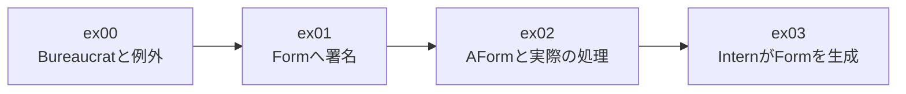
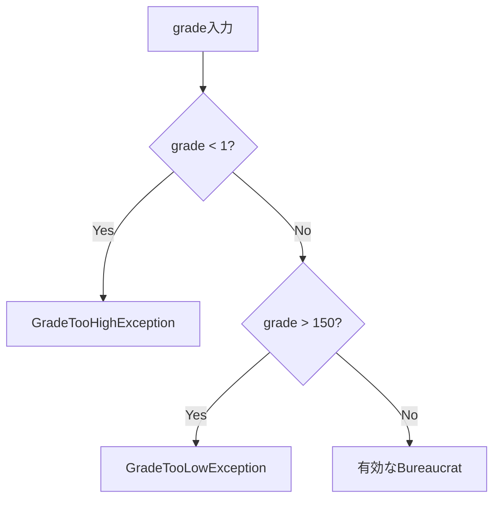
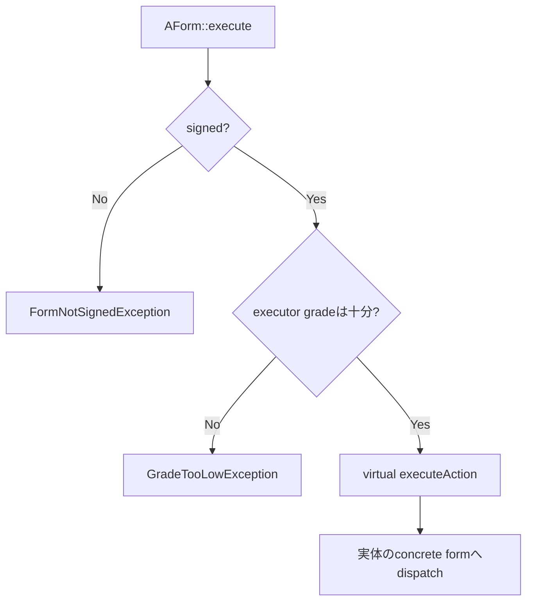
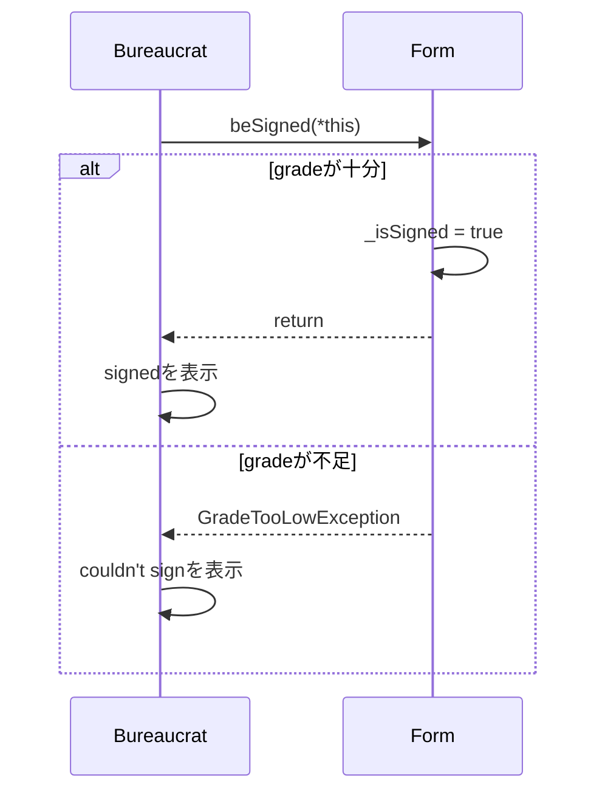
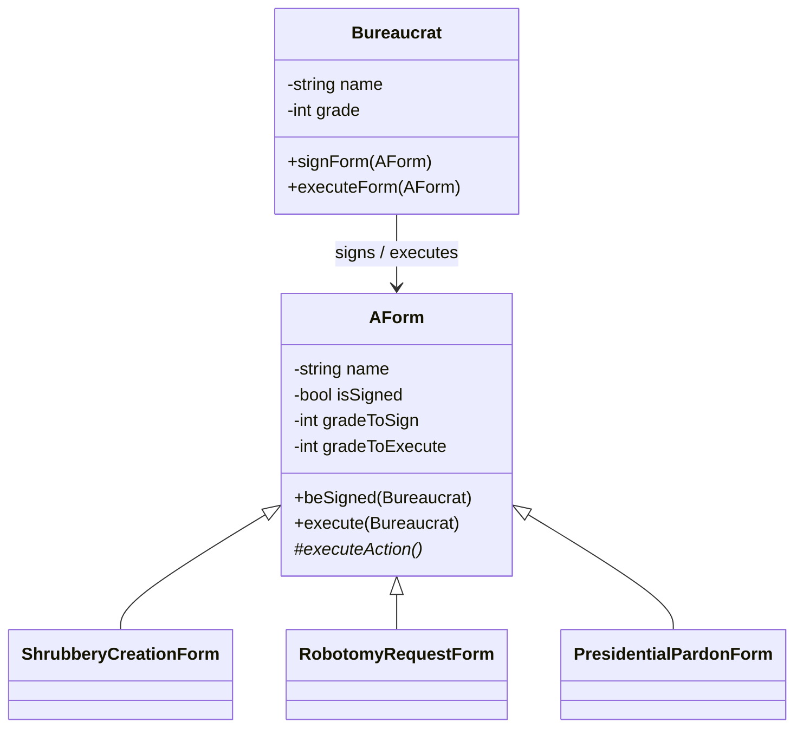
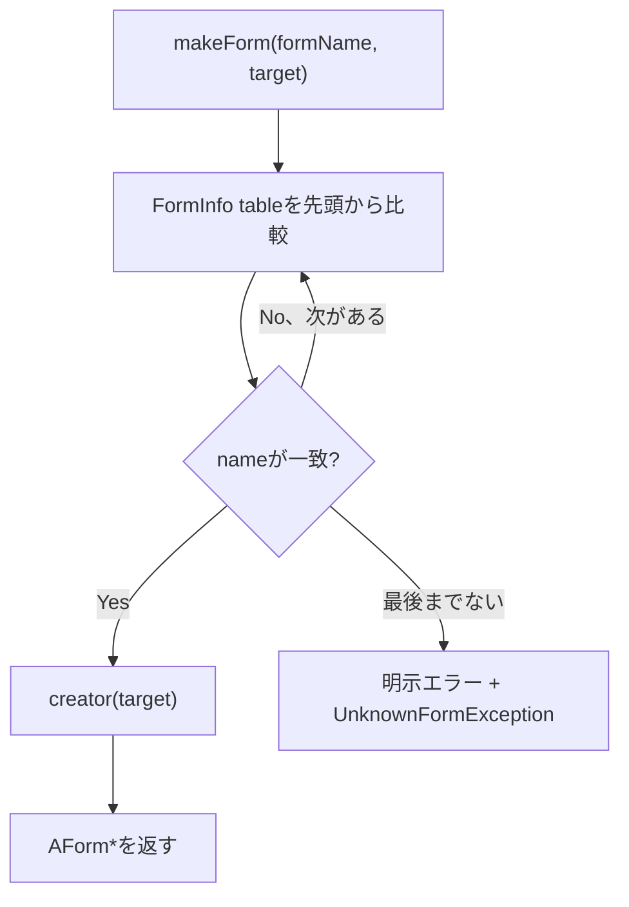
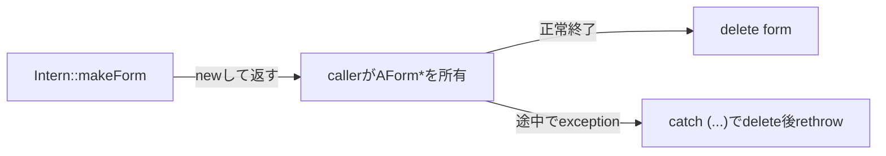

# CPP05 完全理解・Defense Guide（ELI5）

> 目的: CPP05を「動く」だけでなく、なぜこの設計なのかを説明し、追加テストを書き、レビュー質問へ自分の言葉で答えられる状態にする。
>
> 監査対象: commit `e04faff6cdb55e15fa7be1f287fc512235a9d742` の `cpp05/ex00`〜`ex03`
>
> 現行評価基準: [42 EvalHub CPP05](https://www.42evalhub.com/common/cpp05)

## 0. 提出直前なら、この順で読む

1. 「60秒で全体像」とgrade表を覚える。
2. ex00〜ex03の「30秒説明」を声に出す。
3. 「頻出レビュー質問」を、自分で答えてから模範回答を見る。
4. 「ライブコーディング4本」の目的を説明する。
5. 最後に提出チェックを実行する。

## 1. 60秒で全体像

CPP05は「権限を持つ人が、書類に署名し、条件を満たせば処理を実行する」仕組みで、C++の例外・継承・抽象クラス・polymorphismを学ぶ課題である。

- `Bureaucrat`: 名前とgradeを持つ職員。gradeは1が最高、150が最低。
- `Form`: 署名に必要なgrade、実行に必要なgrade、署名済みかを持つ書類。
- `AForm`: 直接は作れない抽象書類。共通の署名・実行条件を守る。
- 3つのconcrete form: 実際の処理だけを担当する。
- `Intern`: 文字列から適切なconcrete formを生成する。
- exception: 不正なgrade、未署名、権限不足、未知のformを通常処理から分離して知らせる。




一言で言うなら、`Bureaucrat`が利用者、`AForm`が共通ルール、concrete formが実際の仕事、`Intern`がfactoryである。

## 2. 最初につまずくgradeの向き

数が小さいほど強い。

```text
強い権限                                             弱い権限
1 ───── 5 ───── 25 ───── 45 ───── 72 ───── 137 ───── 145 ───── 150
↑最高                                                          ↑最低
```

- `incrementGrade()`: 地位を上げるので、数値は `-1`。
- `decrementGrade()`: 地位を下げるので、数値は `+1`。
- 必要gradeが50なら、grade 1〜50は許可、51〜150は拒否。

判定式はこれだけ覚える。

```cpp
if (bureaucrat.getGrade() > requiredGrade)
    throw GradeTooLowException();
```

`>`なのは、数値が大きいほど権限が低いからである。

## 3. CPP05で必要なC++基礎


### 3.1 class invariant

invariantは「objectが生きている間、必ず守られる約束」。

`Bureaucrat`のinvariantは `_grade` が常に1〜150であること。constructorだけでなく、gradeを変更する全関数が同じ約束を守る。




レビューでは「invalid objectを一瞬でも作らないため、変更前に検査します」と答える。

### 3.2 constructor initializer list

`const` memberはconstructor本体に入った時点ですでに初期化済みでなければならない。

```cpp
Bureaucrat::Bureaucrat(const std::string& name, int grade)
    : _name(name)
{
    if (grade < HIGHEST_GRADE)
        throw GradeTooHighException();
    if (grade > LOWEST_GRADE)
        throw GradeTooLowException();
    _grade = grade;
}
```

`_name = name;`では遅い。一方、現在の実装はgradeを検査してから`_grade`へ代入し、不正値を持つ完成objectを作らない。

base classもinitializer listで構築する。

```cpp
ShrubberyCreationForm::ShrubberyCreationForm(const std::string& target)
    : AForm("Shrubbery Creation Form", 145, 137), _target(target)
{
}
```


### 3.3 Orthodox Canonical Form（OCF）

exception class以外の各classに次の4つを用意する。

```cpp
ClassName();
ClassName(const ClassName& other);
ClassName& operator=(const ClassName& other);
~ClassName();
```

違いは次のとおり。


| 操作                  | objectの状態 | 役割             |
| ------------------- | --------- | -------------- |
| default constructor | まだ存在しない   | 初期状態で作る        |
| copy constructor    | まだ存在しない   | 別objectから新しく作る |
| assignment operator | すでに存在する   | 代入可能な状態だけ更新する  |
| destructor          | 存在する      | resourceを片付ける  |


この実装では`const` memberはassignmentできない。

- `Bureaucrat::operator=`はgradeだけをコピーし、nameは元のまま。
- `Form::operator=`と`AForm::operator=`はsigned状態だけをコピーする。
- concrete formのassignmentはbaseのsigned状態と`_target`をコピーする。

「コピー代入なのに全部同じにならないの？」への回答は、「nameや契約gradeはsubjectが`const`と指定したidentityなので、既存objectへの代入では変更できません」である。

### 3.4 exception

exceptionは「失敗を戻り値に混ぜず、呼び出し元へ伝える仕組み」。

```cpp
try {
    Bureaucrat invalid("Invalid", 0);
} catch (const std::exception& e) {
    std::cout << e.what() << std::endl;
}
```

重要点:

- `throw`: その場の通常処理を中断する。
- `catch`: 型が一致するexceptionを受け取る。
- `catch (const std::exception& e)`: 派生exceptionをpolymorphismで受け取れる。
- referenceで受けるためobject slicingを避け、不要なcopyもしない。
- `what() const throw()`: objectを変更せず、C++98のexception specificationとして「この関数はthrowしない」と示す。


### 3.5 `const`の読み方

```cpp
void execute(const Bureaucrat& executor) const;
```

- `const Bureaucrat&`: executorをcopyせず、変更もしない。
- 末尾の`const`: `execute`はform自身を変更しない。
- `execute`が`const`でも、file出力や標準出力など外部への作用はできる。


### 3.6 forward declaration

`Bureaucrat.hpp`では`class AForm;`、`AForm.hpp`では`class Bureaucrat;`を使う。

headerでreferenceやpointerとして型名だけ必要なら、完全なclass定義は不要。相互includeを避け、compile依存を小さくできる。member functionを実装する`.cpp`では実際のheaderをincludeする。

### 3.7 abstract classとpure virtual function

```cpp
virtual void executeAction(void) const = 0;
```

`= 0`により`AForm`はabstract classとなり、`AForm form;`とは作れない。concrete formは必ず`executeAction()`を実装する。

### 3.8 virtual destructor

`Intern::makeForm()`は`AForm*`を返す。実体は派生classなので、base pointerから`delete`するときに正しい派生destructorまで呼ぶ必要がある。

```cpp
virtual ~AForm(void);
```

これがvirtualでないと、base pointer経由のdeleteはundefined behaviorになり得る。

### 3.9 Template Method pattern

この実装の中心設計。

```cpp
void AForm::execute(const Bureaucrat& executor) const
{
    if (!_isSigned)
        throw FormNotSignedException();
    if (executor.getGrade() > _gradeToExecute)
        throw GradeTooLowException();
    executeAction();
}
```

共通ルールはbase classが一度だけ検査し、具体的な処理だけを派生classへ任せる。




`executeAction()`を直接publicにしない理由は、署名・grade検査を迂回させないため。

### 3.10 `operator<<`

左辺が`std::ostream`なので、class memberではなくnon-member functionとして実装する。

```cpp
std::ostream& operator<<(std::ostream& out, const Bureaucrat& bureaucrat);
```

streamをreferenceで返すため、`std::cout << a << b;`と連結できる。

## 4. ex00 — Bureaucrat


### 何を学ぶか

- class invariant
- nested exception class
- `const` member
- OCF
- stream insertion operator


### 実装の流れ

1. `_name`はconstructorで固定する。
2. `_grade`は1〜150か検査してから保存する。
3. `incrementGrade()`は1より上へ行かないことを確認して`--`する。
4. `decrementGrade()`は150より下へ行かないことを確認して`++`する。
5. `what()`で理由を返す。


### 30秒説明

> `Bureaucrat`はconstant nameと1〜150のgradeを持ちます。1が最高です。constructorとgrade変更関数は変更前に境界を検査し、不正なら`std::exception`派生のnested exceptionをthrowします。copy constructorはnameとgradeをコピーしますが、assignmentではconst nameを変えられないためgradeだけをコピーします。`operator<<`は指定形式で状態を表示します。


### よく聞かれる質問

**Q. grade 3をincrementすると、なぜ2になる？**

A. 「gradeをincrement」は数値ではなく地位を上げる意味で、1が最高だから数値は減る。

**Q.** `_grade--`**してから範囲外なら戻せばよくない？**

A. 一時的でもinvariantを壊さない方が安全。先に検査すればrollbackも不要。

**Q. exception classもOCFが必要？**

A. subject上、exception classはOCF不要。それ以外のclassは必要。

## 5. ex01 — Formと署名


### Formの状態


| member            | 意味          | 変更可能か   |
| ----------------- | ----------- | ------- |
| `_name`           | 書類名         | `const` |
| `_isSigned`       | 署名済みか       | 変更可能    |
| `_gradeToSign`    | 署名に必要なgrade | `const` |
| `_gradeToExecute` | 実行に必要なgrade | `const` |


全属性は`private`であり、`protected`ではない。

### 署名の流れ




`Form::beSigned()`がルールを持ち、`Bureaucrat::signForm()`は人間向けの操作窓口と結果表示を担当する。

### 30秒説明

> `Form`はconstant name、署名状態、constantな署名gradeと実行gradeをprivateに持ちます。constructorで両gradeを1〜150に検証します。`beSigned()`はBureaucratのgradeが必要grade以下なら署名状態をtrueにし、不足なら`GradeTooLowException`をthrowします。`Bureaucrat::signForm()`はそれを呼び、exceptionをcatchして成功または失敗を表示します。


### つまずきやすい点

- `signForm()`はexceptionを内部でcatchする。throw自体を確認したいときは`form.beSigned(bureaucrat)`を直接呼ぶ。
- 一度署名されたformを再度署名しても、状態はtrueのまま。現在の実装はidempotent。
- assignmentは`_isSigned`だけをコピーする。nameと必要gradeはdestinationのまま。


## 6. ex02 — AFormと3つの処理


### class関係図




### 必ず覚えるgrade表


| concrete form            | sign | execute | action                             |
| ------------------------ | ---- | ------- | ---------------------------------- |
| `ShrubberyCreationForm`  | 145  | 137     | `<target>_shrubbery`へASCII treeを書く |
| `RobotomyRequestForm`    | 72   | 45      | drilling noise、50%成功/失敗を表示         |
| `PresidentialPardonForm` | 25   | 5       | Zaphod Beeblebroxによるpardonを表示      |


覚え方: 木は簡単、robotomyは中間、presidential pardonは最高権限。

### 実行の責務分担


| 関数                          | 責務                                   |
| --------------------------- | ------------------------------------ |
| `AForm::execute()`          | signed確認、executor grade確認、action呼び出し |
| concrete `executeAction()`  | そのform固有の処理だけ                        |
| `Bureaucrat::executeForm()` | `execute()`を呼び、成功/失敗を表示              |


`executeForm()`は`form.execute(*this)`が正常returnした後だけ`executed`と表示する。actionがthrowした場合はcatchへ移動するため、失敗なのに成功表示は出ない。

### concrete form固有のポイント


#### Shrubbery

- C++98では`std::ofstream`へ`std::string`を直接filenameとして渡せない環境があるため、`filename.c_str()`を使う。
- open失敗なら`FileCreationException`。
- `ofstream`はRAIIなのでscope終了時にもcloseされる。現在の明示的`close()`も正しい。


#### Robotomy

- `std::rand() % 2`で2通りを選ぶ。
- `std::srand()`は`main`で一度だけ行う。actionごとにseedすると、短時間の連続実行で同じseedになりやすい。
- randomなので、単発の成功だけを正しさの証明にしない。drilling noiseと成功/失敗のどちらかが出ることを見る。


#### Presidential pardon

- targetとZaphod Beeblebroxを含む指定メッセージを表示する。
- execute grade 5なので非常に高い権限が必要。


### 30秒説明

> `AForm`はpure virtualな`executeAction()`を持つabstract base classです。署名確認とexecutor grade確認は`AForm::execute()`へ集約し、成功した場合だけvirtual dispatchでconcrete actionを呼びます。これにより各派生classで共通検査を重複せず、actionを直接呼んで検査を迂回することも防ぎます。base pointerから削除するためdestructorはvirtualです。


## 7. ex03 — Internとfactory


### 何をするか

2つの文字列を受け取る。

```text
formName = "robotomy request"
target   = "Bender"
```

そして`new RobotomyRequestForm("Bender")`を行い、`AForm*`として返す。

### dispatch図




### function pointerの読み方

```cpp
AForm* (*creator)(const std::string& target);
```

内側から読む。

1. `creator`はpointer。
2. 指す先は`const std::string&`を受け取るfunction。
3. 戻り値は`AForm*`。

この実装のcreatorは`static member function`なので、格納している型は通常のfunction pointerである。non-static member-function pointerの構文`AForm* (Intern::*)(...)`ではない。Intern固有のstateを使わないため、実装としては小さな表駆動dispatchになっている。

> **評価上の注意:** subject本文の必須点は「過剰なif/else-ifを避ける」であり、この実装はtableで満たす。一方、現行EvalHubのGood dispatching欄には「array of pointers to member functions」と書かれている。C++の型として厳密に読むと、現在の通常function pointerはnon-static member-function pointerではない。そのため「EvalHub文言へ型まで完全一致」とは断定しない。evaluatorに聞かれたら、この違いを隠さず説明する。

型までnon-static member-function pointerにする場合の形は次のようになる。

```cpp
typedef AForm* (Intern::*Creator)(const std::string& target) const;

struct FormInfo {
    std::string name;
    Creator creator;
};

AForm* newForm = (this->*forms[i].creator)(target);
```

現在の提出実装はこのalternativeへ変更していない。直前に変更する場合は、`Intern.hpp`と`Intern.cpp`を揃えて変更し、既知3種・未知名・ownership・全buildを再検証する必要がある。

### なぜif/else-if chainを使わないか

form nameとcreatorを1行のdataとして対応づけられるから。

```cpp
FormInfo forms[] = {
    {"shrubbery creation", &createShrubberyForm},
    {"robotomy request", &createRobotomyForm},
    {"presidential pardon", &createPardonForm}
};
```

検索処理は1つのloopで済み、formを追加しても分岐構造を増やさない。

### ownership




`makeForm()`が返したraw pointerはcallerが所有し、必ず`delete`する。C++98には`std::unique_ptr`がないため、現在の`processForm()`はcatch-allでcleanupしてからrethrowする。

```cpp
AForm* form = NULL;
try {
    form = intern.makeForm(name, target);
    // use form
} catch (...) {
    delete form;
    throw;
}
delete form;
```

`delete NULL;`は安全。

### 30秒説明

> `Intern::makeForm()`はform名とstatic creator function pointerを持つtableをloop検索します。一致すればtargetを渡してconcrete formをheap生成し、`AForm*`で返します。if/else-if chainを避け、nameと生成処理をdataとして対応づけています。未知名は明示エラー後に`UnknownFormException`をthrowします。返されたraw pointerのownershipはcallerにあり、正常系でもexception経路でもdeleteします。


## 8. 頻出レビュー質問と模範回答


### 設計

**Q1. なぜ**`AForm`**の属性はprivate？**

A. subject要件であり、派生classが直接契約値を壊さないようにするため。派生classはbase constructorとpublic getterを使う。

**Q2. なぜ**`executeAction()`**はpublicではない？**

A. publicだと署名・grade検査を迂回できる。利用者は必ず`execute()`を通る。

**Q3. 派生class側の**`executeAction()`**がprivateでも、baseから呼べる？**

A. 呼び出し時のaccess checkはbase classのprotected virtual functionに対して行われ、実行時はvirtual dispatchでprivate overrideへ到達できる。overrideのaccess levelは一致不要。

**Q4. なぜ**`AForm::execute()`**へ検査を集めた？**

A. signed/gradeの共通条件を一か所で守り、派生classの重複と検査漏れを防ぐため。

**Q5. なぜvirtual destructor？**

A. `AForm*`が実際には派生objectを指すので、base pointerからdeleteした際に派生destructorまで呼ぶため。

### exception

**Q6. なぜ戻り値**`false`**ではなくexception？**

A. constructor失敗は戻り値を返せず、通常結果と契約違反を分離できる。呼び出し側は型別に処理できる。

**Q7. なぜ**`catch (const std::exception& e)`**？**

A. 派生exceptionをまとめてpolymorphicに捕捉し、copyとslicingを避けるため。

**Q8. constructorがthrowしたらdestructorは呼ばれる？**

A. object本体は完成していないので、そのobjectのdestructorは呼ばれない。すでに構築済みのbase/memberは自動的に破棄される。

### const / copy

**Q9. なぜnameと必要gradeがconst？**

A. objectのidentityと契約であり、生成後に変わるべきでないから。subjectにも明記されている。

**Q10. assignmentでnameをコピーしないのはバグ？**

A. 既存destinationのconst identityは変更できない。代入可能なstateだけをコピーする。copy constructorなら新規構築なのでconst memberもsourceから初期化できる。

### polymorphism

**Q11.** `AForm`**を直接作れない理由は？**

A. `executeAction()`がpure virtualで、action未定義の書類は意味を持たないから。

**Q12.** `AForm::execute()`**はどうやって正しいactionを選ぶ？**

A. `executeAction()`がvirtualなので、objectの実際の型に応じてruntime dispatchされる。

### Intern / memory

**Q13.** `Intern`**のif chainがだめな理由は？**

A. name追加のたびに制御構造が伸びる。tableなら対応関係をdataとして追加でき、検索logicは不変。

**Q14. 返された**`AForm`***は誰がdeleteする？**

A. caller。`makeForm()`がownershipを移し、`processForm()`が正常系とexception系の両方でdeleteする。

**Q15. 現在のtableは本当のmember-function pointer？**

A. 厳密には違う。static member functionを指す通常のfunction pointerである。subjectの「if chainを避ける」という目的には表駆動で対応しているが、EvalHubのmember-function pointerという文言へC++型まで一致しているとは答えない。

### 実装固有

**Q16.** `Bureaucrat::signForm()`**がexceptionを外へ投げないのはなぜ？**

A. `signForm()`はユーザー向けの操作窓口で、成功・失敗の表示まで担当する設計だから。exception型そのもののtestは`Form::beSigned()`を直接呼ぶ。

**Q17. action失敗時に成功表示されない根拠は？**

A. `executeForm()`は`form.execute()`がreturnした後にだけ成功を表示する。actionがthrowすれば直ちにcatchへ移る。

**Q18. Robotomyを50%とどう説明する？**

A. `std::rand() % 2`の2結果を成功/失敗へ割り当てる。統計的品質を保証するrandom generatorではないが、subjectの二分岐をC++98で実装している。

## 9. レビュー時の受け答えの型

答えは次の順番にする。

1. **結論**: 一文で答える。
2. **不変条件または責務**: なぜそうするか。
3. **source**: 実際の関数を指す。
4. **境界case**: 何をtestすれば証明できるか。

例:

> Q. なぜactionをbase classから呼ぶのですか？
>
> A. 共通の署名・grade検査を必ず通すためです。`AForm::execute()`が2条件を検査した後だけvirtual `executeAction()`を呼びます。未署名formを実行するtestなら、actionが呼ばれず`FormNotSignedException`になることで証明できます。

分からない場合は推測しない。

> 「質問は、copy constructorとassignmentの違いについてですか？」
>
> 「この実装ではconst memberがあるため、assignmentはmutable stateだけをコピーします。該当箇所を確認して説明します。」

これは逃げではなく、前提を揃えてsourceから答える正しいレビュー態度である。

## 10. ライブコーディングで最初に言うこと

現行EvalHubには独立したLive coding採点欄はないが、subject上は数分でできる小変更を求められる場合がある。

最初にこう言う。

> 「何を証明する変更か確認します。提出sourceを大きく変えず、最小のmainでそのcaseだけをtestし、`c++ -Wall -Wextra -Werror -std=c++98`で確認します。」


### ex00: 境界

```cpp
#include "Bureaucrat.hpp"
#include <iostream>

int main()
{
    try {
        Bureaucrat top("Top", 1);
        top.incrementGrade();
    } catch (const std::exception& e) {
        std::cout << e.what() << std::endl;
    }
    return 0;
}
```

証明: grade 1より高くなる変更を拒否し、invariantを維持する。

### ex01: 署名成功と失敗

```cpp
#include "Bureaucrat.hpp"
#include "Form.hpp"
#include <iostream>

int main()
{
    Form form("Permit", 50, 25);
    Bureaucrat low("Low", 51);
    Bureaucrat enough("Enough", 50);
    low.signForm(form);
    enough.signForm(form);
    std::cout << form << std::endl;
    return 0;
}
```

証明: 必要gradeと同値は成功し、数値が1大きいgradeは失敗する。

### ex02: 実行の2段階gate

```cpp
#include "Bureaucrat.hpp"
#include "ShrubberyCreationForm.hpp"

int main()
{
    ShrubberyCreationForm form("demo");
    Bureaucrat signer("Signer", 145);
    Bureaucrat lowExecutor("Low", 138);
    Bureaucrat executor("Executor", 137);
    executor.executeForm(form);
    signer.signForm(form);
    lowExecutor.executeForm(form);
    executor.executeForm(form);
    return 0;
}
```

証明: 未署名、実行grade不足、成功の3経路。

### ex03: known / unknown / ownership

```cpp
#include "AForm.hpp"
#include "Intern.hpp"
#include "RobotomyRequestForm.hpp"
#include <iostream>

int main()
{
    Intern intern;
    AForm* form = intern.makeForm("robotomy request", "Bender");
    if (dynamic_cast<RobotomyRequestForm*>(form) == NULL) {
        delete form;
        return 1;
    }
    delete form;
    try {
        intern.makeForm("coffee making", "Cup");
    } catch (const std::exception& e) {
        std::cout << e.what() << std::endl;
    }
    return 0;
}
```

証明: `dynamic_cast`による正しいdynamic type、caller ownership、未知名の失敗。

### compileの基本形

提出fileを直接書き換えず、`/tmp/evaluator_main.cpp`を使う。

```bash
c++ -Wall -Wextra -Werror -std=c++98 \
  -Icpp05/ex00 /tmp/evaluator_main.cpp cpp05/ex00/Bureaucrat.cpp \
  -o /tmp/cpp05-check
/tmp/cpp05-check
```


## 11. つまずきやすいポイント一覧


| 誤解                                | 正しい理解                                       |
| --------------------------------- | ------------------------------------------- |
| incrementは数値を増やす                  | gradeの地位を上げるので数値は減る                         |
| gradeが大きいほど強い                     | 1が最高、150が最低                                 |
| `signForm()`が署名条件を決める             | 条件は`Form::beSigned()`が持つ                    |
| concrete formが毎回gradeを検査する        | この実装は`AForm::execute()`へ集約                  |
| `executeAction()`を直接呼べばよい         | 共通検査を迂回するため非公開                              |
| base destructorは空だからvirtual不要     | base pointerから派生objectをdeleteするので必要         |
| copy constructorとassignmentは完全に同じ | assignmentではconst memberを変更できない             |
| `makeForm()`のpointerはInternが管理する  | callerが所有しdeleteする                          |
| unknown formは`NULL`だけ返せばよい        | この実装は明示エラー後にexceptionをthrow                 |
| Robotomy成功だけ出ればよい                 | 成功/失敗の両方が仕様                                 |
| headerに全部書く方が簡単                   | non-template実装をheaderに置くとEvalHubでexercise停止 |
| `using namespace std;`は短くて便利      | CPP05では禁止                                   |


## 12. 各Exerciseの一行回答

- ex00: 「1〜150というBureaucratのinvariantをexceptionで守ります。」
- ex01: 「署名条件はForm自身が持ち、Bureaucratは操作と結果表示を担当します。」
- ex02: 「AFormが共通gateを守り、concrete formはactionだけを実装します。」
- ex03: 「Internはtable-driven factoryでnameをcreatorへ対応づけ、callerへownershipを渡します。」


## 13. 提出直前チェック


### repository

- Intraが参照する公式repoを空directoryへcloneしたか。
- root直下に`ex00`〜`ex03`があるか。
- `git status --porcelain`が空か。
- local HEADと提出branchのremote SHAが一致するか。
- binary、`obj/`、`*_shrubbery`をcommitしていないか。


### build

各Exerciseで実行する。

```bash
make fclean
make re
make
make fclean
```

確認すること:

- compilerが`c++`
- flagsが`-Wall -Wextra -Werror -std=c++98`
- 2回目の`make`で不要なrelinkをしない
- `all`、`clean`、`fclean`、`re`がある


### source

- non-template functionをheader内で実装していない。
- `using namespace`、`friend`、`printf`、`malloc`、`calloc`、`realloc`、`free`を使っていない。
- exception以外のclassがOCFを持つ。
- `AForm` destructorがvirtual。
- 3 concrete formsのgradeを言える。
- `Intern`の3つの正確なform nameを言える。
- `makeForm()`の返却pointerを誰がdeleteするか言える。


### defense

- 4つの30秒説明を声に出した。
- grade 1が最高である理由を迷わず答えられる。
- copy constructorとassignmentの違いを説明できる。
- `execute()`からactionまでの流れを図なしで説明できる。
- exception経路で成功表示やmemory leakが起きない理由を説明できる。

より厳密な提出repo同一性チェックは[REVIEW_NOTES.md](REVIEW_NOTES.md#提出当日の最終チェック)を使う。

## 14. 最後の暗記カード

```text
grade: 1が最高、150が最低

Shrubbery:  sign 145 / execute 137
Robotomy:   sign  72 / execute  45
Pardon:     sign  25 / execute   5

execute順序:
signed? → executor grade? → executeAction()

Intern names:
"shrubbery creation"
"robotomy request"
"presidential pardon"

ownership:
makeForm()がnew → callerがdelete
```

ここまでを自分の言葉で説明できれば、CPP05のレビューに必要な基礎・実装・防御は一通り押さえられている。