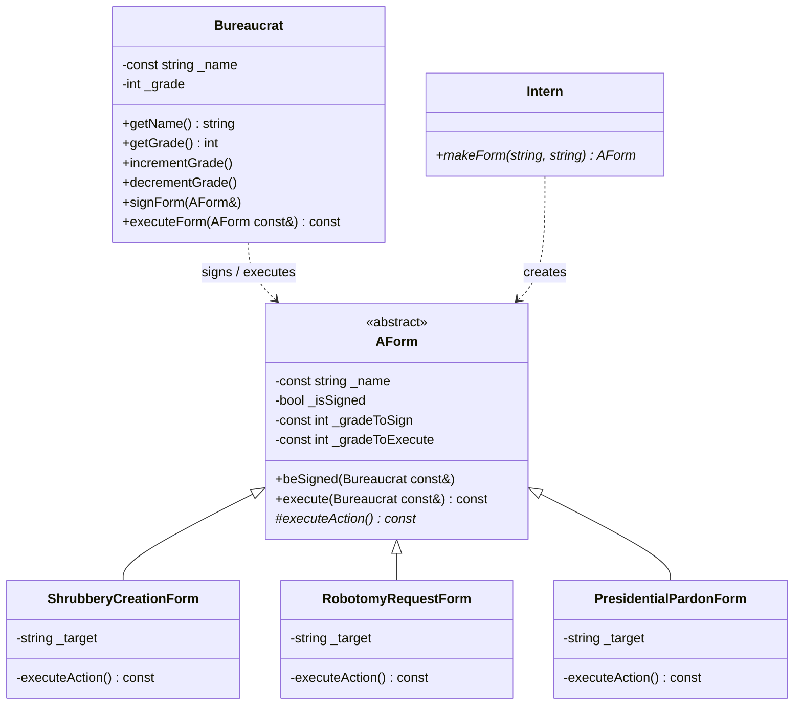
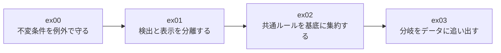
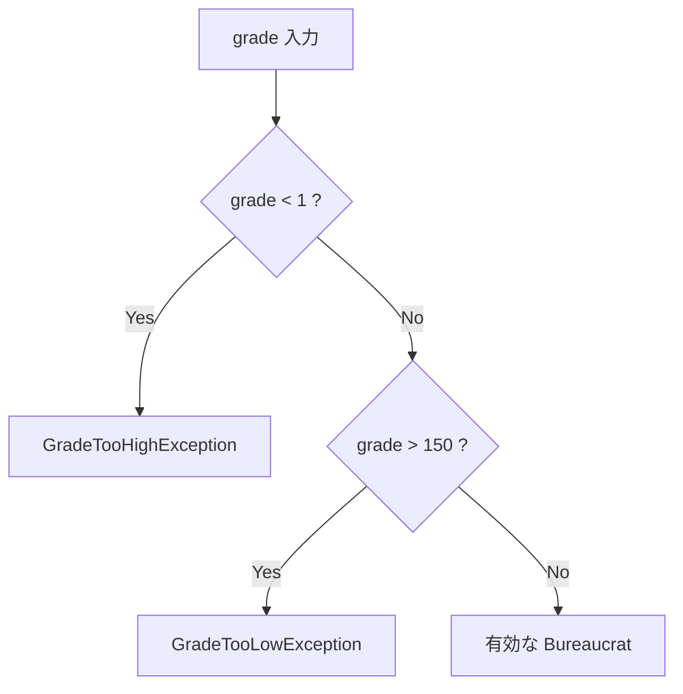
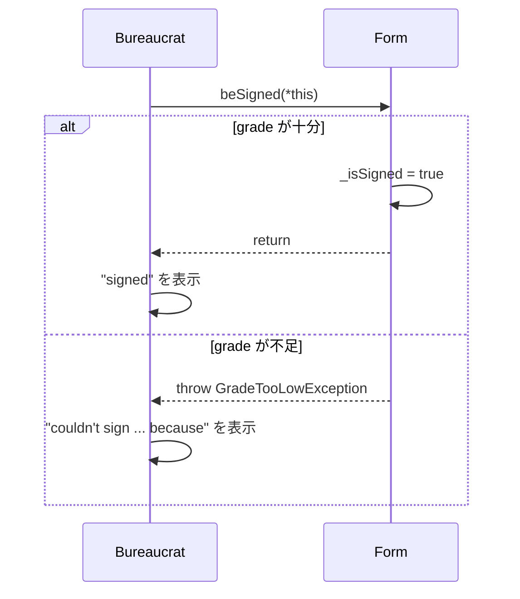
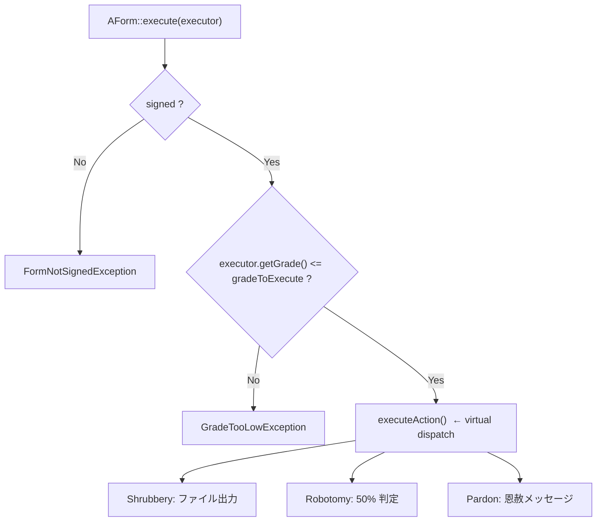
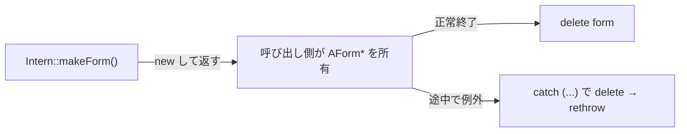

# CPP05 — 実装解説と学習記録

> **対象**: `cpp05/ex00`〜`ex03`（exceptions / inheritance / abstract class / factory）
> **この文書の役割**: 実装を読む人のための解説書であり、同時に自分がどこで何を理解したかの学習記録である。
> **提出手続き・リポジトリ同一性の確認**は [REVIEW_NOTES.md](REVIEW_NOTES.md) に分離してある。ここでは扱わない。

## 読み方

| 読む人 | 推奨ルート |
|---|---|
| レビュワー | [§1 要点カード](#1-要点カード) → 該当 Exercise 節 → [§7 指摘されうる点](#7-指摘されうる点) |
| 実装者（復習） | [§2 全体設計](#2-全体設計) → ex00〜ex03 を順に読み、各節末の「学習メモ」で詰まった箇所を確認する |
| 防衛直前 | [§1 要点カード](#1-要点カード) と [§8 想定質問](#8-想定質問) だけ |

コード参照はすべてリポジトリ内の実ファイルへのリンクである。文章と実装が食い違っていたら**実装が正**。

---

## 1. 要点カード

```text
grade:  1 が最高 / 150 が最低（数字が小さいほど強い）
        increment = 数値 -1（昇進）   decrement = 数値 +1（降格）
        判定式:  if (grade > required) throw GradeTooLowException();

concrete form:
        Shrubbery  sign 145 / exec 137  → <target>_shrubbery に ASCII tree
        Robotomy   sign  72 / exec  45  → drilling noise + 50% 成功/失敗
        Pardon     sign  25 / exec   5  → Zaphod Beeblebrox による恩赦

execute の順序:
        signed? → executor の grade? → executeAction()

Intern が知っている名前（完全一致）:
        "shrubbery creation" / "robotomy request" / "presidential pardon"

所有権:
        makeForm() が new → 呼び出し側が delete
```

ビルド条件は全 Exercise 共通で `c++ -Wall -Wextra -Werror -std=c++98`（[ex02/Makefile#L3-L4](cpp05/ex02/Makefile#L3)）。

---

## 2. 全体設計



課題の積み上がり方が、そのまま学習の順序になっている。



**設計の芯**は一言でいえば「**ルールを持つ場所を 1 つに決める**」ことだった。grade の妥当性は `Bureaucrat` が、署名条件は `AForm` が、生成の対応表は `Intern` が持つ。どのクラスも他人のルールを再実装しない。

---

## 3. ex00 — Bureaucrat と例外

### subject の要求

const な名前、1〜150 の grade、範囲外で `GradeTooHighException` / `GradeTooLowException`、increment/decrement、`<<` オーバーロード。

### 実装

```cpp
// cpp05/ex00/Bureaucrat.cpp#L7
Bureaucrat::Bureaucrat(const std::string &name, int grade) : _name(name)
{
    if (grade < HIGHEST_GRADE)
        throw GradeTooHighException();
    if (grade > LOWEST_GRADE)
        throw GradeTooLowException();
    _grade = grade;
}
```

境界値は [Bureaucrat.hpp#L13-L14](cpp05/ex00/Bureaucrat.hpp#L13) で `static const int HIGHEST_GRADE = 1; LOWEST_GRADE = 150;` としてある。マジックナンバーを 4 箇所（コンストラクタ 2、increment、decrement）に散らさないため。

grade 変更は**変更前**に検査する（[Bureaucrat.cpp#L47-L62](cpp05/ex00/Bureaucrat.cpp#L47)）。

```cpp
void Bureaucrat::incrementGrade(void)
{
    if (_grade <= HIGHEST_GRADE)
        throw GradeTooHighException();
    _grade--;
}
```

### なぜこの設計か

**クラス不変条件（class invariant）を、一瞬も壊さないため。** 「先に `--` して、はみ出したら戻す」でも最終結果は同じだが、その間オブジェクトは grade 0 という不正な状態になる。途中で例外が飛べばロールバックされない。先に検査すればロールバック自体が不要になる。



### 学習メモ

- **コンストラクタで throw すると、そのオブジェクトのデストラクタは呼ばれない。** 「構築が完了していないものは破棄もされない」という規則。ただし初期化リストで構築済みの `_name`（`std::string`）は自動的に破棄されるのでリークはしない。この非対称性が最初は気持ち悪かったが、「デストラクタは *完成したオブジェクト* とペア」と理解して納得した。
- **`operator=` が `_grade` しかコピーしないのは仕様であってバグではない。**（[Bureaucrat.cpp#L24-L31](cpp05/ex00/Bureaucrat.cpp#L24)）`_name` が `const std::string` なので代入できない。コピーコンストラクタは *新規構築* なので const メンバも初期化リストから初期化できる（[#L20](cpp05/ex00/Bureaucrat.cpp#L20)）。**コピーコンストラクタと代入演算子が「同じことをする 2 つの書き方」ではない**と腹落ちしたのがこの Exercise の一番の収穫だった。
- ex00 だけ `_grade` を初期化リストではなく**コンストラクタ本体**で代入している（[#L17](cpp05/ex00/Bureaucrat.cpp#L17)）。検査を通ってから代入する意図でこう書いた。ex01 以降は検査対象が const メンバになったため初期化リストへ移している（[Form.cpp#L8-L9](cpp05/ex01/Form.cpp#L8)）。**const メンバは初期化リストでしか初期化できない**ので選択肢がなかった、というのが実際の経緯である。
- 例外クラスだけ OCF 不要なのは subject の明示的な免除。状態を持たない空クラスなので、コンパイラ生成のコピーで十分という理屈も納得できる。

---

## 4. ex01 — Form と署名

### subject の要求

const な名前、署名済みフラグ、const な署名 grade と実行 grade。**すべて private**（protected ではない）。`beSigned()` は grade 不足で throw。`Bureaucrat::signForm()` がそれを呼ぶ。

### 実装

役割分担がこの Exercise の全てである。

```cpp
// Form.cpp#L50 — 条件を「判定」して throw するだけ。表示はしない
void Form::beSigned(const Bureaucrat& bureaucrat) {
    if (bureaucrat.getGrade() > _gradeToSign)
        throw GradeTooLowException();
    _isSigned = true;
}

// Bureaucrat.cpp#L52 — 例外を「解釈」して subject 指定の文言を出す
void Bureaucrat::signForm(Form& form) {
    try {
        form.beSigned(*this);
        std::cout << _name << " signed " << form.getName() << std::endl;
    } catch (const std::exception& e) {
        std::cout << _name << " couldn't sign " << form.getName()
                  << " because " << e.what() << std::endl;
    }
}
```



### なぜこの設計か

**異常を「検出する場所」と「どう扱うか決める場所」を分けられることが、例外の本質的な利点だから。** `Form` は自分の署名条件しか知らず、それを誰にどう見せるかは知らない。`Bureaucrat` は人間向けの操作窓口として、失敗を出力へ変換する。

戻り値の `bool` ではこの分離ができない。`beSigned` が `false` を返した場合、**なぜ失敗したか**の情報が呼び出し側に届かず、`e.what()` に相当するものを別途作る羽目になる。

### 学習メモ

- **循環参照は前方宣言で切る。** `Form.hpp` が `class Bureaucrat;`（[#L8](cpp05/ex01/Form.hpp#L8)）、`Bureaucrat.hpp` が `class Form;`（[#L8](cpp05/ex01/Bureaucrat.hpp#L8)）。ヘッダでは参照／ポインタとして名前しか要らないので不完全型で足り、実体を触る `.cpp` 側で本物を include する（[Form.cpp#L2](cpp05/ex01/Form.cpp#L2)）。ここを相互 include で書いて無限ループさせたのが最初の失敗だった。
- **署名の判定は `>=` ではなく `>` で「拒否」を書く。** 「必要 grade **以下**なら許可」を裏返して「必要 grade より**大きい**なら拒否」と書くほうが、例外を投げる条件と式が一致して読みやすい。
- 署名済みの Form にもう一度署名しても `_isSigned = true` のままで、エラーにはならない（冪等）。subject は再署名の扱いを指定していないため、状態遷移を単純に保つ側を選んだ。実出力の Test 7 がその挙動を示している。
- `Form::operator=` も `_isSigned` だけをコピーする（[Form.cpp#L24-L29](cpp05/ex01/Form.cpp#L24)）。ex00 と同じ理屈で、name と必要 grade は const な「その書類の identity」だから。

---

## 5. ex02 — AForm と Template Method

ここが CPP05 の設計上の山場。subject に「**どちらのやり方でもよいが、一方がよりエレガントだ**」という誘導がある。

### concrete form の仕様

| form | sign | exec | action |
|---|---:|---:|---|
| `ShrubberyCreationForm` | 145 | 137 | `<target>_shrubbery` に ASCII tree を書く |
| `RobotomyRequestForm` | 72 | 45 | drilling noise の後、50% で成功／失敗 |
| `PresidentialPardonForm` | 25 | 5 | Zaphod Beeblebrox による恩赦を表示 |

grade はリテラルではなく各ヘッダの `SIGN_GRADE` / `EXEC_GRADE` に置いてある（例: [ShrubberyCreationForm.hpp#L12-L13](cpp05/ex02/ShrubberyCreationForm.hpp#L12)）。

### 実装

```cpp
// AForm.hpp#L20
protected:
    virtual void executeAction(void) const = 0;   // 派生は「処理」だけ実装する
public:
    void execute(const Bureaucrat& executor) const;
```

```cpp
// AForm.cpp#L57 — 検査は基底が独占する
void AForm::execute(const Bureaucrat& executor) const {
    if (!_isSigned)
        throw FormNotSignedException();
    if (executor.getGrade() > _gradeToExecute)
        throw GradeTooLowException();
    executeAction();
}
```



これが **Template Method パターン**（アルゴリズムの骨格を基底に置き、可変部分だけを派生に任せる）である。

### なぜこの設計か

各 concrete class で検査する方式と比べた利点は 3 つ。

1. **検査ロジックが 1 箇所にしかない。** 4 つ目の form を追加した人が検査を書き忘れることが構造的に起こらない。
2. **concrete class が「何をするか」だけになる。** [PresidentialPardonForm.cpp#L26-L29](cpp05/ex02/PresidentialPardonForm.cpp#L26) は実質 1 行で、読んで仕様がそのまま分かる。
3. **検査を迂回できない。** `executeAction()` が public でないため、外部から直接呼んで未署名のまま実行する経路が存在しない。

### 学習メモ

- **`virtual ~AForm()` が必須。**（[AForm.hpp#L28](cpp05/ex02/AForm.hpp#L28)）ex03 で `AForm*` 経由の `delete` をするため。virtual でないと派生デストラクタが呼ばれず未定義動作になる。「基底のデストラクタは空だから要らない」は間違い、というのが CPP04 から持ち越した教訓。
- **派生側の `executeAction()` は private で宣言している。**（[RobotomyRequestForm.hpp#L9](cpp05/ex02/RobotomyRequestForm.hpp#L9)）基底では protected、派生では private とアクセス指定が食い違うが、これは合法で意図どおり動く。**アクセスチェックは呼び出し式の静的な型（= 基底の宣言）に対して行われ、実際にどの関数へ飛ぶかは実行時の virtual dispatch で決まる**ため。この 2 段構えを理解したのが ex02 で一番時間を使ったところだった。結果として「派生を直接 `form.executeAction()` と呼ぶ」経路がさらに塞がれている。
- **`FormNotSignedException` は subject 指定の 2 種類に加えた独自追加。**（[AForm.hpp#L48](cpp05/ex02/AForm.hpp#L48)）未署名と権限不足は原因が違うので、`e.what()` が同じ文言になるのを避けたかった。実出力の 1 行目と `LowGrade couldn't sign ...` の行で、メッセージが区別されているのが確認できる。
- **`std::srand()` は `main` で 1 回だけ呼ぶ。**（[ex02/main.cpp#L12](cpp05/ex02/main.cpp#L12)）`executeAction()` の中で毎回 seed すると、短時間に連続実行したとき `time(NULL)` が同じ値になり、同じ結果が並ぶ。seed は「プログラムの起動時の関心事」であって form の関心事ではない。
- `std::ofstream` には `filename.c_str()` を渡す（[ShrubberyCreationForm.cpp#L32](cpp05/ex02/ShrubberyCreationForm.cpp#L32)）。`std::string` を直接受け取るコンストラクタは C++11 から。C++98 縛りを実感した箇所。

---

## 6. ex03 — Intern と factory

### subject の要求

`makeForm(名前, target)` が対応する concrete form を `AForm*` で返す。**「大量の if/elseif/else は評価で認めない」と明記されている。**

### 実装

名前と生成関数を対にしたテーブルを走査する（[Intern.cpp#L35-L55](cpp05/ex03/Intern.cpp#L35)）。

```cpp
struct FormInfo {                                   // Intern.hpp#L9
    std::string name;
    AForm* (*creator)(const std::string& target);
};

FormInfo forms[] = {
    {"shrubbery creation",  &createShrubberyForm},
    {"robotomy request",    &createRobotomyForm},
    {"presidential pardon", &createPardonForm}
};

for (int i = 0; i < numForms; i++)
    if (forms[i].name == formName) { ... return forms[i].creator(target); }
```

関数ポインタ型は内側から読む。`creator` はポインタ → 指す先は `const std::string&` を取る関数 → 戻り値は `AForm*`。

### なぜこの設計か

**form を追加するときに変更するのがデータ（配列の 1 行）だけで、制御構造が変わらないから。** if 連鎖では名前が増えるたびに分岐が伸び、関数の複雑度が上がる。テーブルなら検索ループは永久に 1 つのまま。これが Factory パターンの最小実装である。

テーブルに入れているのが `static` メンバ関数を指す通常の関数ポインタである点については [§7.1](#71-関数ポインタ-vs-メンバ関数ポインタ) に整理した。



所有権の受け渡しは [ex03/main.cpp#L12-L22](cpp05/ex03/main.cpp#L12) が引き受けている。

```cpp
AForm* form = NULL;
try {
    form = intern.makeForm(name, target);
    // 署名・実行
} catch (...) {
    delete form;
    throw;          // 後始末してから呼び出し元へ投げ直す
}
delete form;
```

### 学習メモ

- **C++98 には `std::unique_ptr` がない。** だから「例外が飛ぶ経路でも必ず `delete` する」ことを手書きで保証する必要がある。`catch (...) { delete form; throw; }` という定型がそれで、C++11 以降なら `std::unique_ptr` 1 行で消える定型でもある。**RAII が何を自動化してくれているのかを、手で書いて理解した**のがこの Exercise の収穫だった。`delete NULL;` が安全なので、`form = NULL` 初期化と組み合わせれば生成失敗時も同じ経路で書ける。
- **未知の名前のときは、エラー表示と throw の両方をしている。**（[Intern.cpp#L52-L54](cpp05/ex03/Intern.cpp#L52)）subject の要求は「明示的なエラーメッセージ」だけなので表示で足りるが、呼び出し側が `NULL` チェックを忘れて落ちるのを避けたくて例外も投げている。二重報告である点は自覚しており、[§7.2](#72-intern-の二重報告) に書いた。
- `Intern` は状態を持たないので、コピーコンストラクタと代入演算子は `(void)other;` で引数を捨てるだけの実装になる（[Intern.cpp#L11-L18](cpp05/ex03/Intern.cpp#L11)）。OCF の要求を満たすためだけに存在するコードだが、`-Wunused-parameter` を通すために `(void)` キャストが要る。

---

## 7. 指摘されうる点

自分で把握している「ここは突っ込まれうる」箇所。隠さず説明する方針。

### 7.1 関数ポインタ vs メンバ関数ポインタ

現在の実装は `static` メンバ関数を指す**通常の関数ポインタ**の配列（[Intern.hpp#L11](cpp05/ex03/Intern.hpp#L11)）であり、C++ の型としては非静的メンバ関数ポインタ `AForm* (Intern::*)(...)` ではない。dispatch をメンバ関数ポインタで組むことを求められた場合、この差が論点になる。

- subject 本文の必須要件は「過剰な if/else-if を避ける」であり、テーブル駆動はこれを満たす。
- 「メンバ関数ポインタの配列」という形へ、型まで厳密に一致しているとは主張しない。
- `Intern` は状態を持たないので `static` で十分、というのが選択理由。

非静的メンバ関数ポインタにする場合の形は以下。現提出では採用していない。

```cpp
typedef AForm* (Intern::*Creator)(const std::string& target) const;
struct FormInfo { std::string name; Creator creator; };
AForm* newForm = (this->*forms[i].creator)(target);
```

### 7.2 Intern の二重報告

未知の form 名で、`std::cout` への出力と `UnknownFormException` の throw を両方行う。意図は [§6 の学習メモ](#学習メモ-3) のとおりだが、「ライブラリとしては throw だけにして、表示は呼び出し側の責任にすべき」という指摘はもっともである。実際 `Bureaucrat::signForm()` は「表示する側」に徹しており、そちらの分離のほうが一貫している。

### 7.3 `FormNotSignedException` は subject 外の追加

subject が挙げるのは `GradeTooHighException` / `GradeTooLowException` の 2 つ。未署名を別の型にしたのは可読性のための独自判断で、要求を減らしてはいないが増やしてはいる。

### 7.4 `static const int` のクラス内初期化

`static const int HIGHEST_GRADE = 1;` のクラス内初期化は C++98 で合法だが、**アドレスを取る（ODR-use する）と定義が別途必要**になる。現在は比較にしか使っておらず該当しない。参照で受け取る関数へ渡すような変更を加えると、リンクエラーになりうる点は認識している。

---

## 8. 想定質問

「こう答える」ではなく「なぜそうなっているか」として整理したもの。

**Q. grade 3 を increment するとなぜ 2 になるのか。**
increment は数値ではなく**地位**を上げる操作だから。1 が最高なので、地位が上がれば数値は減る。

**Q. なぜ検査してから `--` するのか。`--` してから戻せばよいのでは。**
不変条件を一瞬も壊さないため。途中で例外が飛んだ場合にロールバックが走らない設計を避けた。[§3](#なぜこの設計か) 参照。

**Q. コピー代入で name がコピーされないのはバグではないか。**
`_name` は `const`。代入演算子は**既存オブジェクト**を更新する操作なので、const な identity は変更できない。コピーコンストラクタは新規構築なので初期化リストから const メンバも初期化できる。[§3 の学習メモ](#学習メモ) 参照。

**Q. コンストラクタが throw したらデストラクタは呼ばれるか。**
そのオブジェクトのデストラクタは呼ばれない。ただし初期化済みの基底クラスとメンバは破棄されるのでリークはしない。

**Q. なぜ `catch (const std::exception& e)` で受けるのか。**
派生した例外型をまとめて捕捉でき（polymorphism）、参照で受けることでスライシングと不要なコピーを避けられるから。これが成立するのは、例外クラスを `std::exception` から派生させているため（subject にも明記されている）。

**Q. なぜ検査を基底の `execute()` に集めたのか。**
署名済みかどうかと実行 grade は**全 form に共通のルール**だから。派生ごとに書くと重複し、追加時の書き忘れが起きる。subject はどちらでもよいとしているが、こちらを選んだ。

**Q. 派生の `executeAction()` は private なのに、なぜ基底から呼べるのか。**
アクセスチェックは呼び出し式に現れる静的な型、つまり基底クラスの protected 宣言に対して行われる。実際に飛ぶ先は virtual dispatch が実行時に決めるため、override 側のアクセス指定は一致していなくてよい。

**Q. `AForm` を直接インスタンス化できない理由は。**
`executeAction()` が純粋仮想（`= 0`）だから。「何をするか未定義の書類」に意味がないという仕様を、型で表現している。

**Q. action が失敗したのに "executed" と表示される心配はないか。**
`Bureaucrat::executeForm()` は `form.execute(*this)` が**正常 return した後**にだけ成功を表示する（[ex02/Bureaucrat.cpp#L62-L70](cpp05/ex02/Bureaucrat.cpp#L62)）。action が throw すれば即座に catch へ移る。

**Q. `makeForm()` が返したポインタは誰が delete するのか。**
呼び出し側。`makeForm()` は所有権を移す。[ex03/main.cpp](cpp05/ex03/main.cpp#L12) は正常系と例外系の両方で `delete` している。

**Q. Robotomy の 50% はどう保証しているのか。**
`std::rand() % 2` の 2 値を成功／失敗へ割り当てている。統計的品質を保証する乱数生成器ではなく、subject の二分岐を C++98 の範囲で実装したもの。単発の実行結果を正しさの根拠にはできないので、「drilling noise の後に成功か失敗のどちらかが出る」ことを確認する。

---

## 9. 検証手順と実際の出力

以下は `make -C cpp05/exNN re` の後に実行した実際の出力である（macOS / Apple clang、2026-09-22 時点）。

### ex00

```console
$ cd cpp05/ex00 && make re && ./bureaucrat
--- Test 3: Grade too high exception ---
Caught GradeTooHighException: Grade is too high! (minimum grade is 1)

--- Test 5: Grade manipulation exceptions ---
David, bureaucrat grade 1.
Caught GradeTooHighException: Grade is too high! (minimum grade is 1)

--- Test 7: Copy constructor and assignment ---
Original: Frank, bureaucrat grade 42.
Copy: Frank, bureaucrat grade 42.
After assignment: George, bureaucrat grade 42.
```

Test 7 が [§3 の学習メモ](#学習メモ)で述べた挙動そのもの。代入先 `George` は名前を保ったまま grade だけ 42 になっている。

### ex01

```console
$ cd cpp05/ex01 && make re && ./form
--- Test 5: Bureaucrat can't sign form (grade too low) ---
Bob, bureaucrat grade 50.
Bob couldn't sign Important Form because Grade is too low to sign this form!
Form Important Form (signed: no, grade to sign: 10, grade to execute: 5)
```

失敗後も `signed: no` のままで、状態が中途半端に変わっていないことが確認できる。

### ex02

```console
$ cd cpp05/ex02 && make re && ./aform
AForm Shrubbery Creation Form (signed: no, grade to sign: 145, grade to execute: 137)
Admin couldn't execute Shrubbery Creation Form because Form is not signed!
Admin signed Shrubbery Creation Form
Admin executed Shrubbery Creation Form
Admin signed Robotomy Request Form
* DRILLING NOISES *
Bender has been robotomized successfully
Admin executed Robotomy Request Form
LowGrade couldn't sign Presidential Pardon Form because Grade is too low!
Admin signed Presidential Pardon Form
Arthur Dent has been pardoned by Zaphod Beeblebrox
Admin executed Presidential Pardon Form
```

2 行目が未署名 gate、`LowGrade` の行が署名 grade gate。Robotomy は乱数なので `The robotomy of Bender failed` になる実行もある（成功／失敗どちらも仕様どおり）。

### ex03

```console
$ cd cpp05/ex03 && make re && ./intern
Intern creates shrubbery creation
AForm Shrubbery Creation Form (signed: no, grade to sign: 145, grade to execute: 137)
Master signed Shrubbery Creation Form
Master executed Shrubbery Creation Form
Intern creates robotomy request
AForm Robotomy Request Form (signed: no, grade to sign: 72, grade to execute: 45)
Master signed Robotomy Request Form
* DRILLING NOISES *
The robotomy of Bender failed
Master executed Robotomy Request Form
Intern creates presidential pardon
...
Intern could not create coffee making: Unknown form type
```

最終行が未知 form の経路。表示の後に throw された例外は `main` の catch まで届き、途中で確保していたポインタは `processForm()` の `catch (...)` が解放している。

### メモリリーク

```console
$ cd cpp05/ex03 && leaks --atExit -- ./intern
Process 46121: 195 nodes malloced for 32 KB
Process 46121: 0 leaks for 0 total leaked bytes.
```

`new` を使うのは ex03 だけなので、リーク検証はここが本体になる。CPP05〜09 を通した ASan/UBSan 込みの再現可能な検証は [scripts/verify_cpp05_09.sh](scripts/verify_cpp05_09.sh) にある。

### レビュワーが自分で確かめるとき

提出ファイルを書き換えずに main を差し替える形が安全。

```bash
c++ -Wall -Wextra -Werror -std=c++98 \
  -Icpp05/ex00 /tmp/evaluator_main.cpp cpp05/ex00/Bureaucrat.cpp \
  -o /tmp/cpp05-check && /tmp/cpp05-check
```

境界として意味があるのは、grade 1 の increment / grade 150 の decrement、必要 grade ちょうど（成功）と +1（失敗）、未署名での execute、未知の form 名の 5 つ。

---

## 10. つまずきやすい点の一覧

| 誤解 | 正しい理解 |
|---|---|
| increment は数値を増やす | 地位を上げるので数値は減る |
| grade が大きいほど強い | 1 が最高、150 が最低 |
| 署名条件は `signForm()` が決める | 条件は `Form::beSigned()` が持つ。`signForm()` は表示担当 |
| concrete form が毎回 grade を検査する | この実装は `AForm::execute()` に集約 |
| `executeAction()` を直接呼べばよい | 検査を迂回するので非公開 |
| 基底のデストラクタは空だから virtual 不要 | 基底ポインタから派生を delete するので必要 |
| コピーコンストラクタと代入演算子は同じ | 代入では const メンバを変更できない |
| `makeForm()` のポインタは `Intern` が管理する | 呼び出し側が所有し delete する |
| ヘッダに全部書くほうが簡単 | 非テンプレート実装をヘッダに置くと、その Exercise は評価対象外になる |
| `using namespace std;` は短くて便利 | subject が禁止しており、使用すると評価が止まる |

---

## 11. 関連資料

- [cpp05/subject.txt](cpp05/subject.txt) — 課題原文
- [REVIEW_NOTES.md](REVIEW_NOTES.md) — CPP05〜09 横断の防衛ノートと提出前チェック
- [COMPREHENSIVE_EVALUATION.md](COMPREHENSIVE_EVALUATION.md) — 監査レポートと provenance
- [scripts/verify_cpp05_09.sh](scripts/verify_cpp05_09.sh) — 再現可能な検証スクリプト
