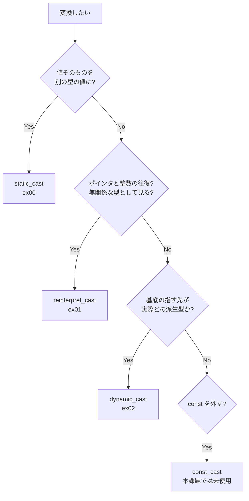
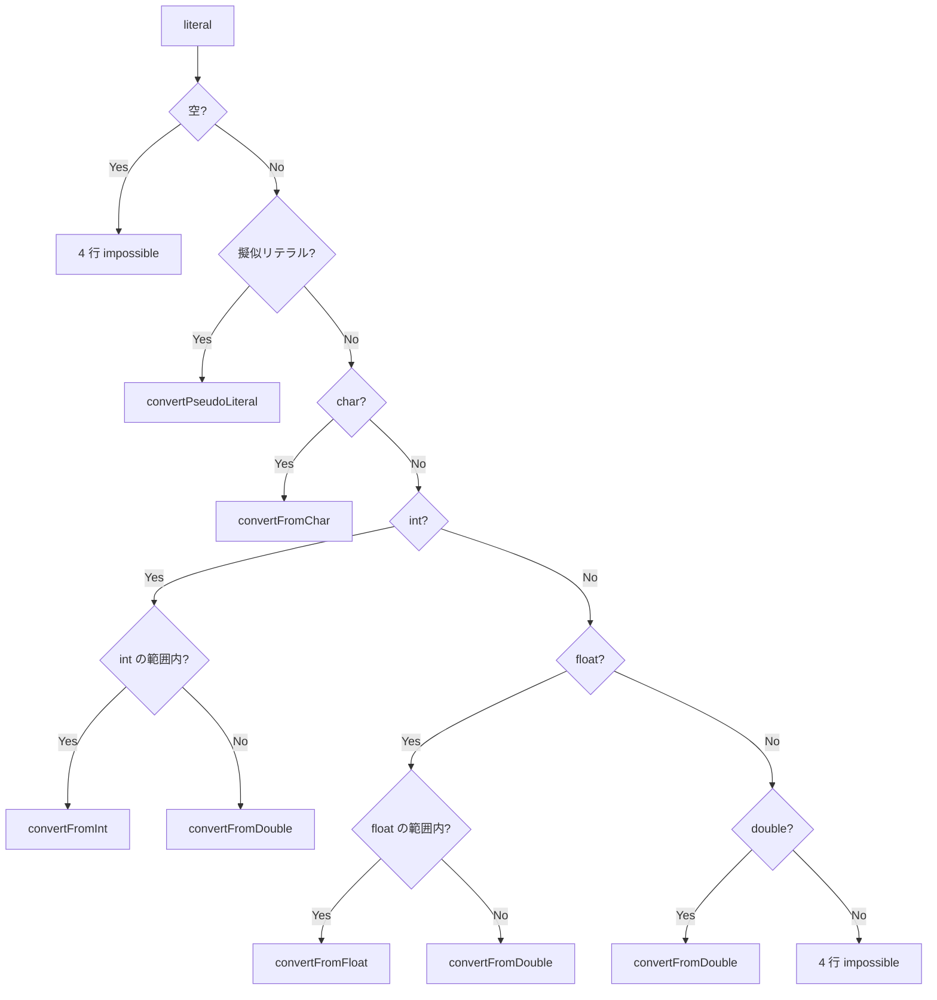

# CPP06 — 実装解説と学習記録

> **対象**: `cpp06/ex00`〜`ex02`（static_cast / reinterpret_cast / dynamic_cast）
> **この文書の役割**: 実装を読む人のための解説書であり、同時に自分がどこで何を理解したかの学習記録である。
> **提出手続き・リポジトリ同一性の確認**は [REVIEW_NOTES.md](REVIEW_NOTES.md) に分離してある。ここでは扱わない。

## 読み方

| 読む人 | 推奨ルート |
|---|---|
| レビュワー | [§1 要点カード](#1-要点カード) → [§2 この課題の性質](#2-この課題の性質) → 該当 Exercise 節 → [§8 指摘されうる点](#8-指摘されうる点) |
| 実装者（復習） | [§4 3 つのキャストと選び方](#4-3-つのキャストと選び方) → ex00〜ex02 を順に読み、各節末の「学習メモ」で詰まった箇所を確認する |
| 防衛直前 | [§2](#2-この課題の性質) の引用 1 行 → [§4 の決定木](#4-3-つのキャストと選び方) → [§9 想定質問](#9-想定質問) |

コード参照はすべてリポジトリ内の実ファイルへのリンクである。文章と実装が食い違っていたら**実装が正**。

---

## 1. 要点カード

```text
各 Exercise に割り当てられたキャスト:
        ex00  static_cast       値を別の型の値へ。コンパイル時に決まる
        ex01  reinterpret_cast  ビット列を別の型として読み替える
        ex02  dynamic_cast      実行時に本当の型を問い合わせる

ex00 の型判別は順序が仕様:
        空 → 擬似リテラル → char → int → float → double → それ以外

ex00 の char 表示 3 状態:
        値 < 0 または > 127     impossible
        値 < 32 または == 127   Non displayable
        32 <= 値 <= 126         'c' の形式

ex01 の往復:
        Data*  --reinterpret_cast-->  uintptr_t
        uintptr_t  --reinterpret_cast-->  Data*

ex02 の失敗の伝え方:
        identify(Base*)  失敗は NULL が返る       → if で検査
        identify(Base&)  失敗は例外が飛ぶ         → try/catch で捕捉
        catch は (...) 一択。std::bad_cast は <typeinfo> にあり禁止されているため

所有権:
        generate() が new → 呼び出し側が delete
```

ビルド条件は全 Exercise 共通で `c++ -Wall -Wextra -Werror -std=c++98`（[ex00/Makefile#L3-L4](cpp06/ex00/Makefile#L3)）。

---

## 2. この課題の性質

subject には、この課題の性質を決めている章が 1 つある。Exercise 本文とは別に、モジュール全体へ適用される追加ルールとして置かれている。

> For each exercise, type conversion must be handled using a specific type of casting.
> **Your choice will be reviewed during the defense.**
>
> — 公式 subject Version 8.1, Chapter III（[cpp06/subject.txt](cpp06/subject.txt)）

つまり CPP06 は「動くコードを書く」課題ではない。**3 つのキャストの使い分けを説明できるか**を問う課題である。出力が subject の例と一致していても、なぜそのキャストを選んだかを言えなければ意味がない。逆に言えば、防衛の準備はこの 1 点に集約できる。

EvalHub の評価表も各 Exercise の冒頭で "This exercise is about using the static_cast."、"...the reinterpret_cast."、"...the dynamic_cast." と宣言しており、同じことを言っている（[cpp06/evals.txt](cpp06/evals.txt)）。

---

## 3. 共通ルール — 0 点と -42

subject Chapter II にある罰則。実装の良し悪し以前に、ここで評価が止まる。

| 条件 | 罰則 | 本実装 |
|---|---|---|
| `using namespace <ns_name>` または `friend` を使用 | -42 | 不使用 |
| STL のコンテナ／アルゴリズムを使用（許可は Module 08・09 のみ） | -42 | 不使用 |
| ヘッダ内に関数の実装を記述（テンプレートを除く） | 0 | 3 ヘッダとも宣言のみ |
| インクルードガードがない | 0 | 3 ヘッダとも設置 |
| `*printf()` / `*alloc()` / `free()` を使用 | 0 | 不使用 |
| C++11 以降・Boost・その他外部ライブラリを使用 | 0 | 不使用 |

`std::string` / `std::cout` / `std::ostringstream` は STL のコンテナでもアルゴリズムでもないため、この制限には触れない。評価表も対象を "Containers (vector/list/map, and so forth)" と "Algorithms (anything that requires including the `<algorithm>` header)" に限定している。

0 点にはならないが必ず守るものとして、Orthodox Canonical Form（Module 02〜09、明示的な免除を除く）、メモリリーク禁止、出力メッセージの改行終端、ディレクトリ名 `exNN`、クラス名 UpperCamelCase とファイル名の一致がある。**ex02 の 4 クラスは OCF 免除が subject に明記されている**（Chapter VII）。

---

## 4. 3 つのキャストと選び方

C 言語のキャスト `(int)x` は 1 つの書き方で複数の変換を黙って引き受ける。どれが起きたのかは書いた本人にも読む人にも判らない。C++ は名前を分け、**意図を型として宣言させる**ことでこれを可視化した。危険な変換（`reinterpret_cast`）だけを後から grep で数えられる、というのが実利である。



境界がまぎらわしいのは次の 2 組で、防衛でもここが問われる。

**static_cast と reinterpret_cast** — `static_cast` はポインタ→整数ができない。コンパイルエラーになる。値としての対応関係が言語仕様上定義されていないためで、ビット列の読み替えは `reinterpret_cast` の領分である。

**static_cast と dynamic_cast** — 基底→派生のダウンキャストは `static_cast` でも *書けてしまう*。しかし実際の型が違っても何も教えず、そのポインタを使った時点で未定義動作になる。検査が目的なら `dynamic_cast` しかない。

---

## 5. ex00 — スカラー型の変換

### subject の要求

文字列として受け取った C++ リテラルの型を判別し、char / int / float / double へ明示的に変換して 4 行で表示する。変換が意味をなさない場合やオーバーフローする場合は不可能である旨を、char にできるが表示できない場合はその旨を表示する。クラス `ScalarConverter` は static メソッド `convert` ただ 1 つを持ち、**ユーザーがインスタンス化できてはならない**。擬似リテラル `-inf` `+inf` `nan` とその `f` 付きを扱う。char 以外は 10 進表記のみが与えられる。

### 実装

インスタンス化の禁止は、4 つの特殊メンバ関数をすべて private に置くことで表現した（[ScalarConverter.hpp#L6-L16](cpp06/ex00/ScalarConverter.hpp#L6)）。

```cpp
class ScalarConverter
{
private:
	ScalarConverter(void);
	ScalarConverter(const ScalarConverter &other);
	ScalarConverter &operator=(const ScalarConverter &other);
	~ScalarConverter(void);

public:
	static void convert(const std::string &literal);
};
```

`convert()` は上から順に型を判定する（[ScalarConverter.cpp#L401-L476](cpp06/ex00/ScalarConverter.cpp#L401)）。



文字列から数値への変換は `strtod` 1 本に集約した（[ScalarConverter.cpp#L38-L49](cpp06/ex00/ScalarConverter.cpp#L38)）。

```cpp
static bool parseDouble(const std::string &literal, double &value)
{
	char *end;

	errno = 0;
	value = std::strtod(literal.c_str(), &end);
	if (end == literal.c_str() || *end != '\0')
		return false;
	if (errno == ERANGE && (value == 0.0 || isInfValue(value)))
		return false;
	return true;
}
```

char の表示は 3 状態を区別する（[ScalarConverter.cpp#L310-L326](cpp06/ex00/ScalarConverter.cpp#L310)）。

| 条件 | 出力 | 例 |
|---|---|---|
| 値 < 0 または > 127 | `impossible` | `-1` / `128` |
| 値 < 32 または == 127 | `Non displayable` | `0` / `31` / `127` |
| 32 ≤ 値 ≤ 126 | `'c'` の形式 | `32` → `' '` / `42` → `'*'` |
| nan / inf | `impossible` | 整数値を持たない |

### なぜこの設計か

**判別の順序そのものが仕様である。** 入れ替えると壊れる箇所が 2 つある。

擬似リテラルを先頭に置いたのは、`nan` や `inf` が数字を含まない文字列だからである。後段の数値パーサに渡しても弾かれるだけで、float / double として出力すべき値を復元できない。特別扱いが必要になる。

char を int より先に置いたのは、`'0'` と `0` を区別するためである。前者は文字の 0（int 値 48）、後者は数値の 0 で、意味が違う。ただし長さ 1 の数字（`0`〜`9`）は int として扱いたいので、`isChar` の条件には「長さ 1 かつ**非数字**」という但し書きが入っている（[ScalarConverter.cpp#L83-L88](cpp06/ex00/ScalarConverter.cpp#L83)）。

**オーバーフローは入力単位ではなく変換単位で判定している。** subject の該当文は "If **a conversion** does not make any sense or overflows" であり、主語が単数の「ひとつの変換」である。4 行まとめて不可能にするのではなく、各行ごとに判断すると読んだ。そのため `2147483648` は `int: impossible` だが float と double は値を出す（[ScalarConverter.cpp#L437-L441](cpp06/ex00/ScalarConverter.cpp#L437)）。

```cpp
// Overflow is judged per conversion (subject): an int-overflowing
// literal keeps its meaningful float/double conversions.
if (isIntRange(value))
	convertFromInt(static_cast<int>(value));
else
	convertFromDouble(value);
```

**`.0` を足すかどうかは、値ではなく出力文字列を見て決めている**（[ScalarConverter.cpp#L342-L370](cpp06/ex00/ScalarConverter.cpp#L342)）。subject の例は `42.0f` の形なので、`ostream` が `42` と出したものには `.0` を補う必要がある。しかし `4.2` のように既に小数点があるもの、`2.14748e+09` のような指数表記に付けてはならない。この 3 条件を文字列検索で見ている。

### 学習メモ

- **`'0'` と `0` が別物だと腹に落ちたのがこの Exercise の入口だった。** 判定を書き始めたとき、最初は「短いものから順に」くらいの気持ちで char を先頭に置いた。すると `0` が char の `'0'`（48）になってしまい、そこで初めて「char リテラルとは何か」を考えた。結果、条件に「非数字」を足すことになった。**判定の順序と条件が、仕様そのものを表現している**という感覚はここで得た。
- **subject の英文は単数・複数を見る価値がある。** "if a conversion ... overflows" の `a conversion` が単数であることに気づいて、4 行まとめて impossible にする実装をやめた。実装を変えた後で評価表を読んだら「出力に対して過度に厳格にならないこと」と書いてあり、どちらでも落とされはしないと分かったが、根拠を持って選べたこと自体が収穫だった。コードにもコメントで理由を残してある。
- **`atoi` では失敗と 0 が区別できない。** 最初は `atoi` / `atof` で書こうとして、`"hello"` が 0 になることに気づいて詰まった。`strtod` は終端ポインタを返すので「文字列全体を消費したか」を検査でき、`errno` に `ERANGE` が立つのでオーバーフローも分かる。**戻り値だけでなく、失敗を伝える経路が別にある関数を選ぶ**、という判断基準を覚えた。
- **`.0` の付与を値で判定しようとして破綻した。** 当初は「小数部が 0 なら `.0` を足す」と書いていたが、`2147483648` のような大きい値で `ostream` が指数表記に切り替わり、`2.14748e+09.0f` という出力になった。出力を作ってから文字列を見る、という順序に変えて解決した。**表示の問題は表示の段階で解く**のが素直だった。
- 擬似リテラルの分岐は当初「f 付き」「f なし」の二重構造になっていた。後から `inf` / `inff` を足そうとしたとき、単に文字列を追加するだけでは nan 側の `else` に落ちることに気づき、「nan か → 符号か」の 2 段に組み替えた（[ScalarConverter.cpp#L287-L308](cpp06/ex00/ScalarConverter.cpp#L287)）。**元の分岐は 2 つの枝が同じ出力をしていて、そもそも重複していた**と分かったのは、機能を足そうとしたときだった。

---

## 6. ex01 — 直列化

### subject の要求

`Serializer` クラスに static メソッドを 2 つ。`uintptr_t serialize(Data* ptr)` はポインタを符号なし整数型へ、`Data* deserialize(uintptr_t raw)` は整数を `Data` へのポインタへ変換する。クラスは**いかなる方法でも初期化できてはならない**。`Data` 構造体は**空であってはならない**。`serialize()` の戻り値を `deserialize()` に渡し、結果が元のポインタと等しいことを確認する。

### 実装

本体は 2 行である（[Serializer.cpp#L8-L14](cpp06/ex01/Serializer.cpp#L8)）。

```cpp
uintptr_t Serializer::serialize(Data* ptr) {
	return reinterpret_cast<uintptr_t>(ptr);
}

Data* Serializer::deserialize(uintptr_t raw) {
	return reinterpret_cast<Data*>(raw);
}
```

評価表は「`reinterpret_cast` が 2 回使われていること、1 回目は `Data*` → `uintptr_t`、2 回目は `uintptr_t` → `Data*`」を指定しており、この 2 行がそのまま該当する。

`Data` と `Serializer` は同じヘッダに置いた（[Serializer.hpp#L6-L20](cpp06/ex01/Serializer.hpp#L6)）。`uintptr_t` は `<stdint.h>` から取る。

```cpp
#include <stdint.h>

struct Data {
	int value;
};
```

テストは等価性と値の保持を別々に検査し、NULL の往復も確認している（[ex01/main.cpp#L7-L18](cpp06/ex01/main.cpp#L7)）。

### なぜこの設計か

**`static_cast` ではコンパイルが通らない。** ポインタと整数の間には値としての対応関係が言語仕様上定義されていないため、`static_cast` は変換を認めない。`reinterpret_cast` はビットの並びをそのまま読み替える操作なので通る。往復して元の型に戻す限り、規格上も値は保存される。この Exercise が `reinterpret_cast` の課題である理由がここにある。

**`<cstdint>` ではなく `<stdint.h>` を使う。** `<cstdint>` は C++11 で追加されたヘッダで、C++98 には存在しない。C のヘッダを直接読むのが C++98 での正しい書き方である。

**`Data` が空であってはならない理由**は、空でもポインタの往復は成立してしまうからである。データメンバを持たせることで、復元したポインタが単に一致するだけでなく**実際に使える**ことを示せる。テストで `restored->value == 42` を別立てで検査しているのはそのためで、ポインタの等価性だけでは「使える」ことの証明にならない。

### 学習メモ

- **最初に `static_cast<uintptr_t>(ptr)` と書いてコンパイルエラーになった。** そのエラーメッセージを読んで初めて、`static_cast` が「意味のある変換」しか認めないという性質を実感した。それまでは「static_cast は安全なキャスト」という曖昧な理解しかなかった。**この Exercise の要点は、コードの短さではなく、このコンパイルエラーそのものにある**と思う。防衛で「なぜ reinterpret_cast か」と聞かれたら、この経験をそのまま話せばよい。
- **`<cstdint>` を書いて `-std=c++98` で落ちた。** ヘッダ名に `c` が付いているものは C++ 版だと覚えていたが、それが「C++98 の時点で存在するとは限らない」とは思っていなかった。C++11 で追加されたものがあると知った。
- **`Data` を空のまま書いてもテストが通ってしまった。** ポインタは一致するので「できた」と思ったが、subject がわざわざ「非空」と指定している意味を考え直した。**往復して同じアドレスに戻ることと、そのアドレスの中身が生きていることは別の主張**である。テストを 2 本に分けたのはその区別を自分に対して明示するためでもある。

---

## 7. ex02 — 実型の識別

### subject の要求

`Base` は **public な virtual デストラクタのみ**を持つ。`A` `B` `C` は `Base` を public 継承する空クラスで、**この 4 クラスは Orthodox Canonical Form でなくてよい**。`generate()` は A / B / C のいずれかをランダムに生成し `Base*` で返す。`identify(Base* p)` と `identify(Base& p)` が実際の型名を表示する。**`identify(Base&)` の中でポインタを使うことは禁止**。**`<typeinfo>` のインクルードは禁止**。

### 実装

クラス定義は 4 行で済む（[Base.hpp#L4-L11](cpp06/ex02/Base.hpp#L4)）。

```cpp
class Base {
public:
	virtual ~Base(void);
};

class A : public Base {};
class B : public Base {};
class C : public Base {};
```

ポインタ版は戻り値の NULL で失敗を知る（[Base.cpp#L30-L45](cpp06/ex02/Base.cpp#L30)）。

```cpp
void identify(Base* p) {
	if (p == NULL) { std::cout << "Unknown type" << std::endl; return; }

	if (dynamic_cast<A*>(p)) { std::cout << "A" << std::endl; }
	else if (dynamic_cast<B*>(p)) { std::cout << "B" << std::endl; }
	else if (dynamic_cast<C*>(p)) { std::cout << "C" << std::endl; }
	else { std::cout << "Unknown type" << std::endl; }
}
```

参照版は例外で失敗を知る（[Base.cpp#L47-L73](cpp06/ex02/Base.cpp#L47)）。

```cpp
void identify(Base& p) {
	try {
		A& a = dynamic_cast<A&>(p);
		(void)a;
		std::cout << "A" << std::endl;
		return;
	} catch (...) {
	}
	// B、C も同じ形で続く
}
```

乱数の種は関数内 static で初回のみ蒔く（[Base.cpp#L9-L16](cpp06/ex02/Base.cpp#L9)）。毎回 `srand` を呼ぶと同一秒内で同じ値が返る。

### なぜこの設計か

**`catch (...)` は手抜きではなく、制約から導かれる唯一の書き方である。** 参照版の `dynamic_cast` が失敗したときに投げるのは `std::bad_cast` だが、この型は `<typeinfo>` で定義されている。本課題ではそのヘッダ自体が禁止されているため、型を名指しして `catch (const std::bad_cast&)` と書くことができない。防衛で最も高い確率で聞かれる箇所であり、ここを説明できるかが ex02 の分かれ目になる。

**ポインタ版が NULL で参照版が例外なのは、言語の型システム上の必然である。** C++ に null 参照は存在しない。参照は必ず何かを指すため、`dynamic_cast` は参照版で失敗を値として返す手段を持たず、例外を投げるしかない。ポインタには NULL という「どこも指さない値」があるので戻り値で表現できる。同じキャストが対象によって失敗の伝え方を変えているのは、設計の気まぐれではない。

**virtual デストラクタが必須である理由は 2 つある。** 1 つは、`dynamic_cast` が virtual 関数を 1 つ以上持つ型（polymorphic type）にしか使えないこと。それがなければ実行時型情報が存在せず、コンパイルエラーになる。`Base` にとって virtual デストラクタがその 1 つである。もう 1 つは、`Base*` 経由で `delete` したときに派生クラスのデストラクタを正しく呼ぶためで、`generate()` が返したポインタはまさに `Base*` として delete される（[ex02/main.cpp#L25](cpp06/ex02/main.cpp#L25)）。

### 学習メモ

- **`catch (const std::bad_cast&)` と書いて、必要なヘッダを調べて、それが禁止されていることに気づいた瞬間がこの課題で一番面白かった。** 禁止事項が「使うな」ではなく「別の書き方を発見させるための仕掛け」になっている。subject が `<typeinfo>` を禁じているのは `typeid` を封じるためだと思っていたが、副作用として `std::bad_cast` も名指しできなくなる。**制約の射程が、禁止した本人の意図より広いことがある**と学んだ。
- **「参照版でポインタを使うな」という制約の意味が、最初は分からなかった。** 単に縛りを増やしているだけに見えた。しかし参照版を書いてみると、失敗を戻り値で表せないので try/catch にするしかなく、そこで「null 参照が存在しない」という C++ の基本に行き着いた。**制約が、言語の性質を発見させるように設計されている**と気づいた。
- **試しに `virtual` を外したらコンパイルエラーになった。** エラーメッセージに polymorphic という語が出てきて、`dynamic_cast` が何に依存しているのかを実地で知った。「virtual デストラクタは delete のために付けるもの」としか理解していなかったが、それは 2 つある理由の片方でしかなかった。
- `generate()` の `switch` に `default: return NULL;` を書いてある（[Base.cpp#L25-L26](cpp06/ex02/Base.cpp#L25)）。`rand() % 3` は 0〜2 しか返さないので到達しないが、`-Wall -Wextra -Werror` では「すべての経路が値を返すか」を見られるため、書いておくほうが素直だった。**到達しないコードが必要になることがある**のは、コンパイラの検査が実行時の知識を持たないからである。

---

## 8. 指摘されうる点

自分で把握している「ここは突っ込まれうる」箇所。隠さず説明する方針。

### 8.1 大きい値の float / double が指数表記になる

`./convert 2147483648` は `float: 2.14748e+09f` / `double: 2.14748e+09` を出す。`ostream` のデフォルト精度が 6 桁であることによる表示で、値の変換自体は正しい。

- 評価表は「出力に対して過度に厳格にならないこと」と明記しており、減点対象にはならないと判断している。
- `std::fixed` を一律に適用すると `4.2f` 側が `4.200000f` になり、subject の例と乖離する。桁数を入力ごとに切り替える実装も考えたが、複雑さに見合わないと判断して採用していない。
- 「`setprecision` で有効桁を増やせば `2147483648.0f` と出せるのでは」という指摘は正しい。現提出はそこまでしていない。

### 8.2 `inf` / `inff` は subject 外の追加対応

subject が要求する擬似リテラルは `-inf` `+inf` `nan` とその `f` 付きの 6 種である。符号を省いた `inf` / `inff` は要求に含まれない。

- 評価時に符号なしで入力されることが多いため、正の無限大として受理するようにした。
- 要求を減らしてはいないが増やしている。「subject にないものを勝手に足した」という指摘はありうる。
- 分岐の組み替えを伴ったため、既存 6 種の出力が変わっていないことは実測で確認してある（[§10](#10-検証手順と実際の出力)）。

### 8.3 `A` / `B` / `C` が `Base.hpp` に同居している

subject Chapter II の命名規則は「クラスのコードを含むファイルはクラス名に従って命名する」であり、字義どおりに読めば `A.hpp` / `B.hpp` / `C.hpp` になる。

- subject 本文が `Base` と同じ文脈で「3 つの**空の**クラス」と述べており、独立したコードを持たない。
- 評価表に ex02 のファイル構成に関する項目は存在しない。
- 分割自体は機械的にできるが、`{}` だけのファイルが 3 つ増えることになるため現構成を採っている。厳密な読み方をするレビュワーには、この判断として説明する。

### 8.4 `isChar` が長さ 1 の非数字を広く受理する

`isChar` の条件は「`'c'` 形式、または長さ 1 の非数字」である（[ScalarConverter.cpp#L83-L88](cpp06/ex00/ScalarConverter.cpp#L83)）。このため `+` や `-`、空白文字も char リテラルとして扱われ、`./convert +` は `char: '+'` を出す。

- subject の例示は `'c'` `'a'` というクォート付きの形だけであり、クォートなしの単一文字を受理するかは明示されていない。
- 実運用上 `./convert a` のようにクォートなしで入力されることが多いため受理している。
- 「クォート付きのみを char とすべき」という読み方も成立する。その場合 `isChar` の第 2 条件を落とせばよい。

---

## 9. 想定質問

「こう答える」ではなく「なぜそうなっているか」として整理したもの。

**Q. なぜ C 形式のキャスト `(int)x` ではだめなのか。**
C 形式は複数のキャストを黙って試し、最初に通ったものを選ぶ。書いた本人にも、どの変換が起きたのか判らない。C++ のキャストは意図を型として宣言するので、危険な変換だけを後から探せる。subject Chapter III が「キャストの選択を審査する」と言っているのはこのためである。

**Q. ex01 で `static_cast<uintptr_t>(ptr)` ではだめなのか。**
コンパイルが通らない。ポインタと整数の間には値としての対応関係が言語仕様上定義されておらず、`static_cast` は意味のある変換しか認めない。ビット列の読み替えは `reinterpret_cast` の役目である。

**Q. なぜ `<cstdint>` ではなく `<stdint.h>` なのか。**
`<cstdint>` は C++11 で追加されたヘッダで、C++98 には存在しない。C++98 準拠が必須なので C のヘッダを直接読む。

**Q. ex02 は `typeid` を使えばもっと簡単では。**
簡単だが `typeid` は `<typeinfo>` を必要とし、subject が明示的に禁止している。そもそもこの Exercise の主題が `dynamic_cast` なので、禁止がなくても `dynamic_cast` で書くのが趣旨に沿う。

**Q. ex02 で `static_cast<A*>(p)` ではだめなのか。**
コンパイルは通る。しかし実際の型が `B` だった場合でも何も教えず、そのポインタを使った時点で未定義動作になる。検査が目的なら `dynamic_cast` 一択で、これがダウンキャストで両者を分ける基準である。

**Q. なぜ `catch (...)` なのか。`std::bad_cast` で受けるべきでは。**
`std::bad_cast` は `<typeinfo>` で定義されている型で、本課題ではそのヘッダが禁止されている。型を名指しできないので `catch (...)` になる。制約から導かれた結果であって手抜きではない。

**Q. ポインタ版は NULL、参照版は例外。なぜ挙動が違うのか。**
C++ に null 参照が存在しないため。参照は必ず何かを指すので失敗を戻り値で表す手段がなく、例外を投げるしかない。ポインタには NULL があるので戻り値で表現できる。

**Q. なぜ `Base` に virtual デストラクタが要るのか。**
`dynamic_cast` は virtual 関数を持つ型にしか使えず、1 つもなければ実行時型情報が存在しないためコンパイルエラーになる。加えて `Base*` 経由の `delete` で派生のデストラクタを正しく呼ぶためでもある。

**Q. Module 02〜09 は OCF 必須のはず。`ScalarConverter` が private なのは違反では。**
OCF は 4 つの特殊メンバ関数を明示的に宣言することを求めるもので、アクセス指定までは定めていない。private に置くのも宣言の一形態である。「ユーザーがインスタンス化できてはならない」という subject の要求と両立させる書き方がこれになる。なお ex02 の 4 クラスは OCF 免除が subject に明記されている。

**Q. `ScalarConverter` はデストラクタまで private だが、やりすぎでは。**
コンストラクタだけを private にしてもインスタンス化は防げるが、デストラクタも private にすると「スタック上に置く」記述自体がコンパイル時に弾かれる。要求を最も強く表現した形である。

**Q. `2147483648` で int が impossible なのに float と double は出るのはなぜ。**
subject の "if a conversion ... overflows" は主語が単数であり、各変換ごとの話だと読んだ。int には収まらないが float と double には収まるので、意味のある変換は残している。

**Q. `nan` の char が `impossible` なのはなぜ。0 ではないのか。**
`nan` は数ではないので対応する整数値が存在しない。`static_cast<char>` すると未定義動作になるため、変換を試みずに `impossible` を出す。`inf` も同じ理由である。

---

## 10. 検証手順と実際の出力

以下は `make -C cpp06/exNN re` の後に実行した実際の出力である（macOS / Apple clang 21、2026-09-22 時点、commit `bf7bc1f`）。

### ビルド

```console
$ cd cpp06/ex00 && make re
c++ -Wall -Wextra -Werror -std=c++98 -c main.cpp -o obj/main.o
c++ -Wall -Wextra -Werror -std=c++98 -c ScalarConverter.cpp -o obj/ScalarConverter.o
c++ -Wall -Wextra -Werror -std=c++98 obj/main.o obj/ScalarConverter.o -o convert
```

ex01 / ex02 も同様に警告 0 で通る。2 回目の `make` は `Nothing to be done for 'all'` を返す（再リンクしない）。

### ex00 — subject 記載の 3 例

```console
$ ./convert 0          $ ./convert nan          $ ./convert 42.0f
char: Non displayable  char: impossible         char: '*'
int: 0                 int: impossible          int: 42
float: 0.0f            float: nanf              float: 42.0f
double: 0.0            double: nan              double: 42.0
```

### ex00 — 境界値と擬似リテラル

| 入力 | char | int | float | double | 確認点 |
|---|---|---|---|---|---|
| `'c'` | `'c'` | 99 | 99.0f | 99.0 | char リテラル |
| `31` | Non displayable | 31 | 31.0f | 31.0 | 制御文字 |
| `32` | `' '` | 32 | 32.0f | 32.0 | 表示可能の下端 |
| `127` | Non displayable | 127 | 127.0f | 127.0 | DEL |
| `128` | impossible | 128 | 128.0f | 128.0 | ASCII 範囲外 |
| `-1` | impossible | -1 | -1.0f | -1.0 | 負の値 |
| `2147483648` | impossible | impossible | 2.14748e+09f | 2.14748e+09 | int だけ不可 |
| `inf` | impossible | impossible | +inff | +inf | 符号なし（§8.2） |
| `-inf` | impossible | impossible | -inff | -inf | 擬似リテラル |
| `nanf` | impossible | impossible | nanf | nan | 擬似リテラル |
| `hello` | impossible | impossible | impossible | impossible | 不正入力 |

FLT_MAX を超える 10 進リテラル（`1` に続けて 0 が 39 個と `.0`）では `float: impossible` / `double: 1e+39` となり、float だけがオーバーフローする経路も確認済み。

### ex01

```console
$ ./serializer
Pointers equal: PASS
Value preserved: PASS
NULL preserved: PASS
```

### ex02

```console
$ ./identify
Testing A instance:
A
A
Testing B instance:
B
B
Testing C instance:
C
C
... generate() の結果が 12 行 ...
Unknown type
```

固定インスタンス 3 種をポインタ版と参照版の両方で識別し、続いて `generate()` を 6 回、最後に NULL を渡している。

### メモリリーク

```console
$ leaks --atExit -- ./identify
Process 76311: 0 leaks for 0 total leaked bytes.
```

`new` を使うのは ex02 の `generate()` だけなので、リーク検証はここが本体になる。ex00 / ex01 も 0 leaks を確認済み。Linux 環境なら `valgrind --leak-check=full ./identify` で同じことを確認できる。

### レビュワーが自分で確かめるとき

提出ファイルを書き換えずに main を差し替える形が安全である。

```bash
c++ -Wall -Wextra -Werror -std=c++98 \
  -Icpp06/ex02 /tmp/evaluator_main.cpp cpp06/ex02/Base.cpp \
  -o /tmp/cpp06-check && /tmp/cpp06-check
```

境界として意味があるのは、ex00 の char 境界（0 / 31 / 32 / 127 / 128 / -1）、int 境界（2147483647 / 2147483648）、擬似リテラル 8 種、不正入力、ex02 の NULL ポインタの 5 つである。

---

## 11. 評価中の改修依頼に備える

subject Chapter VIII に、評価中に軽微な改修を求められることがあると明記されている。

> During the evaluation, a brief modification of the project may occasionally be requested.
> This could involve a minor behavior change, a few lines of code to write or rewrite,
> or an easy-to-add feature.

この課題で来そうなものと、触る場所を先に決めておく。

| 依頼されそうなこと | 触る場所 | やること |
|---|---|---|
| 擬似リテラルを 1 つ増やす | [ScalarConverter.cpp#L183-L188](cpp06/ex00/ScalarConverter.cpp#L183) と [#L287-L308](cpp06/ex00/ScalarConverter.cpp#L287) | `isPseudoLiteral` に文字列を足し、`convertPseudoLiteral` の分岐が正しく振り分けるか確認する |
| クラス `D` を追加して識別させる | [Base.hpp#L9-L11](cpp06/ex02/Base.hpp#L9) と [Base.cpp#L30-L73](cpp06/ex02/Base.cpp#L30) | 空クラス `D` を足し、`identify` 両方に分岐を 1 つ追加、`generate` を `% 4` にする |
| `Data` にメンバを足す | [Serializer.hpp#L6-L8](cpp06/ex01/Serializer.hpp#L6) と [ex01/main.cpp](cpp06/ex01/main.cpp) | 構造体にメンバを追加し、往復後にその値も残っているか検査を足す |
| char の表示規則を変える | [ScalarConverter.cpp#L310-L326](cpp06/ex00/ScalarConverter.cpp#L310) | `displayChar` の 3 分岐を調整する |
| float の小数桁数を変える | [ScalarConverter.cpp#L342-L370](cpp06/ex00/ScalarConverter.cpp#L342) | `displayFloat` の `ostringstream` に `std::setprecision` を足す（[§8.1](#81-大きい値の-float--double-が指数表記になる) 参照） |

どれも「どのファイルのどの関数を開けばよいか」が即答できれば数分で終わる。各コード断片にファイル名と行番号を添えてあるのはこのためである。

---

## 12. つまずきやすい点の一覧

| 誤解 | 正しい理解 |
|---|---|
| `static_cast` は安全なキャスト、くらいの理解 | 「値としての対応関係が定義された変換」しか通さない。ポインタ→整数は通らない |
| `reinterpret_cast` は強力な変換 | 変換していない。ビット列の解釈を変えるだけで、正しさは書いた人の責任 |
| `dynamic_cast` はどんなクラスにも使える | virtual 関数を 1 つ以上持つ型にしか使えない |
| virtual デストラクタは delete のためだけに付ける | `dynamic_cast` を成立させる条件でもある |
| `'0'` は数値の 0 | 文字の 0 であり int 値は 48。型判別で char を int より先に置く理由 |
| オーバーフローしたら 4 行とも impossible | subject の主語は単数。変換ごとに判断する |
| `atoi` で文字列を数値にすればよい | 失敗と 0 を区別できない。`strtod` の終端ポインタと `errno` を使う |
| 参照版の `dynamic_cast` は NULL を返す | null 参照は存在しないので例外を投げる |
| `catch (const std::bad_cast&)` と書けばよい | `std::bad_cast` は `<typeinfo>` にあり、本課題では禁止されている |
| `<cstdint>` が C++ 版だから正しい | C++11 で追加されたヘッダ。C++98 では `<stdint.h>` |
| ヘッダに全部書くほうが簡単 | 非テンプレート実装をヘッダに置くと、その Exercise は 0 点になる |
| インクルードガードは付け忘れても動く | 二重インクルードを防げず、subject では 0 点の条件 |
| `using namespace std;` は短くて便利 | subject が禁止しており、使用すると -42 |

---

## 13. 関連資料

- [cpp06/subject.txt](cpp06/subject.txt) — 課題原文（Chapter I〜VIII）
- [cpp06/evals.txt](cpp06/evals.txt) — EvalHub の評価表
- [REVIEW_NOTES.md](REVIEW_NOTES.md) — CPP05〜09 横断の防衛ノートと提出前チェック
- [COMPREHENSIVE_EVALUATION.md](COMPREHENSIVE_EVALUATION.md) — 監査レポートと provenance
- [CPP05_COMPLETE_DEFENSE_GUIDE.md](CPP05_COMPLETE_DEFENSE_GUIDE.md) — 同形式の CPP05 版
