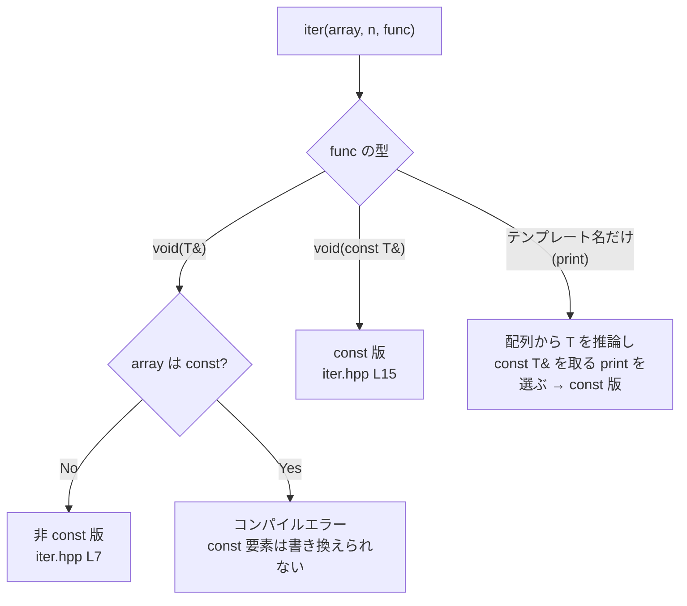

# CPP07 — 実装解説と学習記録

> **対象**: `cpp07/ex00`〜`ex02`（関数テンプレート / 関数ポインタとオーバーロード / クラステンプレート）
> **この文書の役割**: 実装を読む人のための解説書であり、同時に自分がどこで何を理解したかの学習記録である。
> **提出手続き・リポジトリ同一性の確認**は [REVIEW_NOTES.md](REVIEW_NOTES.md) に分離してある。ここでは扱わない。

## 読み方

| 読む人 | 推奨ルート |
|---|---|
| レビュワー | [§1 要点カード](#1-要点カード) → [§2 この課題の性質](#2-この課題の性質) → 該当 Exercise 節 → [§8 指摘されうる点](#8-指摘されうる点) |
| 実装者（復習） | [§4 テンプレートの基礎](#4-テンプレートの基礎) → ex00〜ex02 を順に読み、各節末の「学習メモ」で詰まった箇所を確認する |
| 防衛直前 | [§1](#1-要点カード) → [§6 の選択表](#6-ex01--iter) → [§9 想定質問](#9-想定質問) |

コード参照はすべてリポジトリ内の実ファイルへのリンクである。文章と実装が食い違っていたら**実装が正**。

---

## 1. 要点カード

```text
各 Exercise の中身:
        ex00  whatever.hpp  関数テンプレート swap / min / max
        ex01  iter.hpp      配列の全要素に関数を適用する関数テンプレート（2 本のオーバーロード）
        ex02  Array.hpp     new[] で確保する配列のクラステンプレート

テンプレートの実装はすべてヘッダ:
        使う側の .cpp から定義全体が見えないとインスタンス化できない
        「ヘッダに実装を書くと 0 点」の規則はテンプレートを除外している

ex00 の「等しいときは第 2 引数」:
        min: (a < b) ? a : b      a < b が偽（等しいを含む）なら b
        max: (a > b) ? a : b

ex01 の振り分け:
        関数が T& を取る         → 非 const 版   iter(T*,       const size_t, void (*)(T&))
        関数が const T& を取る   → const 版      iter(const T*, const size_t, void (*)(const T&))
        テンプレート名だけ（print）→ const 版   配列から T が決まり、合う print<T> が選ばれる

ex02 の資源管理:
        確保        new T[n]()          値初期化（int なら 0）。n == 0 なら確保しない
        コピー      新しい領域へ要素を 1 つずつ。途中の例外は delete[] して再送出
        代入        copy-and-swap       失敗しても代入先は元のまま
        解放        delete[]
        範囲外      std::out_of_range（std::exception の派生）。引数は size_t なので負値も弾く
```

ビルド条件は全 Exercise 共通で `c++ -Wall -Wextra -Werror -std=c++98`（[ex00/Makefile#L3-L4](cpp07/ex00/Makefile#L3)）。

---

## 2. この課題の性質

CPP07 のテーマは C++ templates であり、3 つの Exercise はすべて「型を引数にしたコード」を書く練習である。性質を決めているのは、ex00 の囲みにある次の 1 行と、共通ルールの 0 点条件の組み合わせである。

> Templates must be defined in the header files.
>
> — 公式 subject Version 10.1, Chapter IV（[cpp07/subject.txt](cpp07/subject.txt)）

> Any function implementation put in a header file (except for function templates) means 0 to the exercise.
>
> — 同 Chapter II

つまりこのモジュールでは、実装がヘッダにあること自体は違反ではなく、**なぜヘッダに置かなければならないのかを説明できること**が問われる。加えて ex01 は「const な要素と非 const な要素の両方をどう受けるか」、ex02 は「コピーと例外のもとで資源を正しく扱えるか」が実質的な論点になる。

EvalHub の評価表も、ex00 は複合型（比較演算子を持つ自作クラス）での動作、ex01 は評価者が持ち込む main での出力、ex02 は内部確保が `new[]` であることと範囲外アクセスの例外を確認する構成になっている（[cpp07/evals.txt](cpp07/evals.txt)）。

---

## 3. 共通ルール — 0 点と -42

subject Chapter II にある罰則。実装の良し悪し以前に、ここで評価が止まる。

| 条件 | 罰則 | 本実装 |
|---|---|---|
| `using namespace <ns_name>` または `friend` を使用 | -42 | 不使用 |
| STL のコンテナ／アルゴリズムを使用（許可は Module 08・09 のみ） | -42 | 不使用 |
| ヘッダ内に関数の実装を記述（関数テンプレートを除く） | 0 | ヘッダにあるのはすべてテンプレート |
| インクルードガードがない | 0 | 3 ヘッダとも設置 |
| `*printf()` / `*alloc()` / `free()` を使用 | 0 | 不使用 |
| C++11 以降・Boost・その他外部ライブラリを使用 | 0 | 不使用（`-pedantic-errors` でも通る） |

`std::string` / `std::cout` / `<stdexcept>` は STL のコンテナでもアルゴリズムでもないため、この制限には触れない。

0 点にはならないが必ず守るものとして、Orthodox Canonical Form（Module 02〜09）、メモリリーク禁止、出力メッセージの改行終端がある。ex02 の `Array` は 4 つの特殊メンバ関数をすべて明示している。

---

## 4. テンプレートの基礎

**テンプレートは型を引数にした設計図である。** 同じ処理を型ごとに書き写す代わりに、型の部分を `T` として 1 回だけ書く。

**インスタンス化はコンパイル時に起こる。** `::max(2, 3)` と書いた時点で、コンパイラが `max<int>` という具体的な関数を作る。テンプレートそのものは設計図なので、使われるまで機械語にならない。

**だから定義はヘッダに置く。** インスタンス化するには、使う側の翻訳単位（.cpp）から定義全体が見えていなければならない。定義を別の .cpp に分けると、使う側には宣言しか見えず、実体が作られないままリンク時に undefined reference になる。subject が任意ファイルとして挙げている `Array.tpp` は、実装を別ファイルに分けてヘッダ末尾で include する流儀のためのもので、本実装では使っていない。

**型の決まり方は関数とクラスで違う。**

| 種類 | 書き方 | T の決まり方 |
|---|---|---|
| 関数テンプレート | `::min(a, b)` | 引数の型から推論される |
| クラステンプレート | `Array<int> numbers(750);` | C++98 では推論できないので明示する |

**テンプレートの中で使った操作が、そのまま T への条件になる。** `min` は `<`、`max` は `>`、`swap` はコピー構築と代入、`Array` は引数なしの構築と代入を T に要求する。満たさない型で使うとインスタンス化の時点でコンパイルエラーになる。

Makefile はヘッダを依存関係に入れている（[ex02/Makefile#L11](cpp07/ex02/Makefile#L11)、[#L18](cpp07/ex02/Makefile#L18)）。実装がヘッダにある以上、これがないと `Array.hpp` を直しても `main.o` が作り直されない。

---

## 5. ex00 — swap / min / max

### subject の要求

関数テンプレート `swap`・`min`・`max` を実装する。`swap` は 2 引数の値を入れ替えて何も返さない。`min` / `max` は小さい方 / 大きい方を返し、**等しいときは第 2 引数を返す**。どんな型でも呼べること（条件は 2 引数が同じ型で、比較演算子をすべて持つこと）。subject には main の例と期待出力があり、例は `::swap(a, b)` のように `::` を付けて呼んでいる。

### 実装

ヘッダ 1 つで完結し、標準ライブラリを何も使わないので `#include` もない（[whatever.hpp](cpp07/ex00/whatever.hpp)）。

```cpp
template<typename T>
void swap(T& a, T& b) {
	T temp = a;
	a = b;
	b = temp;
}

template<typename T>
const T& min(const T& a, const T& b) {
	return (a < b) ? a : b;
}

template<typename T>
const T& max(const T& a, const T& b) {
	return (a > b) ? a : b;
}
```

main は subject の例をそのまま再現したうえで、値が等しい 2 変数を渡し、返ってきた参照のアドレスが第 2 引数と一致するかを確かめている（[ex00/main.cpp#L22-L27](cpp07/ex00/main.cpp#L22)）。

### なぜこの設計か

**「等しいときは第 2 引数」は条件式の向きで表現している。** `(a < b) ? a : b` は a が真に小さいときだけ a を返すので、等しいときは自然に b になる（[whatever.hpp#L11-L14](cpp07/ex00/whatever.hpp#L11)）。`<=` を使うと第 1 引数を返してしまう。

**戻り値は `const T&` にした。** コピーを作らず引数そのものを返すためで、`std::min` と同じ形である。これにより main で「第 2 引数が返った」ことをアドレス比較で検証できる。引数も `const T&` なので `::min(1, 2)` のように定数を渡せる。

**`swap` の一時変数を const にしていない**（[whatever.hpp#L6](cpp07/ex00/whatever.hpp#L6)）。評価表の複合型テストで使われるクラスは `operator=` が非 const 参照 `Awesome&` を受け取る形になっており、`const T temp` にすると `b = temp` がコンパイルできなくなる。非 const にしておけば、`a = b` も `b = temp` も非 const の左辺値を渡す形になり通る。

**課題文の main が `::` を付ける理由は ADL にある。** `std::string` を引数にすると、引数の型が属する名前空間 `std` も名前探索の対象になり、`std::min` / `std::swap` も候補に入る。実測した結果は次のとおり（macOS / Apple clang 21 と Ubuntu 24.04 / g++ 13・clang++ で同じ結果）。どちらの `swap` が呼ばれたかは、`whatever.hpp` のコピーの `swap` に出力を仕込んで確かめた。

| 呼び方 | 引数 | 結果 |
|---|---|---|
| `min(c, d)`（`::` なし） | `std::string` | `call to 'min' is ambiguous` でコンパイルエラー。候補に自作版と `std::min` が並ぶ |
| `swap(c, d)`（`::` なし） | `std::string` | コンパイルは通るが、より特殊化された `std::string` 用の `std::swap` が選ばれ、自作版は呼ばれない |
| `swap(a, b)` / `min(a, b)`（`::` なし） | `int` | 自作版が呼ばれる。基本型は名前空間に属さないので ADL が働かない |
| `::min(c, d)` | `std::string` | 自作版だけが呼ばれる |

### 学習メモ

- **ヘッダは使うものだけを include する。** 2026-07-21 の整理（`80d365f`）で、`whatever.hpp` から使っていない `#include <iostream>` と説明コメントを削除した。ヘッダは「単体で include できること」が要件だが、逆に要らないものまで引き込むと、include した側のコンパイルを重くし依存を増やすだけだと整理した。
- **`::` は飾りではなかった。** subject の main が `::swap` と書いている理由を、最終確認（2026-09-24）で `::` を外してコンパイルして確かめた。`min` はコンパイルエラー、`swap` は黙って `std::swap` が呼ばれる。後者は**エラーにならないぶん危ない**。自作関数と標準関数が同名のとき、何が呼ばれているかは実測しないと分からない、というのがここでの収穫だった。
- **評価用のクラスは、自分のテストより意地が悪い。** 非 const 参照を取る `operator=` を持つクラスで `swap` を試されると、`const T temp` では落ちる。テンプレートは「T に何を要求しているか」がコードの書き方で決まる、という感覚をここで得た。

---

## 6. ex01 — iter

### subject の要求

3 引数・戻り値なしの関数テンプレート `iter` を実装する。第 1 引数は配列のアドレス、第 2 引数は配列の長さ（**const な値**として渡す）、第 3 引数は各要素に対して呼ぶ関数。どんな型の配列でも動き、第 3 引数にはインスタンス化した関数テンプレートも渡せること。渡される関数は要素を const 参照で受けることも非 const 参照で受けることもあり、subject は次のように注意している。

> Think carefully about how to support both const and non-const elements in your iter function.
>
> — 公式 subject Version 10.1, Chapter V

### 実装

同名の関数テンプレートを 2 本用意し、オーバーロード解決で振り分けている（[iter.hpp#L6-L20](cpp07/ex01/iter.hpp#L6)）。

```cpp
template<typename T>
void iter(T* array, const size_t length, void (*func)(T&)) {
	if (array == NULL)
		return;
	for (size_t i = 0; i < length; i++)
		func(array[i]);
}

template<typename T>
void iter(const T* array, const size_t length, void (*func)(const T&)) {
	if (array == NULL)
		return;
	for (size_t i = 0; i < length; i++)
		func(array[i]);
}
```

どちらが選ばれるかは次のとおり。すべて実際にコンパイルして確認した。

| 呼び出し | 渡す関数の型 | 選ばれる版 | 理由 |
|---|---|---|---|
| `iter(values, 5, increment)` | `void(int&)` | 非 const 版 | const 版は `const int&` を取る関数を要求するので合わない |
| `iter(values, 5, print<int>)` | `void(const int&)` | const 版 | 非 const 版は配列から `T = int`、関数から `T = const int` と推論されて矛盾する |
| `iter(immutable, 2, print<int>)`（const 配列） | `void(const int&)` | const 版 | 両方が候補になるが、`const T*` の方がより特殊化されているので半順序で優先される |
| `iter(tab, 5, print)`（評価表の形） | テンプレート名だけ | const 版 | 下記 |
| `iter(immutable, 2, increment)`（const 配列） | `void(int&)` | なし | コンパイルエラー。const な要素を書き換える関数は渡せない |



### なぜこの設計か

**関数ポインタ型で受けることで、テンプレート名だけを渡す呼び方が通る。** 関数テンプレートの名前（オーバーロード集合）を引数に渡すと、その引数からは T を推論しない決まりになっている（非推論文脈）。T は配列から決まり、その後で `void (*)(const int&)` という型に合う `print<int>` をコンパイラが選ぶ。評価表のテストはまさにこの `iter(tab, 5, print)` の形で書かれている。

**トレードオフとして、受けられる関数は「戻り値が void で、参照で受け取るもの」に限られる。** 戻り値のある関数、値渡しの関数、関数オブジェクトは渡せない。subject が求めているのは const 参照と非 const 参照の関数なので要件は満たしている、と判断した。戻り値のある関数も受けたい場合の拡張は [§11](#11-評価中の改修依頼に備える) に置いた。

**`const size_t length`** は subject の "passed as a const value" への対応である。`NULL` の配列を渡されたら何もせずに戻る防御も入れてある。

### 学習メモ

- **汎用版から関数ポインタ版に書き換えた経緯がこの Exercise の中心だった。** 当初の実装は `template<typename T, typename F> void iter(T* array, size_t length, F func)` で、関数オブジェクトでも何でも受けられる形だった。2026-07-21 の整理（`80d365f`）で現在の 2 本に書き換えた。書き換え前の `iter.hpp` を `80d365f^` から取り出し、評価表と同じ `iter(tab, 5, print)` でコンパイルすると `no matching function for call to 'iter'` になる（`print<int>` と明示すれば旧版でも通る）。**F は「渡された関数の型」から推論するしかないのに、テンプレート名だけでは型が 1 つに決まらない**、というのが原因である。汎用にしたつもりが、評価の呼び方を受けられていなかった。
- **同じ整理で長さを `const size_t` にした。** 旧版は `size_t length` で、subject の "passed as a const value" を満たしていなかった。仕様の単語 1 つずつを型に写す、という読み方をここで意識した。
- **旧 `iter.hpp` にはテスト用の関数（`printElement`、`increment` など）が同居していた。** 課題のヘッダに課題外の関数があると、何が提出物なのかが曖昧になる。テスト用の関数は main.cpp 側に移した。
- **const 配列に書き換える関数を渡すとコンパイルエラーになるのは、欠陥ではなく性質である。** 2 本の候補がどちらも T の推論で脱落する（`deduced conflicting types for parameter 'T'`）。const を守る判断をコンパイラがしてくれる。

---

## 7. ex02 — Array

### subject の要求

型 `T` の要素を持つクラステンプレート `Array` を作る。引数なしなら空の配列、`unsigned int n` なら n 個の要素をデフォルトで初期化した配列。コピー構築と代入のあと、元とコピーのどちらを変更しても他方に影響しないこと。メモリ確保には `new[]` を必ず使い、先行確保（必要以上を前もって確保すること）は禁止。未確保の領域には決してアクセスしない。`[]` で要素にアクセスでき、範囲外なら `std::exception` を投げる。`size()` は引数を取らず、インスタンスを変更しない。subject にはヒントとして次の 1 行がある。

> Tip: Try to compile `int * a = new int();` then display `*a`.
>
> — 公式 subject Version 10.1, Chapter VI

### 実装

メンバは先頭要素へのポインタと要素数の 2 つだけである（[Array.hpp#L10-L11](cpp07/ex02/Array.hpp#L10)）。要件との対応は次のとおり。

| 要件 | 実装 | 場所 |
|---|---|---|
| 引数なし → 空の配列 | ポインタ `NULL`、サイズ 0 | [Array.hpp#L24-L25](cpp07/ex02/Array.hpp#L24) |
| n 個をデフォルトで初期化 | `new T[n]()`（値初期化）。n が 0 なら確保しない | [#L27-L32](cpp07/ex02/Array.hpp#L27) |
| コピーしたら独立 | 新しい領域を確保し、要素を 1 つずつコピー | [#L34-L48](cpp07/ex02/Array.hpp#L34) |
| 代入したら独立 | copy-and-swap | [#L50-L56](cpp07/ex02/Array.hpp#L50) |
| `new[]` 必須・先行確保禁止 | n 個ちょうどを `new[]` | [#L29](cpp07/ex02/Array.hpp#L29)、[#L36](cpp07/ex02/Array.hpp#L36) |
| 未確保領域にアクセスしない | `[]` で毎回範囲チェック | [#L63](cpp07/ex02/Array.hpp#L63)、[#L70](cpp07/ex02/Array.hpp#L70) |
| 範囲外で `std::exception` | `std::out_of_range` を送出 | [#L64](cpp07/ex02/Array.hpp#L64)、[#L71](cpp07/ex02/Array.hpp#L71) |
| `size()` は引数なし・不変 | const メンバ関数 | [#L76-L78](cpp07/ex02/Array.hpp#L76) |
| リークしない | デストラクタで `delete[]` | [#L58-L60](cpp07/ex02/Array.hpp#L58) |

コピーと代入の中心部分（[Array.hpp#L34-L56](cpp07/ex02/Array.hpp#L34)）:

```cpp
Array(const Array& other) : _elements(NULL), _size(0) {
	if (other._size > 0) {
		T* elements = new T[other._size];
		try {
			for (size_t i = 0; i < other._size; i++) {
				elements[i] = other._elements[i];
			}
		} catch (...) {
			delete[] elements;
			throw;
		}
		_elements = elements;
	}
	_size = other._size;
}

Array& operator=(const Array& other) {
	if (this != &other) {
		Array copy(other);
		swap(copy);
	}
	return *this;
}
```

`swap` は private のメンバ関数で、2 つの `Array` のポインタとサイズだけを入れ替える（要素はコピーしない）。ex00 の `swap` とは別物である（[Array.hpp#L13-L21](cpp07/ex02/Array.hpp#L13)）。

### なぜこの設計か

**`new T[n]()` の `()` が「デフォルトで初期化」の答えである。** `()` を付けると値初期化になり、int なら 0、クラスならデフォルトコンストラクタで初期化される。付けないと int は不定値のまま残る。subject の Tip（`new int()` を表示してみよ）はこの違いを指している。n が 0 のときは確保せず `NULL` のままにする。`delete[] NULL` は何もしないので安全である。

**コピーは深いコピーでなければならない。** コンパイラが作るコピーはポインタの値だけを写す浅いコピーで、2 つの `Array` が同じ領域を共有する。片方の変更がもう片方にも見え、デストラクタで同じ領域を 2 回 `delete[]` する。

**コピーコンストラクタの try/catch は、例外が出たときのリークを塞ぐためにある。** コンストラクタが途中で例外を投げると、オブジェクトは完成していないのでデストラクタが呼ばれない。確保した領域を解放できるのは、その場の catch だけである。メンバへの代入（[#L45](cpp07/ex02/Array.hpp#L45)）は全要素のコピーが成功してから行う。

**代入は copy-and-swap にした。** 先に相手の完全なコピーを作り、成功してから自分と中身を交換する。古い領域は `copy` 側に移り、if ブロックを抜けるときに `copy` のデストラクタが解放する。コピーの途中で例外が出ても自分はまだ何も変わっていないので、代入先は元のまま残る（強い例外保証）。

**`operator[]` は 2 つある。** 非 const 版は `T&` を返して読み書きでき、const 版は `const T&` を返して読むだけにする。const 参照で受け取った `Array` からは const 版しか呼べない（[ex02/main.cpp#L6](cpp07/ex02/main.cpp#L6) の `printArray` がその例）。const な `Array` の要素へ代入するとコンパイルエラーになることも確認した。

**範囲チェックは `index >= _size` の 1 つで足りる。** 引数が `size_t`（符号なし）なので、`-2` のような負の値は巨大な正の数に変換され、同じ判定で弾ける。サイズ 0 の配列では、どの index も範囲外になる。送出する `std::out_of_range` は `std::logic_error` を経て `std::exception` を継承しているので、`catch (const std::exception&)` で受けられる。

### 学習メモ

2026-07-21 の整理（`80d365f`）で、`Array.hpp` はほぼ書き直しになった。書き換え前の版を `80d365f^` から取り出し、現在の版と同じテストを当てて違いを確かめてある。

- **サイズ指定コンストラクタ**: 旧版は `new T[n]` のあと、ループで `_elements[i] = T();` を代入していた。これだと T に「代入できること」まで要求してしまう。`new T[n]()` なら確保と初期化が 1 回で済み、代入は要らない。subject の Tip の意味をここで理解した。
- **コピーコンストラクタ**: 旧版には try/catch がなかった。要素の代入が 2 個目で例外を投げるクラスでコピーさせると、Linux の valgrind で `12 bytes in 1 blocks are definitely lost` が出る（確保した 3 要素分の領域が誰にも解放されない）。現在の版では 0 である。**コンストラクタの中の例外はデストラクタが拾ってくれない**、というのはこれで腹に落ちた。
- **代入演算子**: 旧版は `delete[] _elements;` してから新しく確保してコピーしていた。同じクラスで、サイズ 1 の配列にサイズ 3 の配列を代入させて途中で失敗させると、旧版では代入先のサイズが 3 に変わった状態で残る（中身は途中までしかコピーされていない）。現在の copy-and-swap ではサイズ 1 のまま残る。**「先に壊してから作る」順番そのものが問題**だった。
- **デバッグ出力とテスト用メンバの削除**: 旧版はコンストラクタやデストラクタで `std::cout` にログを出し、public メンバに `fill()` と `display()` を持っていた。どちらも課題の要求にない。テストの都合は main 側で持つ、と整理して削除した（main の `printArray` がその置き換え）。
- **2026-08-24 の追加（`e04faff`）**: main に `Array<int>(3)` の値初期化の確認と、`Array<std::string>` でのコピー・代入・const アクセスのテストを加えた。評価表が「単純型と複合型の両方で動くことを学生に示させる」としていることへの対応である。
- **配布 main.cpp の件（2026-09-24）**: EvalHub に添付されている ex02 用の main.cpp は、`#include <Array.hpp>` と山括弧で書かれ、`rand` / `srand` を使うのに `<cstdlib>` を include していない。macOS（libc++）では他のヘッダ経由で宣言が届いて通るが、Ubuntu（libstdc++）では g++ で `'rand' was not declared in this scope`、clang++ で `use of undeclared identifier 'srand'` になる。**include し忘れが環境によって隠れる**という典型例で、自分のヘッダが「使うものは自分で include する」方針なのはこのためだと再確認した（詳細は [§8.2](#82-配布-maincpp-はそのままではコンパイルできない)）。

---

## 8. 指摘されうる点

自分で把握している「ここは突っ込まれうる」箇所。隠さず説明する方針。

### 8.1 subject の例自体に表記の食い違いがある

ex00 の subject は、コード例では `"min( a, b ) = "` とスペース入りで出力しているのに、期待出力は `min(a, b) = 2` になっている。本実装は期待出力に合わせた（[ex00/main.cpp#L12](cpp07/ex00/main.cpp#L12)）。検証スクリプトも期待出力のブロックと完全一致で照合している。

### 8.2 配布 main.cpp はそのままではコンパイルできない

EvalHub 添付の main.cpp（ex02 用）を無修正で `ex02/main.cpp` に差し替えると、次の 2 点でコンパイルに失敗する。どちらも配布ファイル側の問題である。

- `#include <Array.hpp>` が山括弧。山括弧はシステムと `-I` の場所しか探さないので、Makefile を変えない限り見つからない。
- `<cstdlib>` がない。Linux（libstdc++）では `rand` / `srand` が未宣言になる。

2 行目を `#include "Array.hpp"`・`#include <cstdlib>`・`#include <ctime>` の 3 行に置き換えれば、Linux の valgrind でもエラー・リーク 0、終了コード 0 で通る。直すのはテスト用ファイルなので、提出物を編集することにはならない。修正済みの同等品を [tests/cpp05_09/array_eval.cpp](tests/cpp05_09/array_eval.cpp) に置いてある。

`Array.hpp` に `#include <cstdlib>` を足せば無修正でも通るようになるが、ヘッダが自分では使わないものを include することになるので採用していない。なお配布ファイルは、値が一致しなかったときの `return 1` の経路で `mirror` を解放しない。この経路は通らないが、Array 側のリークと混同しないこと。

### 8.3 `iter` は戻り値が void の関数しか受けない

[§6](#6-ex01--iter) のとおり、評価表の `iter(tab, 5, print)` を通すために関数ポインタ型で受けている。その代償として、戻り値のある関数・値渡しの関数・関数オブジェクトは渡せない。subject の要求（const 参照と非 const 参照の関数）は満たしている。拡張が必要なら、void 版を残したまま戻り値の型 `R` を持つ版を足せる（[§11](#11-評価中の改修依頼に備える)）。

### 8.4 `Array(unsigned int n)` に `explicit` がない

`Array<int> a = 5;` のような暗黙の変換が通る。subject の要求にはないため付けていない。付けても本実装の main と配布 main はどちらも `Array<int> a(5)` の形なので動作は変わらないことを確認してある。

### 8.5 ex01 の main は increment の結果を表示していない

[ex01/main.cpp#L38](cpp07/ex01/main.cpp#L38) で非 const 版を通しているが、書き換えた結果は出力していない（values は {1, 2, 3, 4, 5} になる）。見せる必要があれば直後に `::iter(values, 5, print<int>);` を足す。

### 8.6 ex01 のテスト用クラス `Awesome` は OCF を明示していない

[ex01/main.cpp#L5-L13](cpp07/ex01/main.cpp#L5) の `Awesome` は、評価表のテストコードと同じ形（値 42 を持つだけ）にしている。デフォルトコンストラクタ以外はコンパイラが生成するものに任せている。提出物の本体ではなくテストの道具なので現状のままにしているが、Module 02〜09 の OCF 規則を厳密に読むレビュワーには、この判断として説明する。

---

## 9. 想定質問

「こう答える」ではなく「なぜそうなっているか」として整理したもの。

**Q. テンプレートの実装をヘッダに書くのは 0 点条件に当たらないのか。**
当たらない。0 点条件は「関数テンプレートを除く」と明記しており、クラステンプレートのメンバ関数もテンプレートである。むしろ、使う側から定義が見えないとインスタンス化できないので、ヘッダに置くしかない。

**Q. インスタンス化はいつ起こるのか。実行時のコストは。**
コンパイル時。`::max(a, b)` を int で呼んだ時点で `max<int>` が作られる。実行時のコストはない。

**Q. なぜ `::swap` と書くのか。**
`std::string` を渡すと ADL で `std::min` / `std::swap` が候補に入るため。`min` は同じ形同士で曖昧になってコンパイルエラー、`swap` は `std::string` 用の `std::swap` が選ばれて自作版が呼ばれない。`::` を付けるとグローバル名前空間の自作版だけが対象になる（[§5](#5-ex00--swap--min--max) に実測表）。

**Q. `min` / `max` はなぜ `const T&` を返すのか。危なくないのか。**
コピーを作らず引数そのものを返すため。式の中ですぐ使う分には問題ない。ただし一時オブジェクトを渡した結果を参照の変数で持ち続けると、式の終わりで一時オブジェクトが消えて参照が宙に浮く。`std::min` も同じ性質を持つ。

**Q. ex01 で `print` を `<int>` なしで渡せるのはなぜか。**
テンプレート名だけを渡すと、その引数からは T を推論しない決まりだから。配列から `T = int` が決まり、`void (*)(const int&)` に合う `print<int>` をコンパイラが選ぶ。非 const 版は `void (*)(int&)` が必要で、`const T&` を取る `print` からは作れないので脱落する。

**Q. `template<typename T, typename F>` で何でも受ける方が汎用的では。**
汎用的だが、評価表の `iter(tab, 5, print)` が通らない。F はテンプレート名だけからは推論できないため。実際に当初はその形で書いており、書き換えた経緯を [§6 の学習メモ](#学習メモ-1) に残してある。

**Q. `new T[n]()` と `new T[n]` の違いは。**
`()` があると値初期化で、int は 0、クラスはデフォルトコンストラクタで初期化される。ないと int は不定値。subject の Tip の意味はこれである。

**Q. 先行確保（preventive allocation）の禁止とは。**
必要な分より前もって多めに確保すること（`std::vector` の reserve のような）を指す。本実装は n 個ちょうどだけを確保し、0 個なら確保しない。

**Q. なぜコピーコンストラクタと代入演算子を自分で書くのか。**
コンパイラが作るものはポインタの値を写す浅いコピーで、2 つの Array が同じ領域を共有する。変更が相手に見えるうえ、デストラクタで 2 回 `delete[]` して壊れる。

**Q. copy-and-swap の利点は。**
先に完全なコピーを作ってから中身を交換するので、コピー中に例外が出ても代入先は元のまま残る（強い例外保証）。古い領域は一時オブジェクトのデストラクタが解放するので、解放漏れもない。旧版との違いは [§7 の学習メモ](#学習メモ-2) で実測してある。

**Q. 自己代入 `a = a` は。**
`this != &other` で何もしない。main でも参照を経由した自己代入で値が壊れないことを確かめている（[ex02/main.cpp#L47-L49](cpp07/ex02/main.cpp#L47)）。

**Q. `numbers[-2]` はなぜ例外になるのか。**
引数が `size_t` なので `-2` は巨大な正の数に変換され、`index >= _size` で弾かれる。負の値のための別の判定は要らない。

**Q. なぜ `std::exception` で catch できるのか。**
`std::out_of_range` は `std::logic_error` を経て `std::exception` を継承しているから。

**Q. const 版の `operator[]` はなぜ必要か。**
const な Array からは const メンバ関数しか呼べないから。const 版は `const T&` を返すので、読めるが書き込めない。

**Q. `size()` が `unsigned int` ではなく `size_t` を返すのは。**
要素数と添字を同じ型で扱うため。コンストラクタは subject の指定どおり `unsigned int` を受け取るが、内部では `size_t` で持ち、`operator[]` の引数も `size_t` にそろえてある。

**Q. `Array<int> tmp = numbers;` は代入演算子か。**
違う。宣言と同時の初期化なのでコピーコンストラクタが呼ばれる。代入演算子は、すでにある変数に代入するときに呼ばれる。

---

## 10. 検証手順と実際の出力

以下は 2026-09-24 に、`cpp07/` をリポジトリ外へコピーしてビルドした実際の出力である。環境は macOS / Apple clang 21 と Ubuntu 24.04（Docker）/ g++ 13.3.0・clang++ / Valgrind 3.22.0。cpp07 のソースは commit `e04faff` 以降変更されていない。

### ビルド

```console
$ cd cpp07/ex02 && make re
c++ -Wall -Wextra -Werror -std=c++98 -c main.cpp -o obj/main.o
c++ -Wall -Wextra -Werror -std=c++98 obj/main.o -o array_test
$ make
make: Nothing to be done for `all'.
```

ex00（`whatever`）/ ex01（`iter`）も同様に警告 0 で通り、2 回目の `make` は再リンクしない。3 つの main とも `-pedantic` を足しても通る。3 ヘッダとも単体で include でき、2 回続けて include してもコンパイルできる（インクルードガード）。

### ex00

```console
$ ./whatever
a = 3, b = 2
min(a, b) = 2
max(a, b) = 3
c = chaine2, d = chaine1
min(c, d) = chaine1
max(c, d) = chaine2
equal min returns second: yes
equal max returns second: yes
```

先頭 6 行は subject の期待出力と完全一致。評価表の複合型テスト（比較演算子一式と非 const 参照の `operator=` を持つクラスで、`swap` / `max` / `min` を `::` なしで呼ぶ）は `4 2` / `4` / `2` を出す。

### ex01

```console
$ ./iter
0
1
2
3
4
42
42
42
42
42
10
20
```

評価表の main（`iter(tab, 5, print)` の形）は [tests/cpp05_09/iter_eval.cpp](tests/cpp05_09/iter_eval.cpp) で再現しており、`0`〜`4` と `42` × 5 を出す。`print(T&)` を `print<const int>` / `print<Awesome>` で渡す書き方、`print(T&)` を型指定なしで渡す書き方でも、g++ と clang++ の両方で同じ結果になることを確認した。

### ex02

```console
$ ./array_test
Empty size: 0
Default initialization: Array[3]: {0, 0, 0}
Original: Array[4]: {99, 2, 3, 4}
Copy: Array[4]: {1, 2, 3, 4}
Assigned: Array[4]: {1, 2, 3, 4}
Self assignment: 99
Bounds: Array index out of bounds
String original: Array[2]: {changed, beta}
String copy: Array[2]: {alpha, beta}
String assigned: Array[2]: {alpha, beta}
Const access: alpha
Const bounds: Array index out of bounds
```

追加で確認したもの:

| 確認内容 | 結果 |
|---|---|
| 配布 main.cpp（修正版、[tests/cpp05_09/array_eval.cpp](tests/cpp05_09/array_eval.cpp)） | 終了コード 0 |
| 配布 main.cpp を無修正で使用 | macOS: `-I.` があれば通る / Linux: `rand` 未宣言でコンパイル不可（[§8.2](#82-配布-maincpp-はそのままではコンパイルできない)） |
| 要素のコピーが例外を投げる型（[tests/cpp05_09/array_throw.cpp](tests/cpp05_09/array_throw.cpp)） | コピー失敗時もリークなし、代入先のサイズは変わらない |
| 動的メモリを持つ自作クラスの Array | 深いコピーで独立、valgrind でリーク 0 |
| const な Array の要素への代入 | コンパイルエラー（期待どおり） |
| `-1` / `-2` / `size()` / サイズ 0 の `[0]` | いずれも `std::out_of_range` |

### メモリリーク

```console
$ valgrind --leak-check=full --show-leak-kinds=all --errors-for-leak-kinds=all --error-exitcode=42 -q ./array_test
$ echo $?
0
```

Ubuntu で `whatever` / `iter` / `array_test` と上記の評価用テストすべてが valgrind のエラー・リーク 0。macOS でも `leaks --atExit` で 0 leaks。

### レビュワーが自分で確かめるとき

提出ファイルを書き換えずに main を差し替える形が安全である。

```bash
c++ -Wall -Wextra -Werror -std=c++98 -Icpp07/ex01 \
  tests/cpp05_09/iter_eval.cpp -o /tmp/cpp07-iter && /tmp/cpp07-iter

c++ -Wall -Wextra -Werror -std=c++98 -Icpp07/ex02 \
  tests/cpp05_09/array_eval.cpp -o /tmp/cpp07-array && /tmp/cpp07-array; echo $?
```

CPP05〜09 をまとめて検証するなら [scripts/verify_cpp05_09.sh](scripts/verify_cpp05_09.sh) を使う。

---

## 11. 評価中の改修依頼に備える

subject Chapter VII に、評価中に軽微な改修を求められることがあると明記されている。この課題で来そうなものと、触る場所を先に決めておく。以下はすべてコンパイルと実行を確認済み。

| 依頼されそうなこと | 触る場所 | やること |
|---|---|---|
| min / max を「等しいときは第 1 引数」にする | [whatever.hpp#L11-L19](cpp07/ex00/whatever.hpp#L11) | `return (b < a) ? b : a;` / `return (b > a) ? b : a;` に変える |
| increment の効果を見せる | [ex01/main.cpp#L38](cpp07/ex01/main.cpp#L38) | 直後に `::iter(values, 5, print<int>);` を足す（`1`〜`5` が出る） |
| 戻り値のある関数も iter に渡したい | [iter.hpp](cpp07/ex01/iter.hpp) | void 版を**残したまま** `template<typename T, typename R> void iter(T*, const size_t, R (*)(T&))` と const 版を足す。void 版を消すと `iter(tab, 5, print)` の形で R を推論できなくなる |
| 範囲外の例外を自作クラスにする | [Array.hpp#L62-L74](cpp07/ex02/Array.hpp#L62) | `class OutOfBoundsException : public std::exception` を public に置き、`virtual const char* what() const throw()` を定義して 2 か所の throw を差し替える。`<stdexcept>` は `<exception>` でよい |
| 自作クラスで動くことを見せる | [ex02/main.cpp](cpp07/ex02/main.cpp) | OCF を持つ小さなクラスで `Array<Box>` を作り、コピー後に元を変えてもコピー側が変わらないことを出力する |
| 暗黙の変換を禁止する | [Array.hpp#L27](cpp07/ex02/Array.hpp#L27) | `explicit` を付ける |

---

## 12. つまずきやすい点の一覧

| 誤解 | 正しい理解 |
|---|---|
| テンプレートの実装をヘッダに書くと 0 点 | 0 点条件はテンプレートを除外している。むしろヘッダに置かないとインスタンス化できない |
| テンプレートは実行時に型を判断する | インスタンス化はコンパイル時。型ごとに別の関数・クラスが作られる |
| `::swap` の `::` は好みの問題 | `std::string` では ADL で `std::min` / `std::swap` が候補に入る。付けないと曖昧エラーか、自作版が呼ばれない |
| 等しいときの戻り値はどちらでもよい | subject は第 2 引数を指定している。`<` の向きで表現する |
| `swap` の一時変数は const にした方が安全 | 非 const 参照の `operator=` を持つ型で `b = temp` が通らなくなる |
| `typename F` で受ければ何でも渡せる | テンプレート名だけを渡すと F を推論できない。評価表の呼び方が通らない |
| const 配列には const 版の iter が必ず使える | 書き換える関数（`T&`）を渡すとコンパイルエラーになる。正しい挙動 |
| `new T[n]` で要素は初期化される | int は不定値。`new T[n]()` で値初期化する |
| コピーはメンバをそのまま写せばよい | ポインタを写すと領域を共有し、二重 `delete[]` になる。新しい領域に要素をコピーする |
| コンストラクタで例外が出てもデストラクタが片付ける | 未完成のオブジェクトのデストラクタは呼ばれない。確保した領域はその場で解放する |
| 代入は古い領域を消してからコピーすればよい | 途中で失敗すると代入先が壊れる。copy-and-swap で先にコピーを作る |
| 負の index には別の判定が要る | 引数を `size_t` にすれば巨大な正の数になり、`>= size` で弾ける |
| `delete` と `delete[]` はどちらでもよい | `new[]` には `delete[]`。取り違えると未定義動作 |
| 配布 main.cpp がコンパイルできないのは Array の問題 | 山括弧 include と `<cstdlib>` の欠落という配布ファイル側の問題 |

---

## 13. 関連資料

- [cpp07/subject.txt](cpp07/subject.txt) — 課題原文の写し（Exercise 以降）
- [cpp07/evals.txt](cpp07/evals.txt) — EvalHub の評価表
- [tests/cpp05_09/](tests/cpp05_09/) — 評価表・配布 main を再現したテスト（`iter_eval.cpp` / `array_eval.cpp` / `array_throw.cpp`）
- [REVIEW_NOTES.md](REVIEW_NOTES.md) — CPP05〜09 横断の防衛ノートと提出前チェック
- [COMPREHENSIVE_EVALUATION.md](COMPREHENSIVE_EVALUATION.md) — 監査レポートと provenance
- [CPP05_COMPLETE_DEFENSE_GUIDE.md](CPP05_COMPLETE_DEFENSE_GUIDE.md) / [CPP06_COMPLETE_DEFENSE_GUIDE.md](CPP06_COMPLETE_DEFENSE_GUIDE.md) — 同形式の CPP05 / CPP06 版
