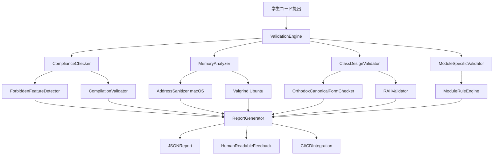

# 設計書

## 概要

C++演習検証・テストフレームワークは、42 スクールの C++カリキュラム（cpp00-cpp04）に特化した自動検証システムです。学生のコード提出物を C++98 標準、42 スクール固有の制約、メモリ管理、クラス設計パターンの観点から包括的に検証し、教育的価値の高いフィードバックを提供します。

## アーキテクチャ

### システム全体構成



### レイヤー構成

1. **プレゼンテーション層**: CLI インターフェース、Web API
2. **アプリケーション層**: ValidationEngine、ReportGenerator
3. **ドメイン層**: 各種 Validator、Checker、Analyzer
4. **インフラストラクチャ層**: ファイルシステム、外部ツール統合

## コンポーネントとインターフェース

### 1. ValidationEngine（検証エンジン）

**責任**: 検証プロセス全体の調整と管理

```cpp
class ValidationEngine {
public:
    ValidationResult validate(const SubmissionPath& path, const ModuleConfig& config);
    void setValidators(const std::vector<IValidator*>& validators);
    void setReportGenerator(IReportGenerator* generator);

private:
    std::vector<IValidator*> validators_;
    IReportGenerator* reportGenerator_;
    ValidationContext context_;
};
```

### 2. IValidator（検証インターフェース）

**責任**: 各種検証機能の共通インターフェース

```cpp
class IValidator {
public:
    virtual ~IValidator() = default;
    virtual ValidationResult validate(const ValidationContext& context) = 0;
    virtual std::string getName() const = 0;
    virtual Priority getPriority() const = 0;
};
```

### 3. ComplianceChecker（準拠性チェッカー）

**責任**: C++98 標準準拠と禁止機能の検出

```cpp
class ComplianceChecker : public IValidator {
public:
    ValidationResult validate(const ValidationContext& context) override;

private:
    ForbiddenFeatureDetector forbiddenDetector_;
    CompilationValidator compilationValidator_;

    bool checkCpp98Compliance(const std::string& sourceCode);
    std::vector<ForbiddenFeature> detectForbiddenFeatures(const std::string& sourceCode);
};
```

### 4. MemoryAnalyzer（メモリ解析器）

**責任**: メモリリーク検出とメモリ管理検証

```cpp
class MemoryAnalyzer : public IValidator {
public:
    ValidationResult validate(const ValidationContext& context) override;

private:
    std::unique_ptr<IMemoryTool> memoryTool_;

    MemoryAnalysisResult runAddressSanitizer(const std::string& executable);
    MemoryAnalysisResult runValgrind(const std::string& executable);
    IMemoryTool* selectMemoryTool(const Platform& platform);
};
```

### 5. ClassDesignValidator（クラス設計検証器）

**責任**: OOP 原則とクラス設計パターンの検証

```cpp
class ClassDesignValidator : public IValidator {
public:
    ValidationResult validate(const ValidationContext& context) override;

private:
    bool validateOrthodoxCanonicalForm(const ClassDefinition& classDef);
    bool validateRAIIPrinciples(const ClassDefinition& classDef);
    bool validateEncapsulation(const ClassDefinition& classDef);
    std::vector<ClassDefinition> extractClassDefinitions(const std::string& sourceCode);
};
```

### 6. ModuleSpecificValidator（モジュール固有検証器）

**責任**: 各モジュール（cpp00-cpp04）固有の要件検証

```cpp
class ModuleSpecificValidator : public IValidator {
public:
    ValidationResult validate(const ValidationContext& context) override;
    void setModuleRules(const ModuleType& module, const ModuleRules& rules);

private:
    std::map<ModuleType, ModuleRules> moduleRules_;

    ValidationResult validateCpp00Requirements(const ValidationContext& context);
    ValidationResult validateCpp01Requirements(const ValidationContext& context);
    ValidationResult validateCpp02Requirements(const ValidationContext& context);
};
```

## データモデル

### ValidationResult（検証結果）

```cpp
struct ValidationResult {
    bool isValid;
    std::vector<Issue> issues;
    std::map<std::string, std::string> metrics;
    std::chrono::system_clock::time_point timestamp;
    std::string validatorName;
};
```

### Issue（問題）

```cpp
struct Issue {
    enum Severity { CRITICAL, MAJOR, MINOR };

    Severity severity;
    std::string category;
    std::string message;
    std::string messageJa;  // 日本語メッセージ
    std::string fileName;
    int lineNumber;
    std::string suggestion;
    std::string suggestionJa;  // 日本語提案
    std::vector<std::string> learningResources;
};
```

### ValidationContext（検証コンテキスト）

```cpp
struct ValidationContext {
    std::string submissionPath;
    ModuleType moduleType;
    Platform targetPlatform;
    std::vector<std::string> sourceFiles;
    std::vector<std::string> headerFiles;
    CompilerConfig compilerConfig;
    std::map<std::string, std::string> metadata;
};
```

### ModuleRules（モジュールルール）

```cpp
struct ModuleRules {
    std::vector<std::string> requiredConcepts;
    std::vector<std::string> forbiddenFeatures;
    std::vector<std::string> requiredPatterns;
    std::map<std::string, std::string> specificChecks;
    std::vector<std::string> learningObjectives;
};
```

## エラーハンドリング

### エラー分類

1. **システムエラー**: ファイルアクセス、外部ツール実行失敗
2. **検証エラー**: コンパイルエラー、メモリリーク、禁止機能使用
3. **設定エラー**: 不正なモジュール設定、無効なパス

### エラー処理戦略

```cpp
class ValidationException : public std::exception {
public:
    ValidationException(const std::string& message, ErrorCode code);
    const char* what() const noexcept override;
    ErrorCode getErrorCode() const;

private:
    std::string message_;
    ErrorCode errorCode_;
};

enum class ErrorCode {
    FILE_NOT_FOUND,
    COMPILATION_FAILED,
    MEMORY_TOOL_ERROR,
    INVALID_MODULE_CONFIG,
    EXTERNAL_TOOL_UNAVAILABLE
};
```

### 回復戦略

- **グレースフルデグラデーション**: 一部の検証が失敗しても他の検証を継続
- **代替ツール使用**: valgrind が利用できない場合は AddressSanitizer を使用
- **部分的結果報告**: 完全な検証ができない場合も利用可能な結果を報告

## テスト戦略

### 単体テスト

```cpp
// ComplianceCheckerのテスト例
TEST(ComplianceCheckerTest, DetectsForbiddenCpp11Features) {
    ComplianceChecker checker;
    std::string codeWithAuto = "auto x = 42;";

    ValidationResult result = checker.validate(createContext(codeWithAuto));

    EXPECT_FALSE(result.isValid);
    EXPECT_EQ(1, result.issues.size());
    EXPECT_EQ("FORBIDDEN_CPP11_AUTO", result.issues[0].category);
}
```

### 統合テスト

```cpp
TEST(ValidationEngineIntegrationTest, ValidatesCompleteSubmission) {
    ValidationEngine engine;
    engine.setValidators({
        new ComplianceChecker(),
        new MemoryAnalyzer(),
        new ClassDesignValidator()
    });

    ValidationResult result = engine.validate("test/cpp01/ex00", ModuleConfig::cpp01());

    EXPECT_TRUE(result.isValid);
    EXPECT_EQ(0, countCriticalIssues(result.issues));
}
```

### エンドツーエンドテスト

- 実際の学生提出物サンプルを使用
- macOS/Ubuntu 両環境での動作確認
- CI/CD パイプラインでの自動実行
- パフォーマンステスト（大量ファイル処理）

### テストデータ

```
test/
├── samples/
│   ├── cpp00/
│   │   ├── valid/          # 正常なコードサンプル
│   │   ├── invalid/        # 問題のあるコードサンプル
│   │   └── edge-cases/     # エッジケース
│   ├── cpp01/
│   └── ...
├── fixtures/
│   ├── memory-leaks/       # メモリリークのあるコード
│   ├── forbidden-features/ # 禁止機能を使用したコード
│   └── class-design/       # クラス設計の問題があるコード
└── expected-results/       # 期待される検証結果
```

## パフォーマンス考慮事項

### 並列処理

- 複数ファイルの並列検証
- 独立した検証器の並列実行
- スレッドプールによるリソース管理

### キャッシュ戦略

- コンパイル結果のキャッシュ
- 静的解析結果のキャッシュ
- モジュールルールのメモリキャッシュ

### リソース管理

- メモリ使用量の監視と制限
- 外部プロセスのタイムアウト設定
- 一時ファイルの自動クリーンアップ

## セキュリティ考慮事項

### コード実行の安全性

- サンドボックス環境での実行
- 実行時間制限の設定
- システムリソースへのアクセス制限

### 入力検証

- ファイルパスのサニタイゼーション
- コードインジェクション対策
- ファイルサイズ制限

## 国際化対応

### 多言語サポート

```cpp
class MessageLocalizer {
public:
    std::string getMessage(const std::string& key, const std::string& locale);
    void loadMessages(const std::string& locale, const std::string& filePath);

private:
    std::map<std::string, std::map<std::string, std::string>> messages_;
};
```

### サポート言語

- 日本語（ja）: 主要対象言語
- 英語（en）: 国際的な利用のため
- 将来的に他言語への拡張可能な設計
