# cpp00
## Source File
[sourceFile](./cpp00/src/cpp00)

 

- - -

 

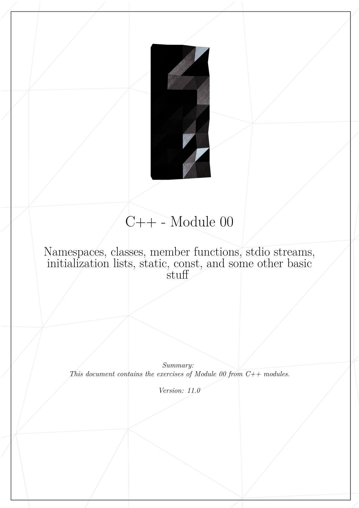
* 

 

- - -

 

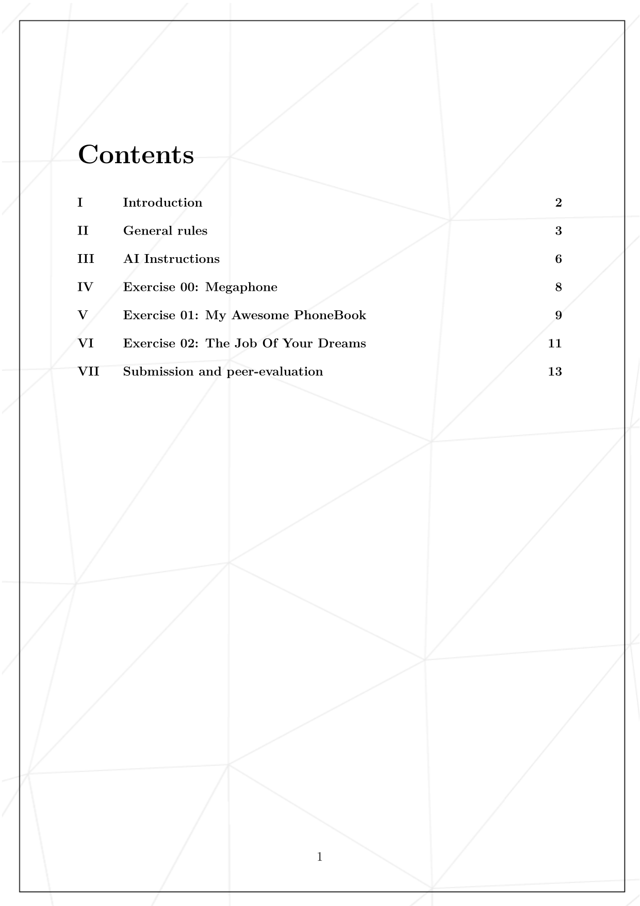
* 

 

- - -

 

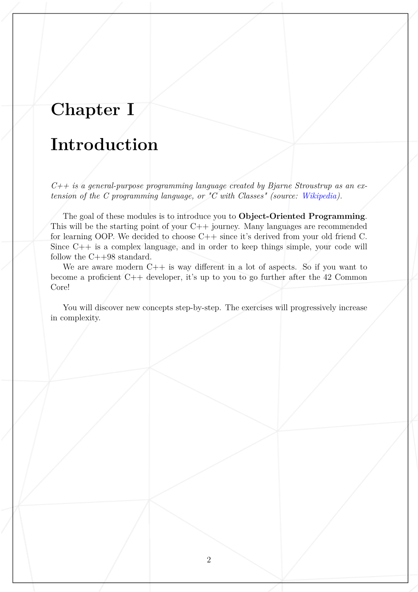
* 

 

- - -

 

* 

 

- - -

 

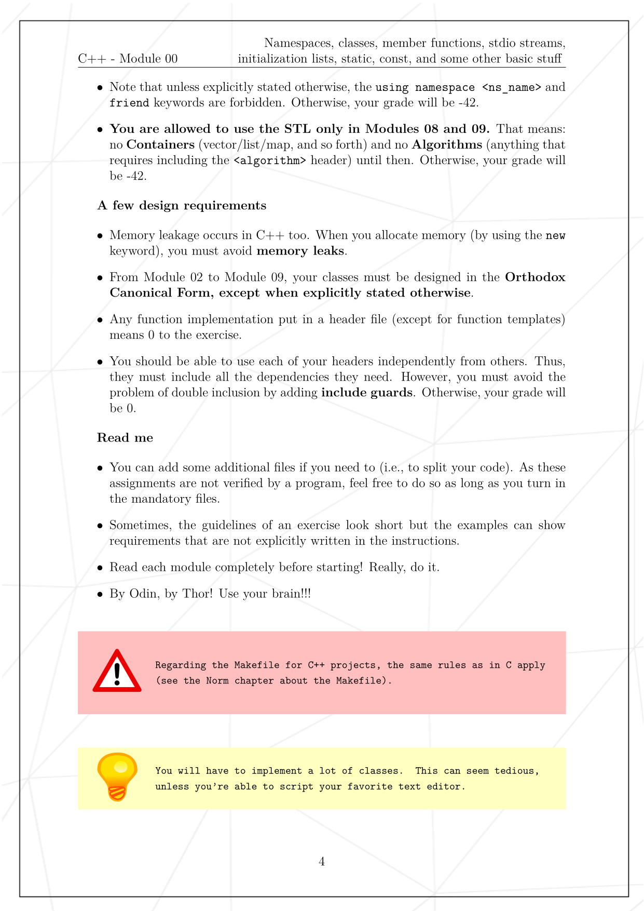
* 

 

- - -

 

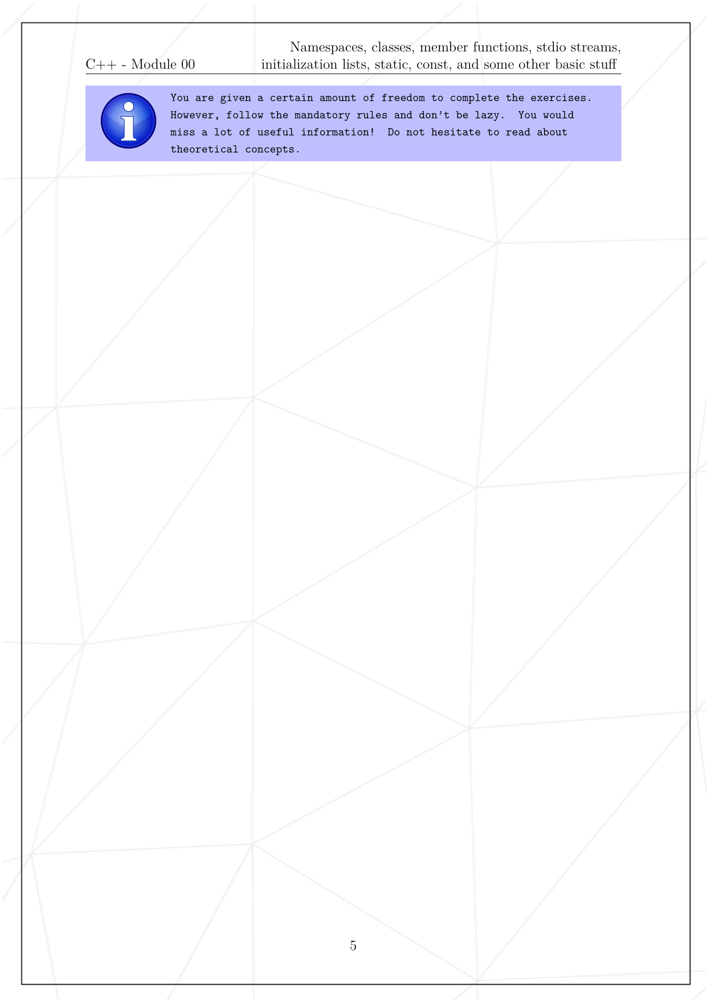
* 

 

- - -

 

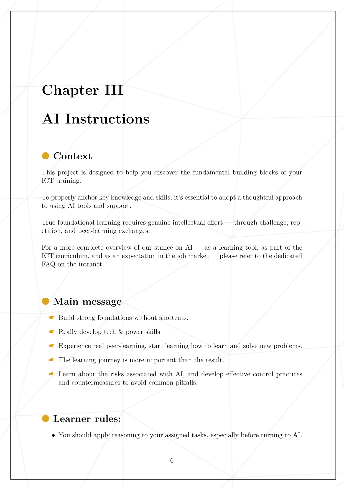
* 

 

- - -

 

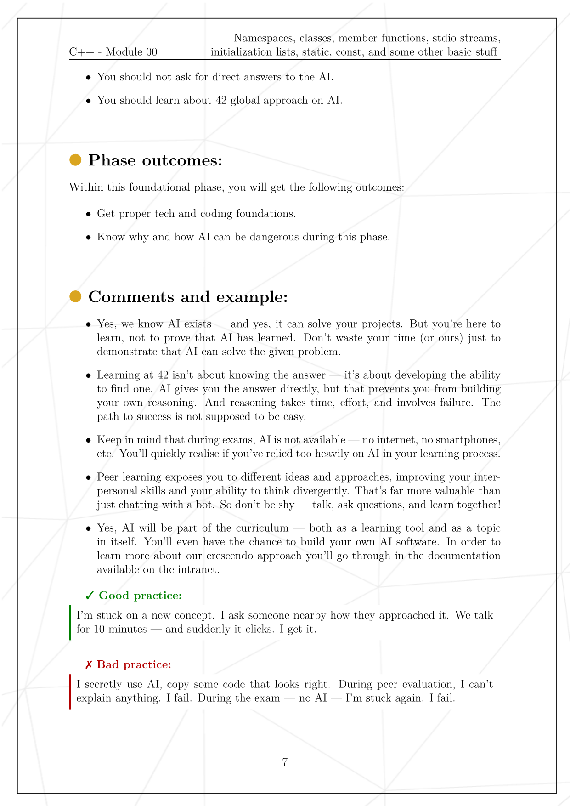
* 

 

- - -

 

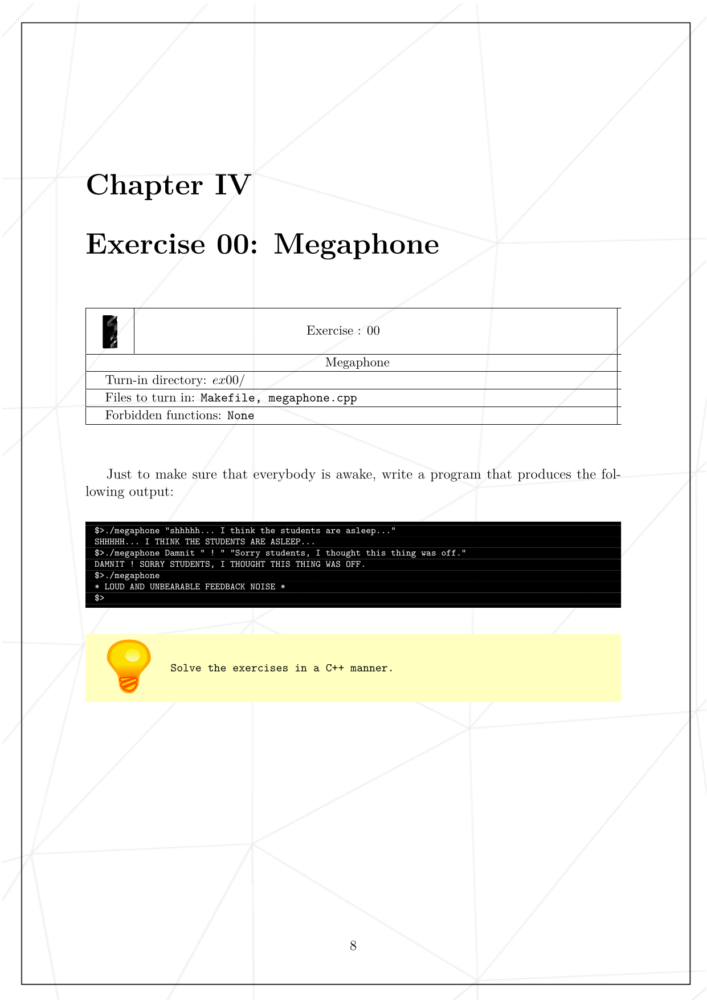
* 

 

- - -

 

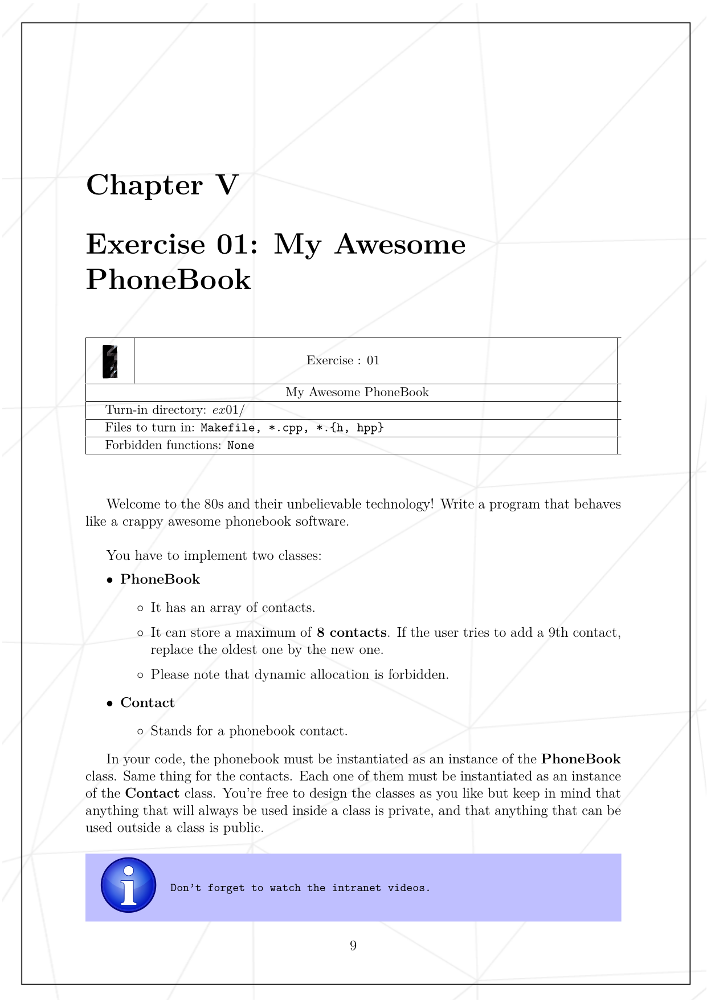
* 

 

- - -

 

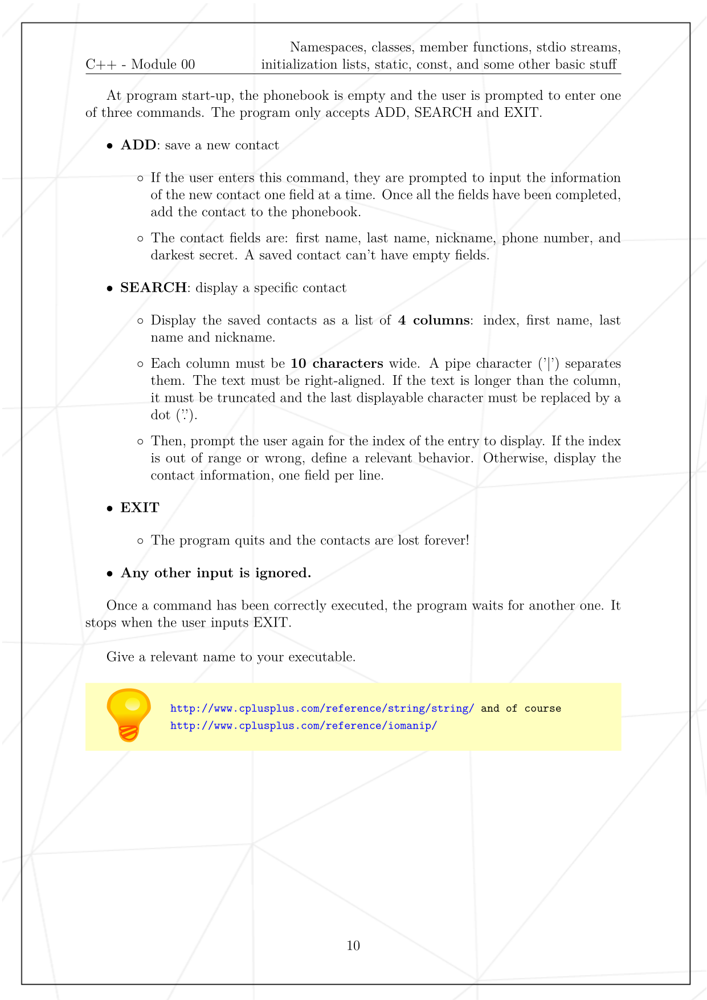
* 

 

- - -

 

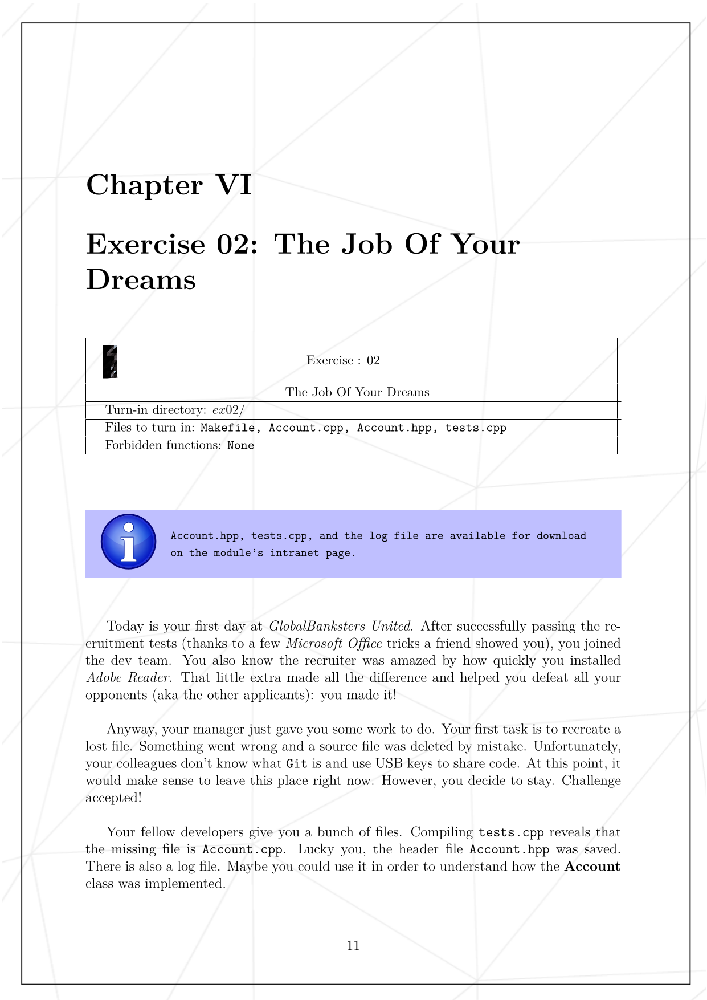
* 

 

- - -

 

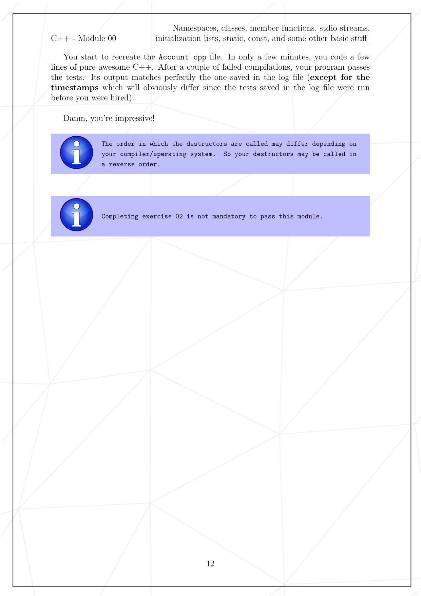
* 

 

- - -

 

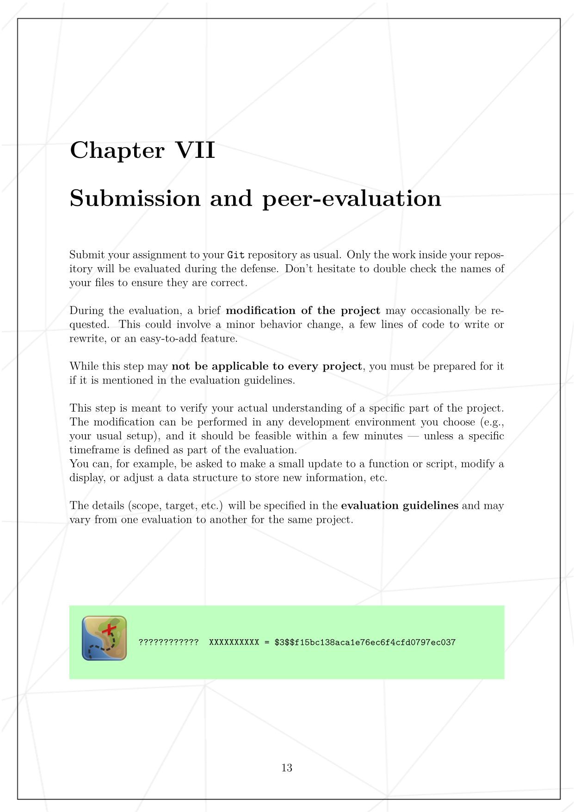
* 

 

