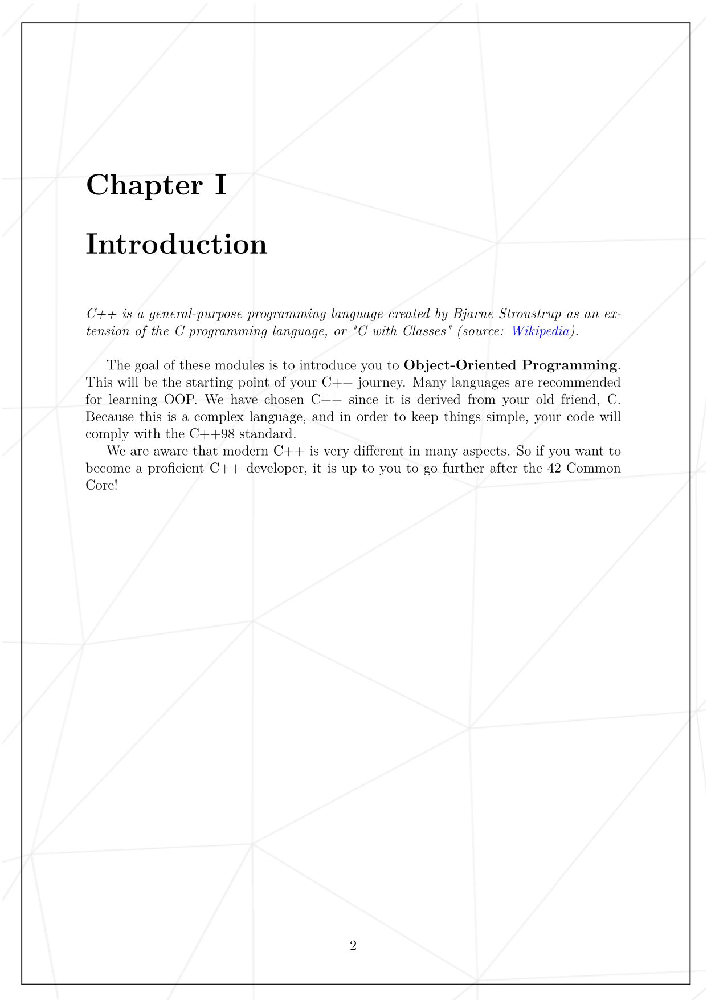
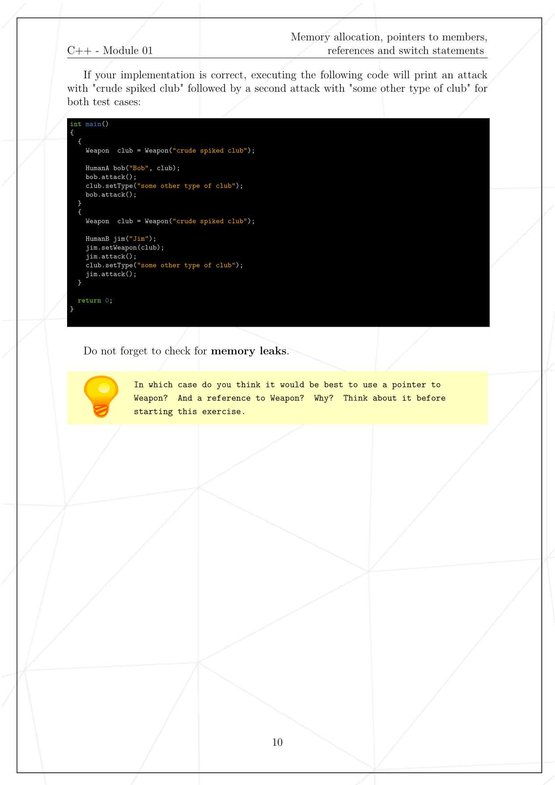

# cpp01
## Source File
[sourceFile](./cpp01/src/cpp01)

 

- - -

 

* 

 

- - -

 

* 

 

- - -

 

* 

 

- - -

 

* 

 

- - -

 

* 

 

- - -

 

* 

 

- - -

 

* 

 

- - -

 

* 

 

- - -

 

* 

 

- - -

 

* 

 

- - -

 

* 

 

- - -

 

* 

 

- - -

 

* 

 

- - -

 

* 

 

- - -

 

* 

 

- - -

 

* 

 

