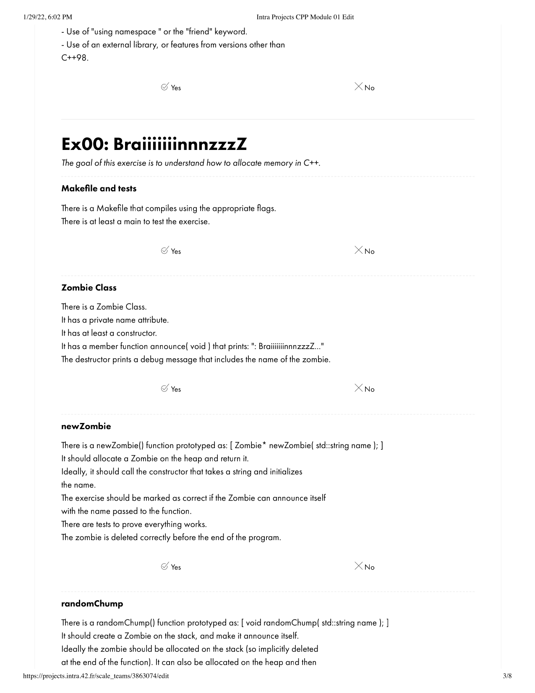

# ng_4_cpp_module_01
## Source File
[sourceFile](./ng_4_cpp_module_01/src/ng_4_cpp_module_01)

 

- - -

 

* 

 

- - -

 

* 

 

- - -

 

* 

 

- - -

 

* 

 

- - -

 

* 

 

- - -

 

* 

 

- - -

 

* 

 

- - -

 

* 

 

