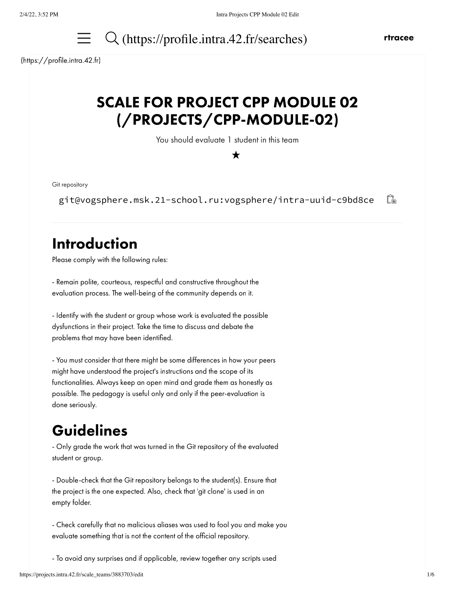
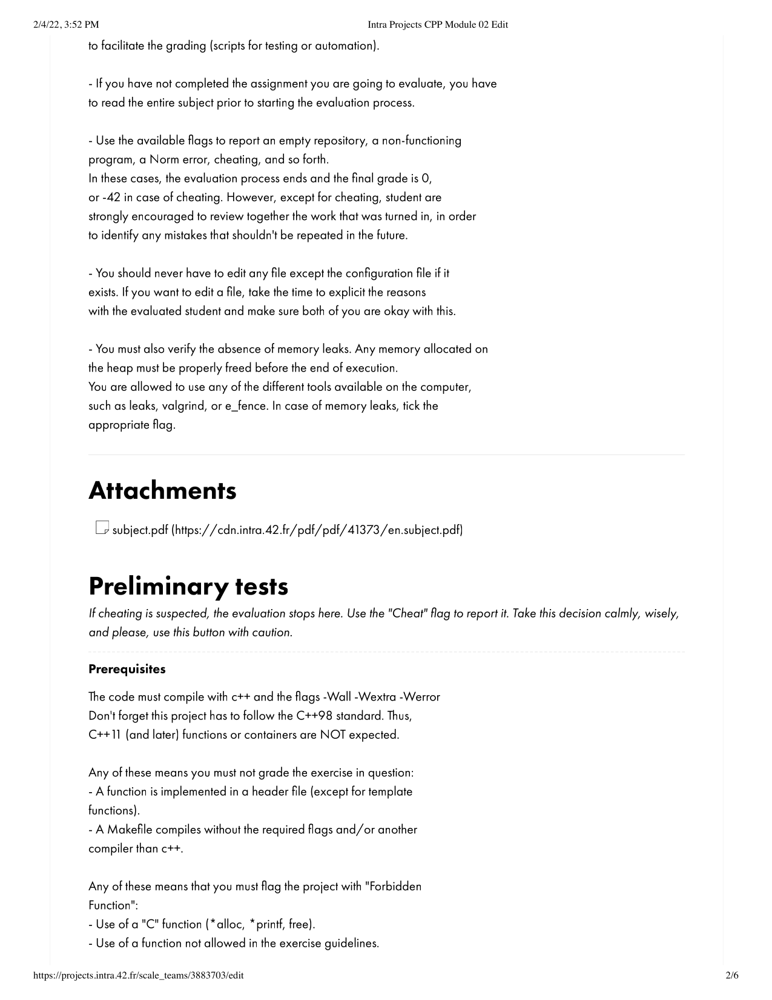
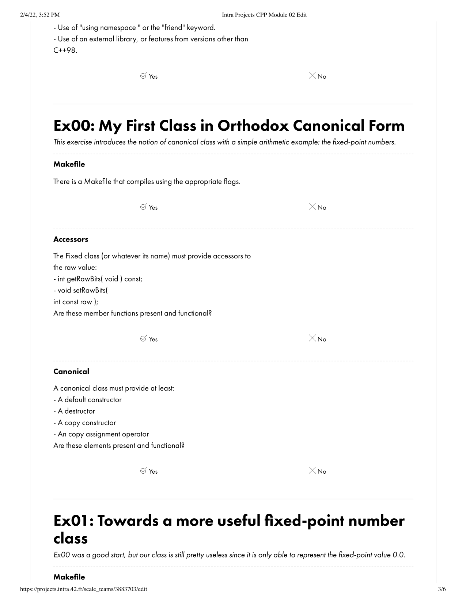

# ng_4_cpp_module_02
## Source File
[sourceFile](./ng_4_cpp_module_02/src/ng_4_cpp_module_02)

 

- - -

 

* 

 

- - -

 

* 

 

- - -

 

* 

 

- - -

 

* 

 

- - -

 

* 

 

- - -

 

* 

 

