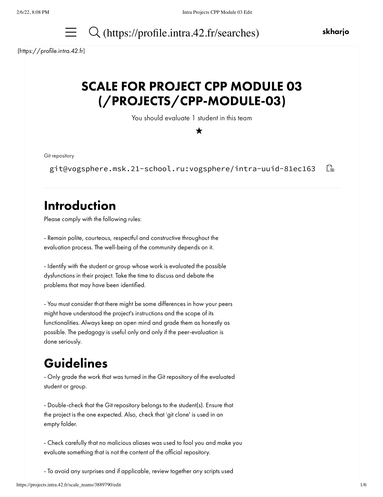
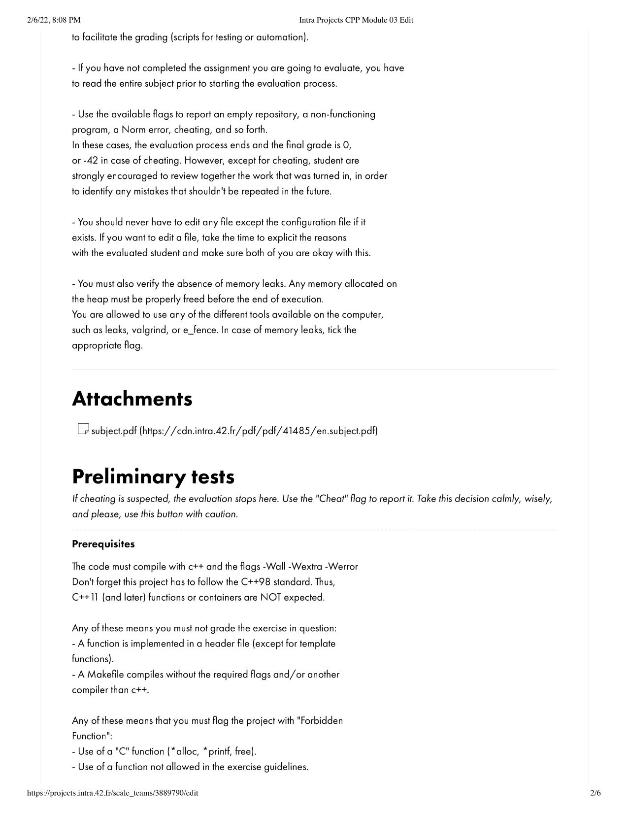
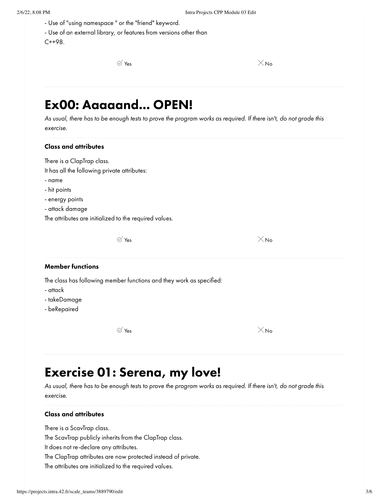
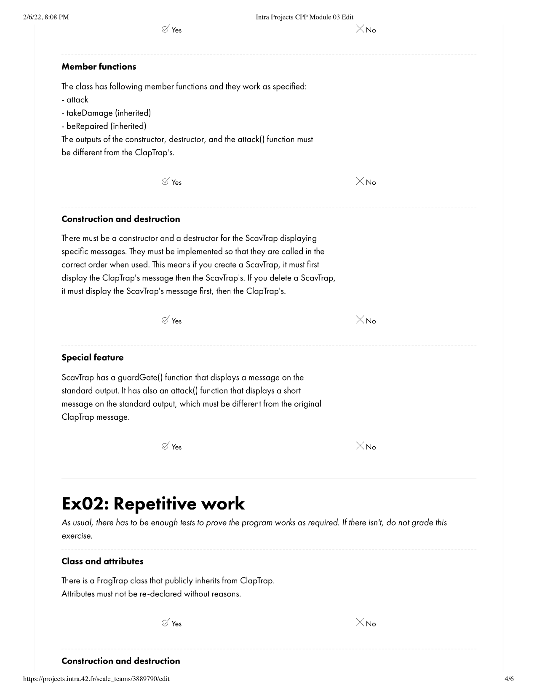

# ng_4_cpp_module_03
## Source File
[sourceFile](./ng_4_cpp_module_03/src/ng_4_cpp_module_03)

 

- - -

 

* 

 

- - -

 

* 

 

- - -

 

* 

 

- - -

 

* 

 

- - -

 

* 

 

- - -

 

* 

 

