# cpp04
## Source File
[sourceFile](./cpp04/src/cpp04)

 

- - -

 

* 

 

- - -

 

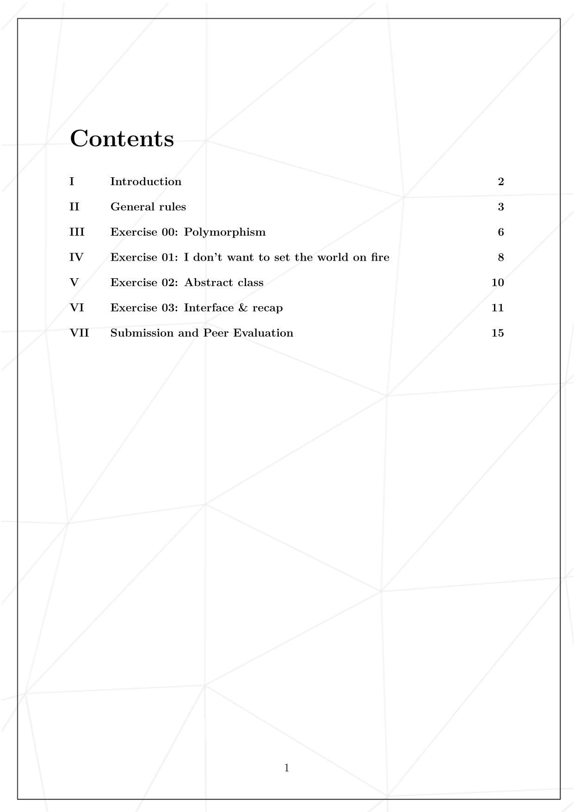
* 

 

- - -

 

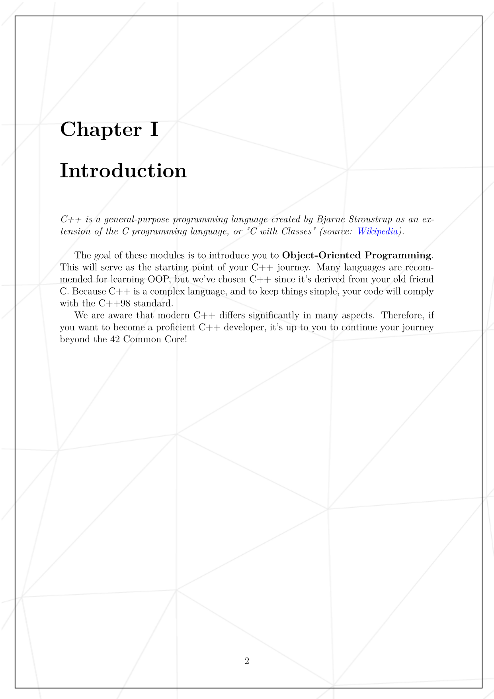
* 

 

- - -

 

* 

 

- - -

 

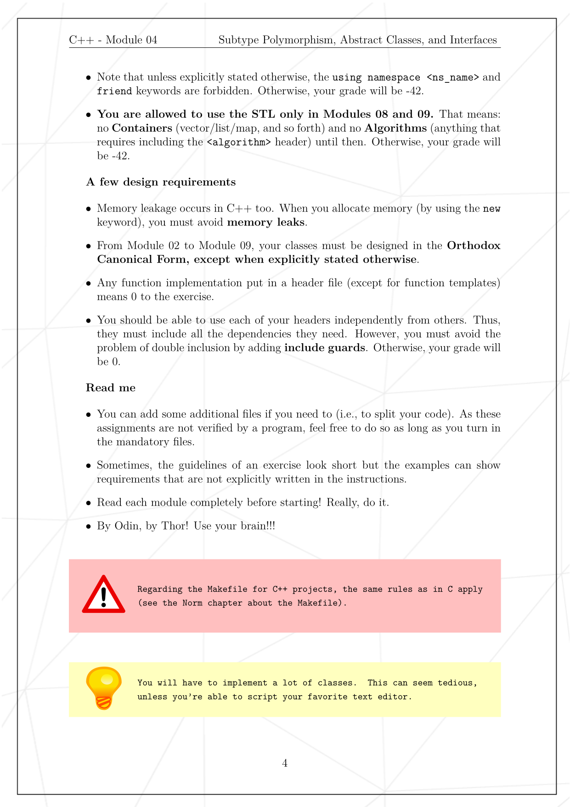
* 

 

- - -

 

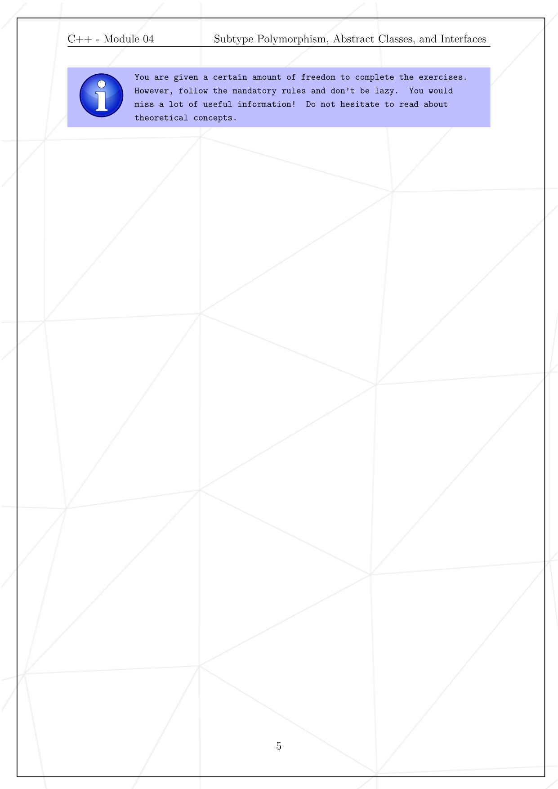
* 

 

- - -

 

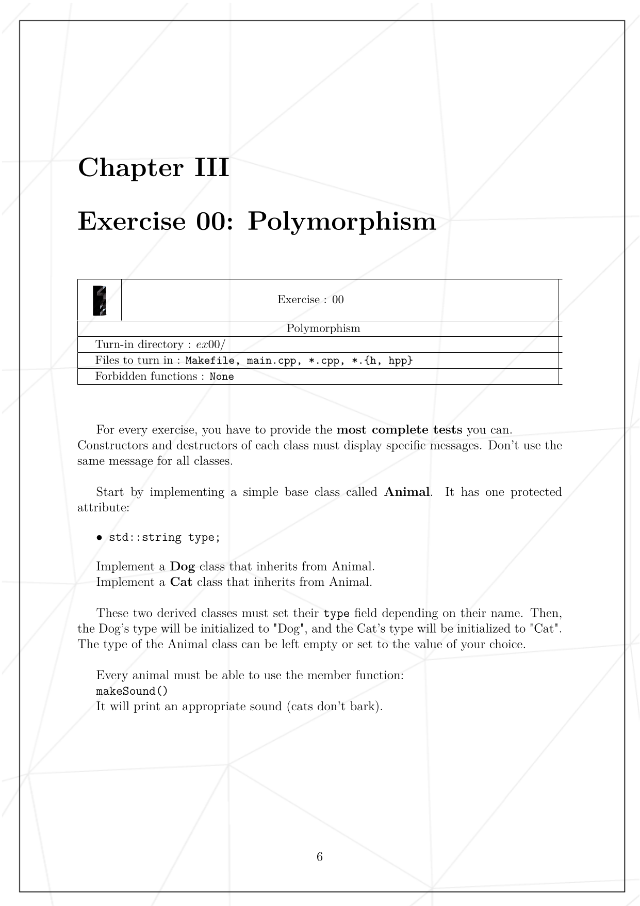
* 

 

- - -

 

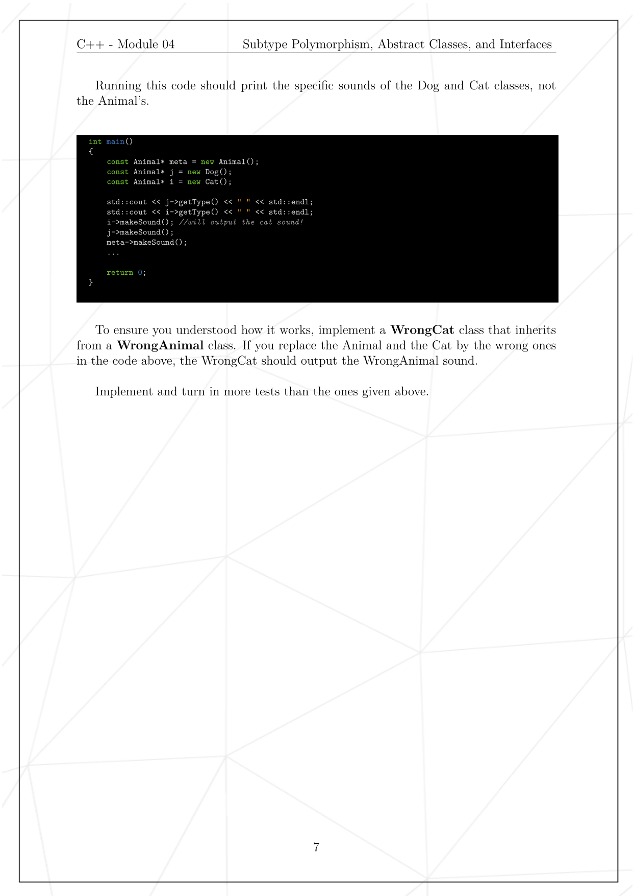
* 

 

- - -

 

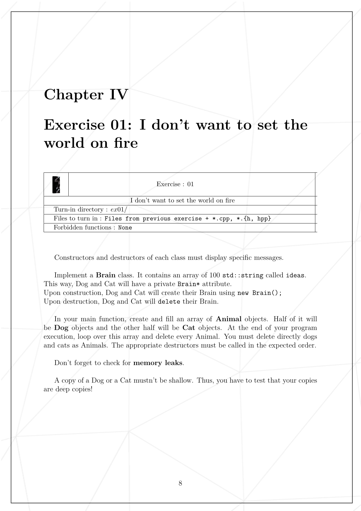
* 

 

- - -

 

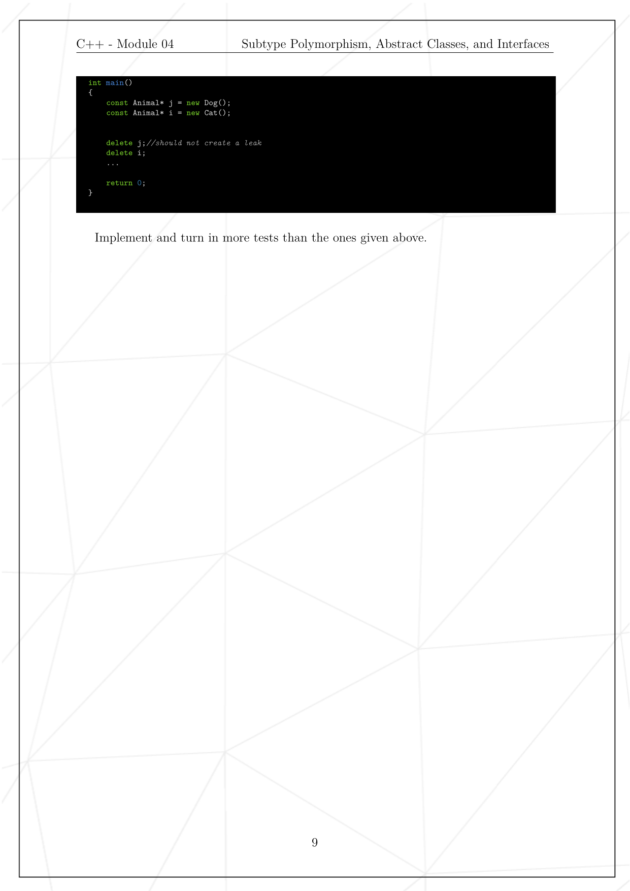
* 

 

- - -

 

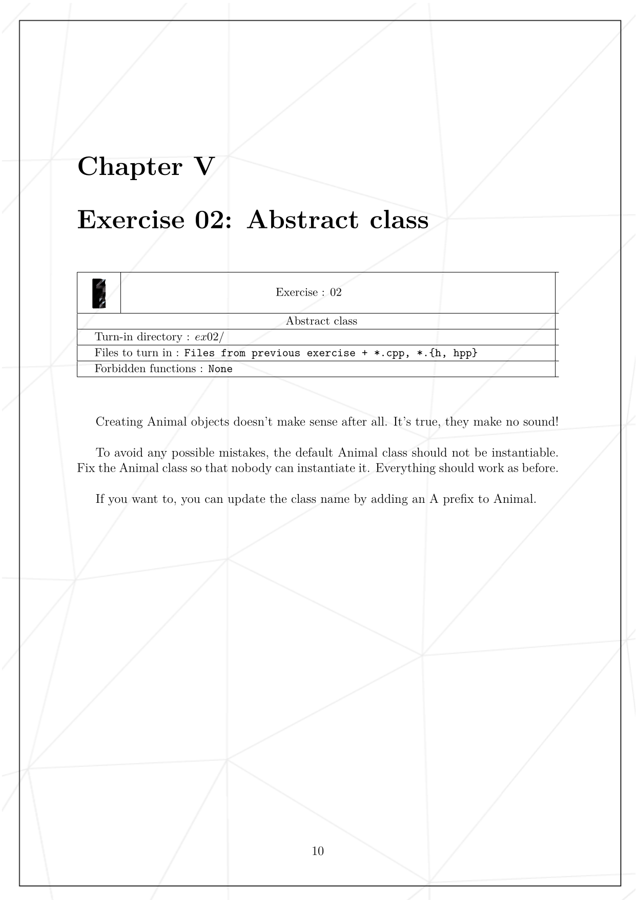
* 

 

- - -

 

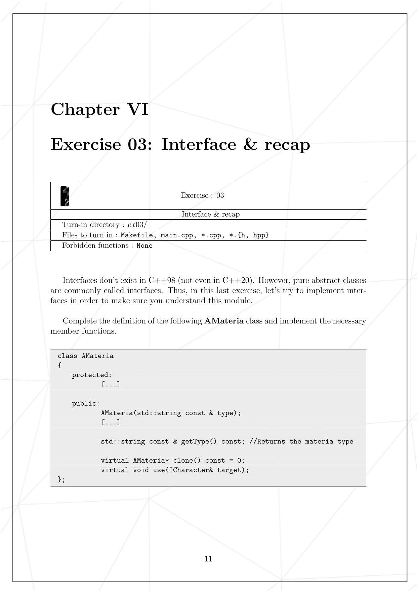
* 

 

- - -

 

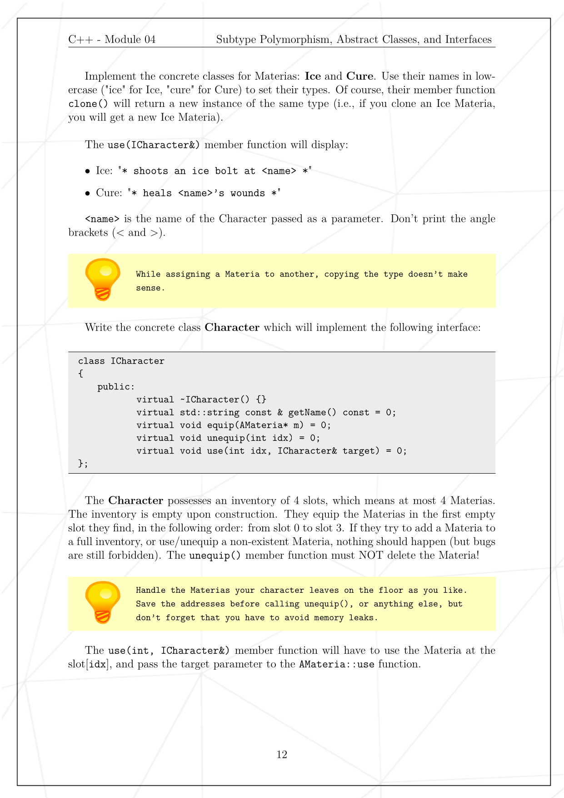
* 

 

- - -

 

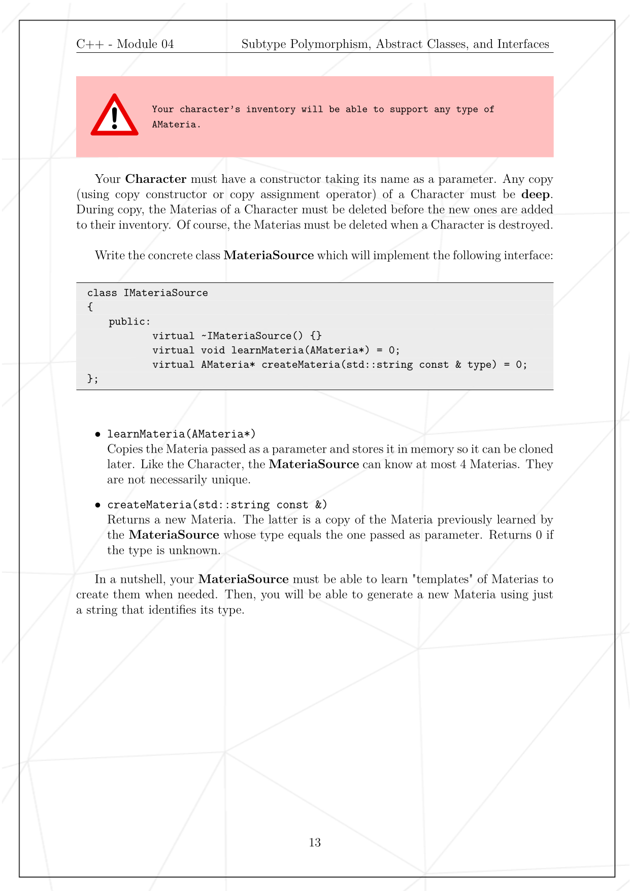
* 

 

- - -

 

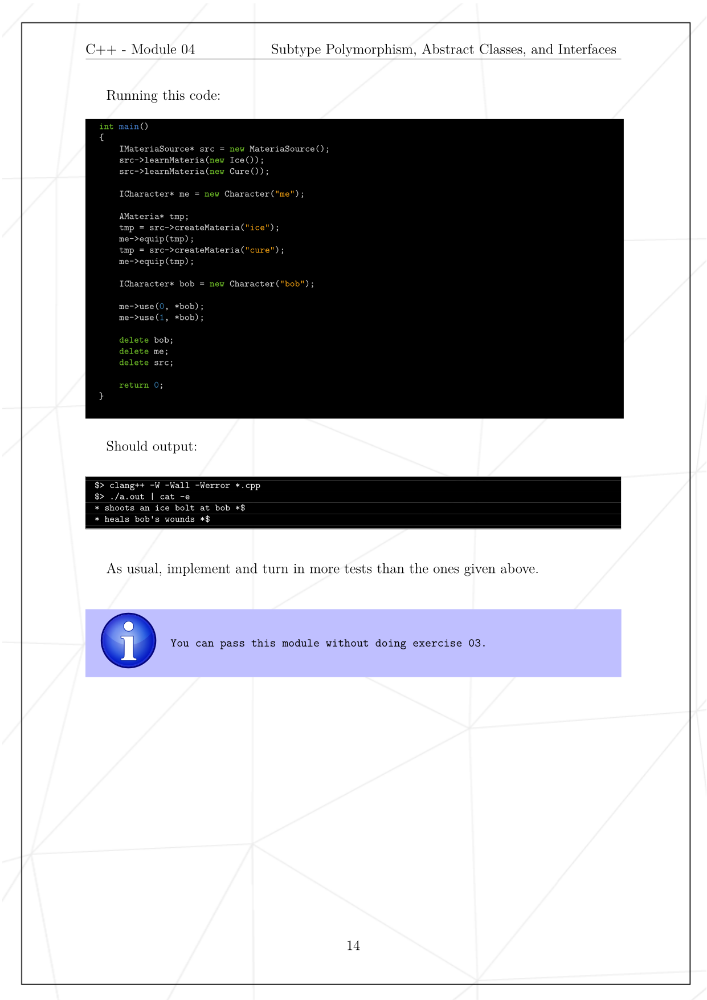
* 

 

- - -

 

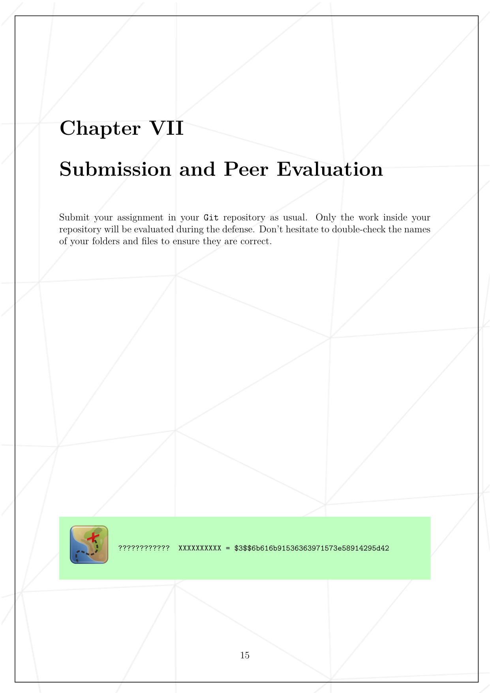
* 

 

