# cpp06
## Source File
[sourceFile](./cpp06/src/cpp06)

 

- - -

 

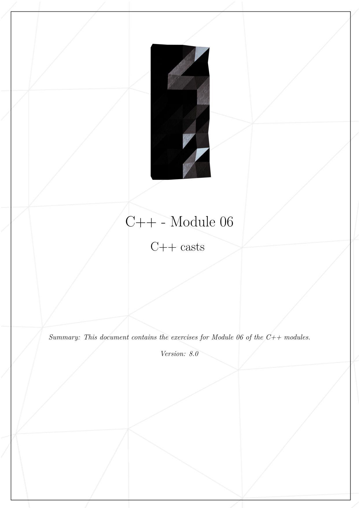
* 

 

- - -

 

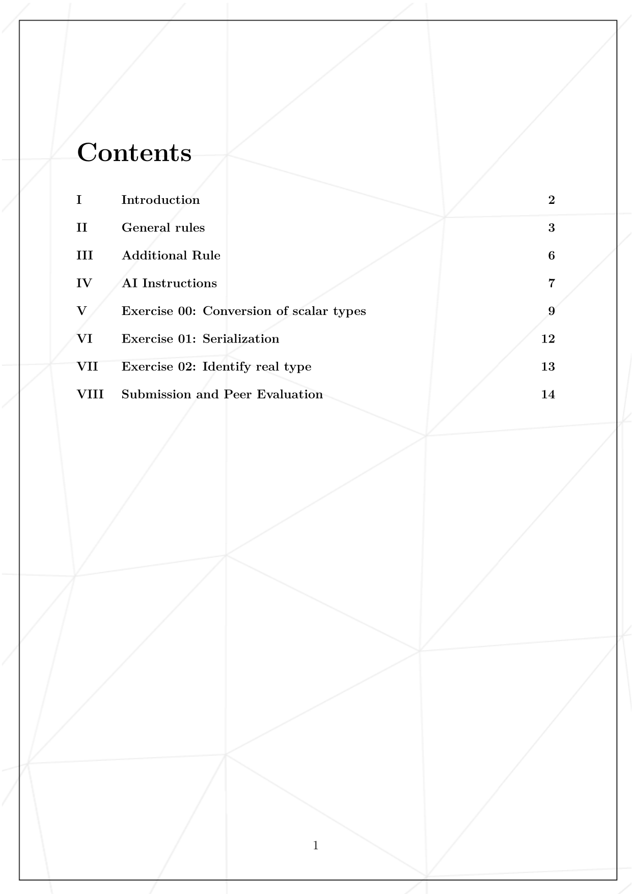
* 

 

- - -

 

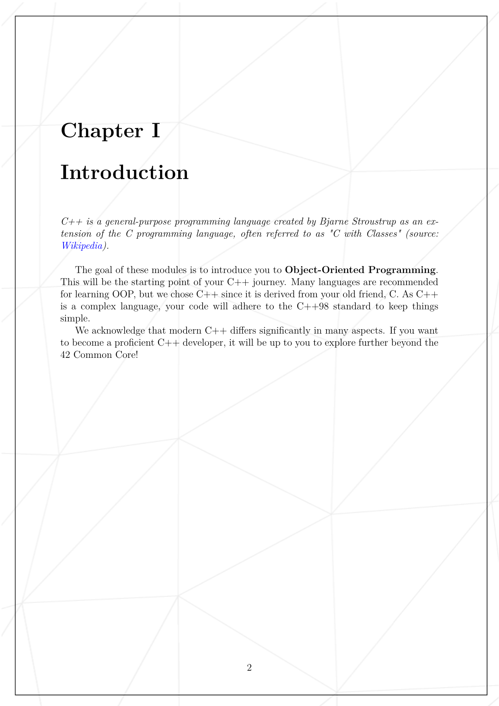
* 

 

- - -

 

* 

 

- - -

 

* 

 

- - -

 

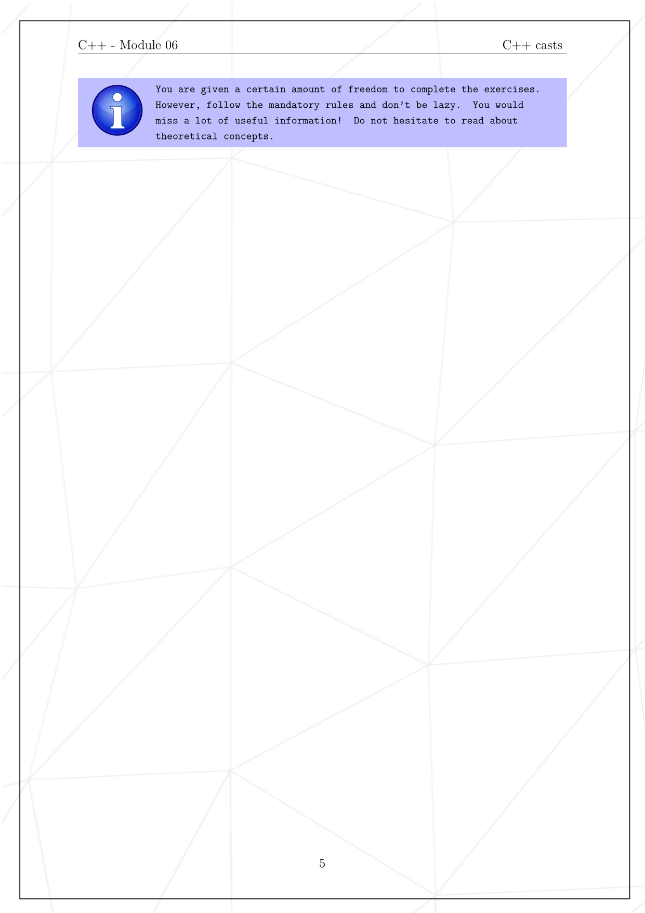
* 

 

- - -

 

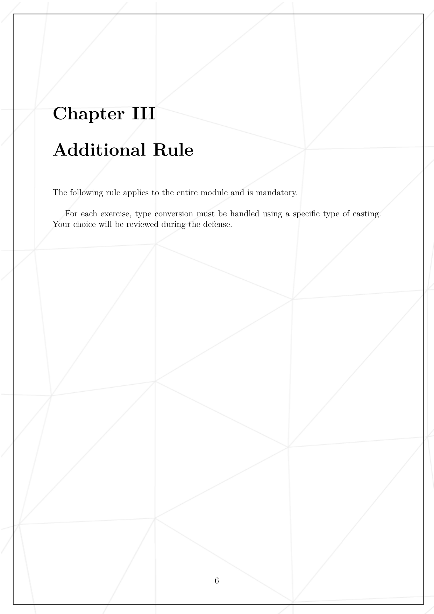
* 

 

- - -

 

* 

 

- - -

 

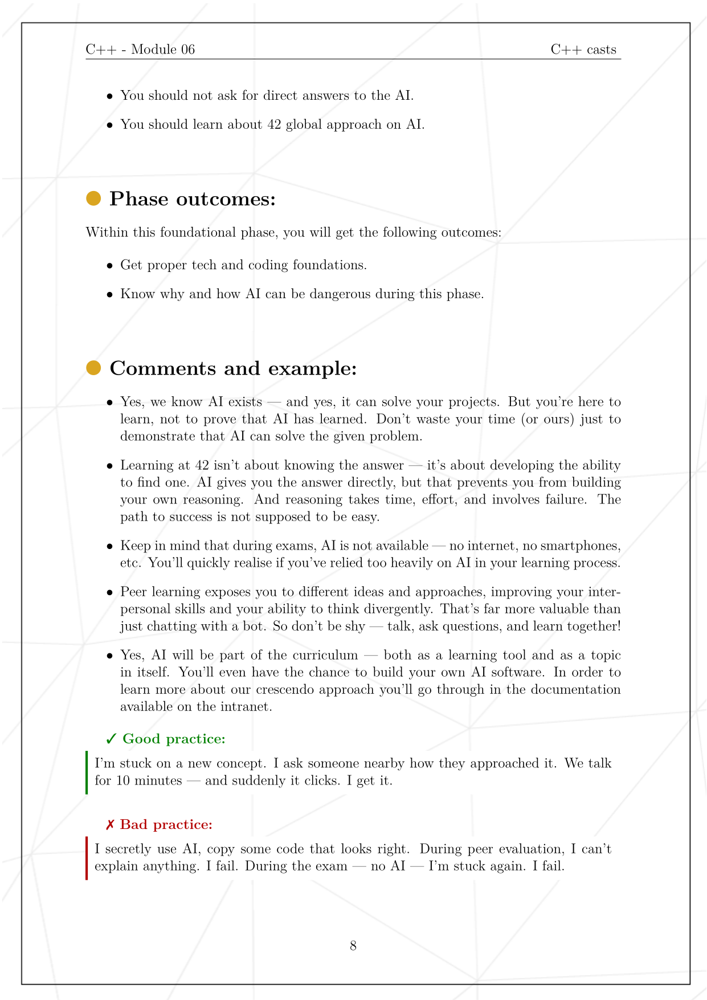
* 

 

- - -

 

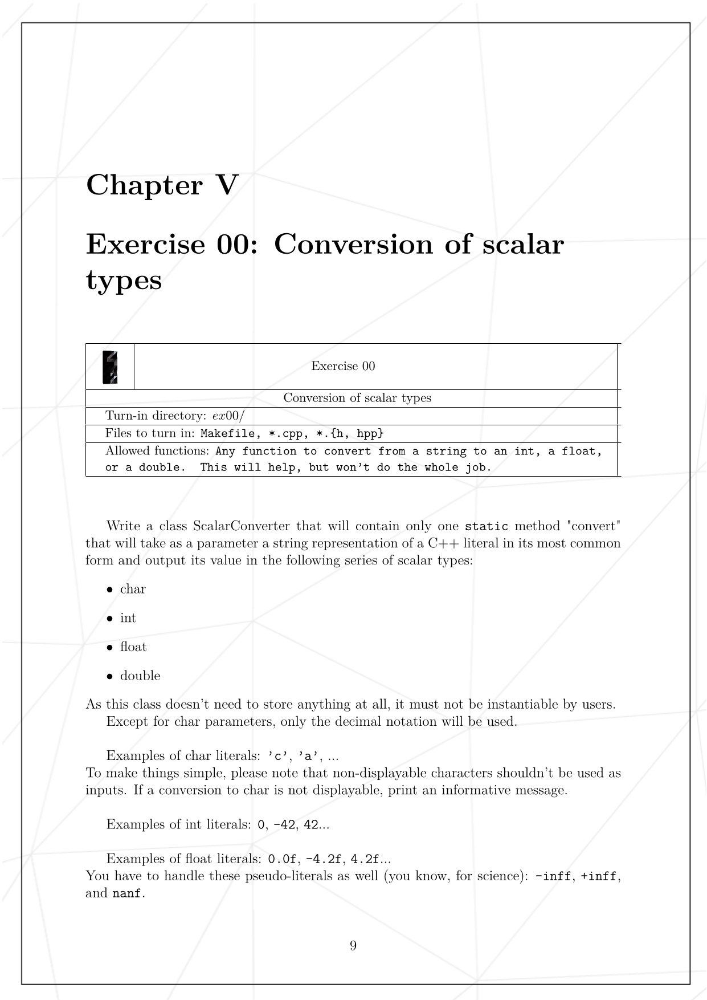
* 

 

- - -

 

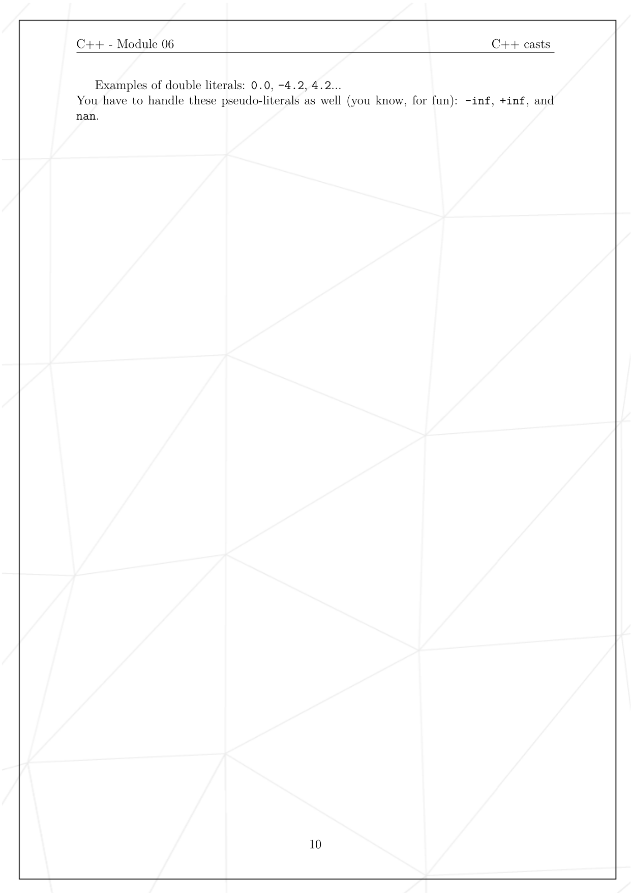
* 

 

- - -

 

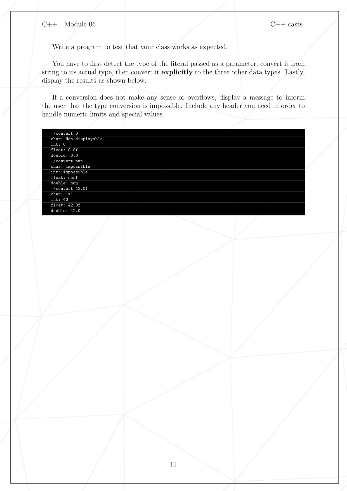
* 

 

- - -

 

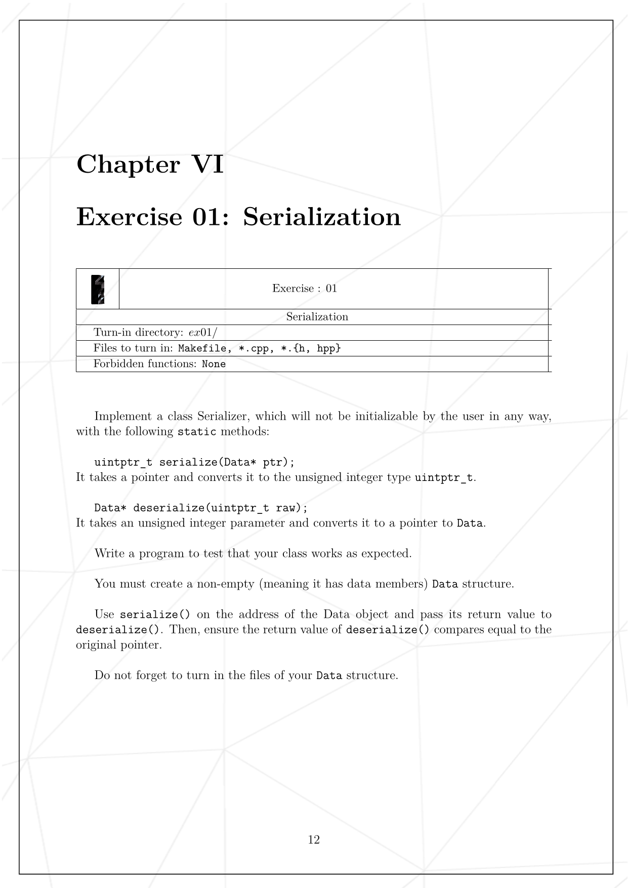
* 

 

- - -

 

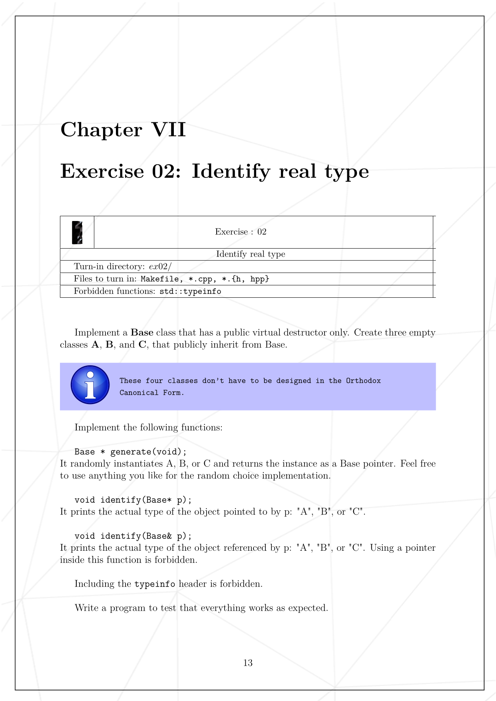
* 

 

- - -

 

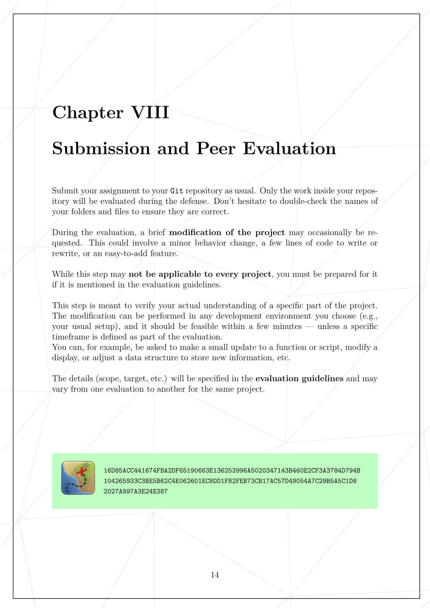
* 

 

