# cpp07
## Source File
[sourceFile](./cpp07/src/cpp07)

 

- - -

 

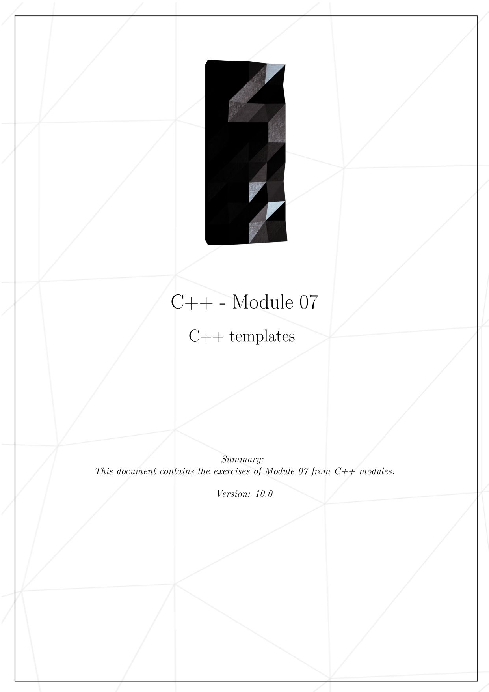
* 

 

- - -

 

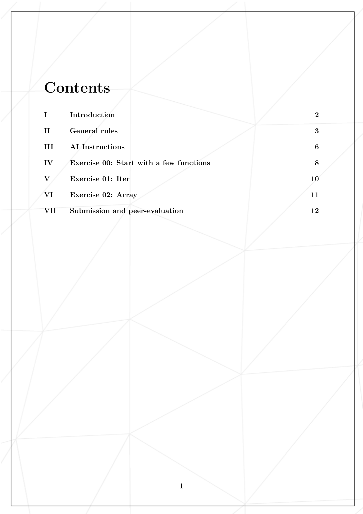
* 

 

- - -

 

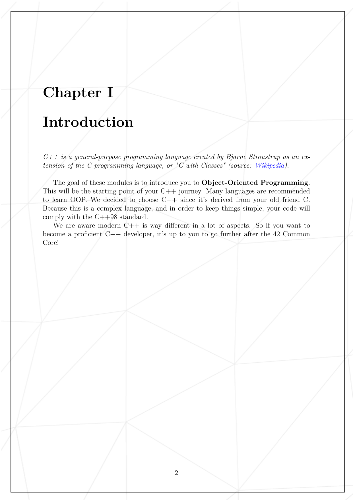
* 

 

- - -

 

* 

 

- - -

 

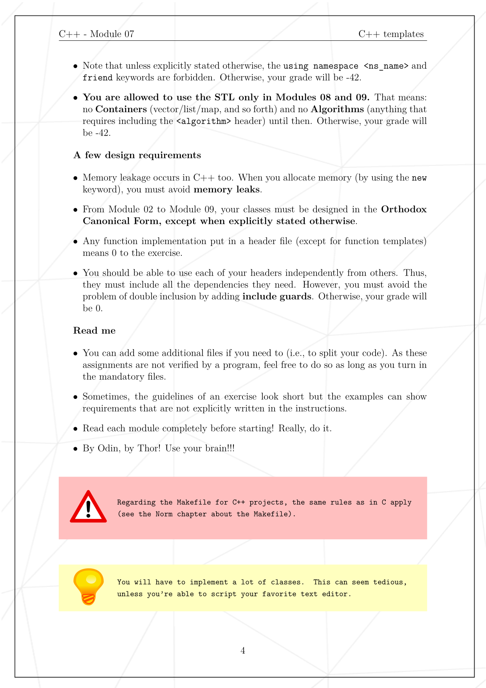
* 

 

- - -

 

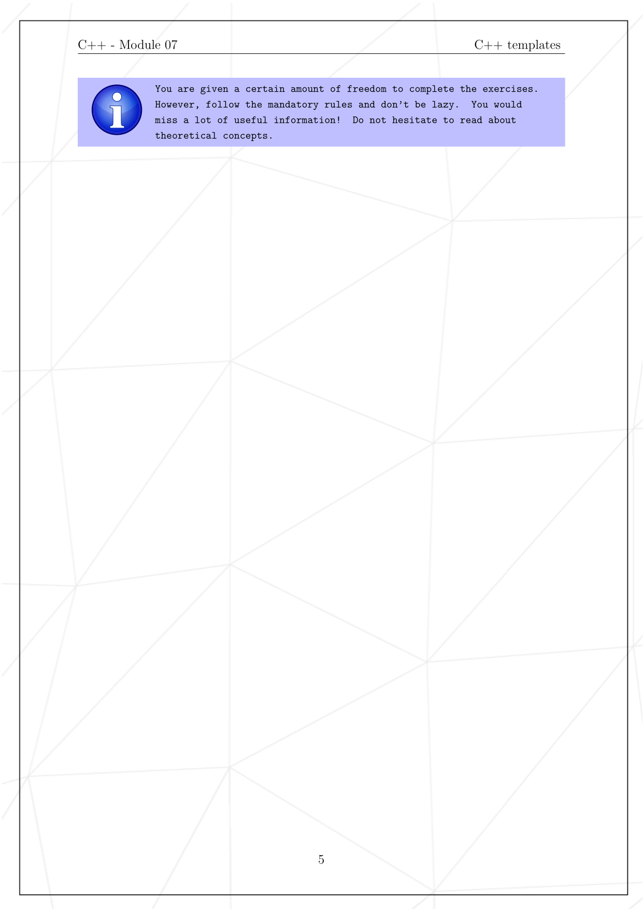
* 

 

- - -

 

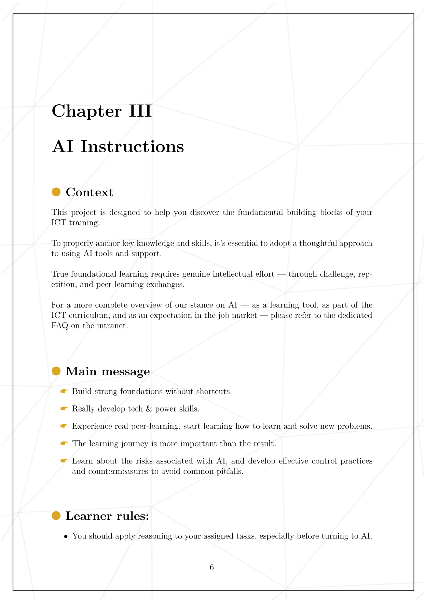
* 

 

- - -

 

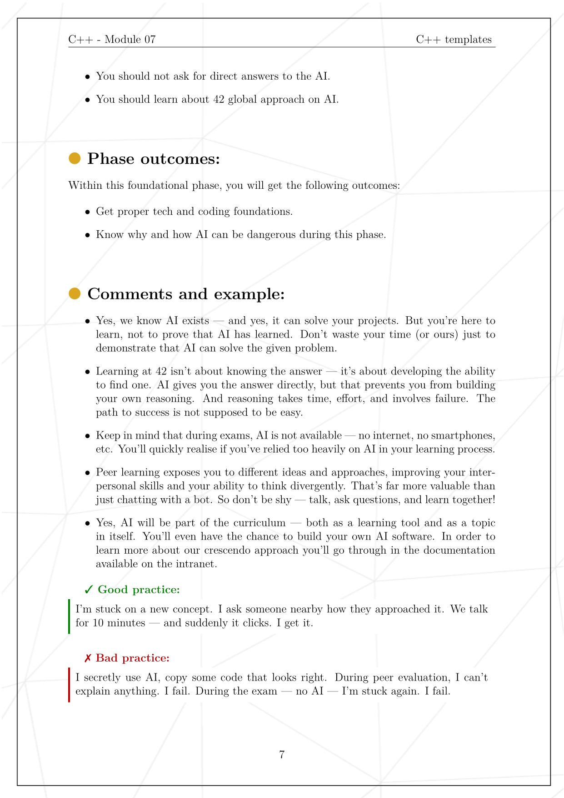
* 

 

- - -

 

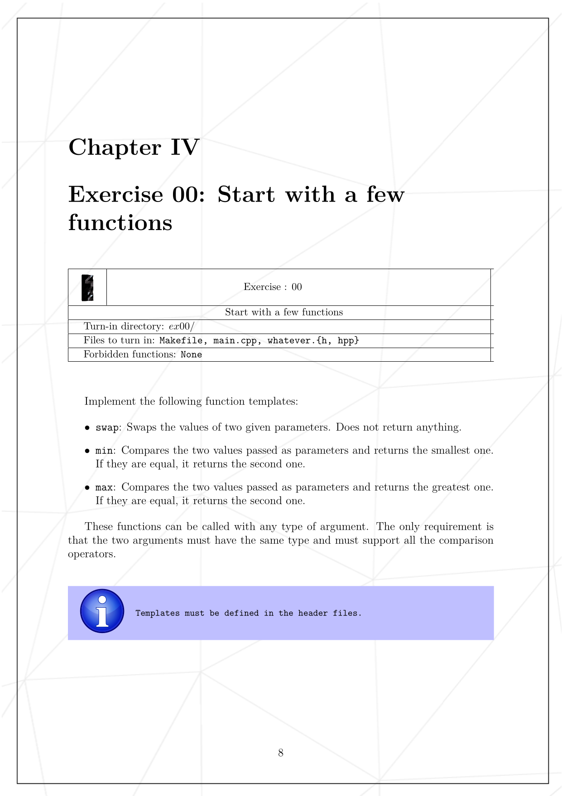
* 

 

- - -

 

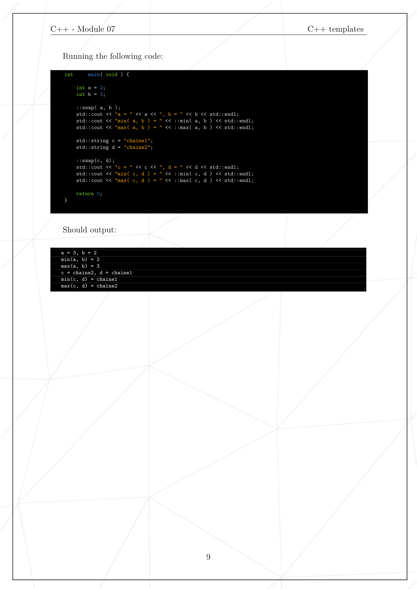
* 

 

- - -

 

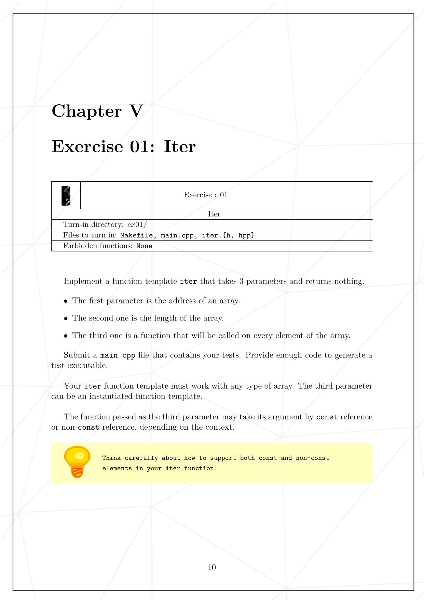
* 

 

- - -

 

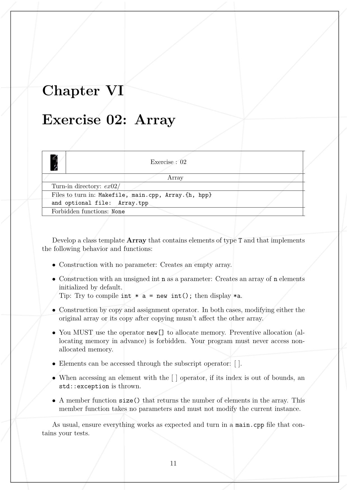
* 

 

- - -

 

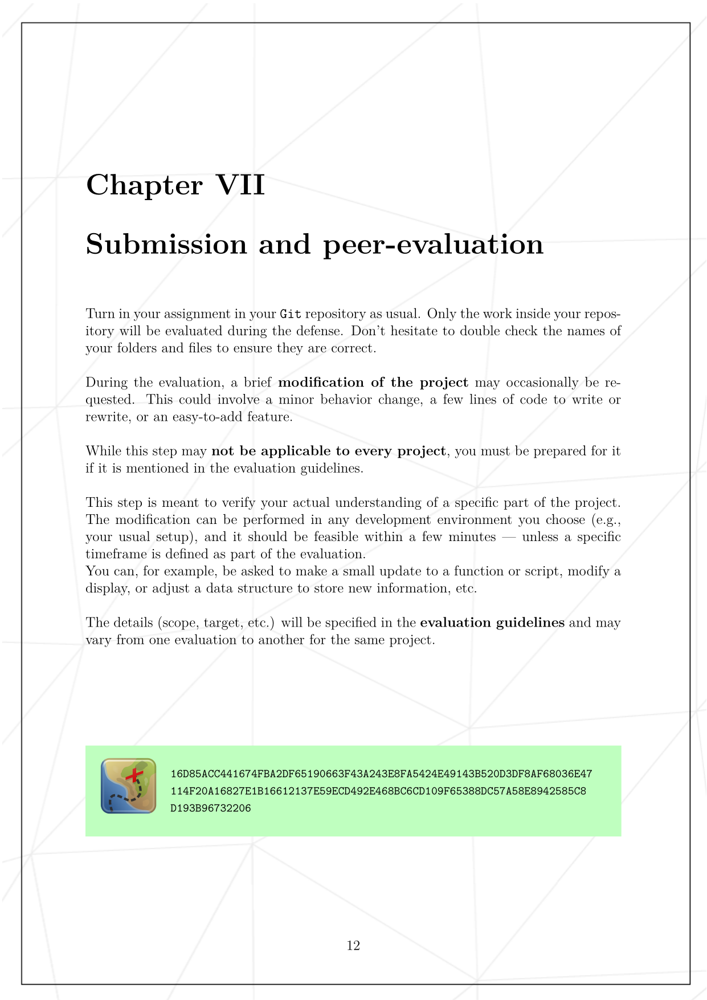
* 

 

