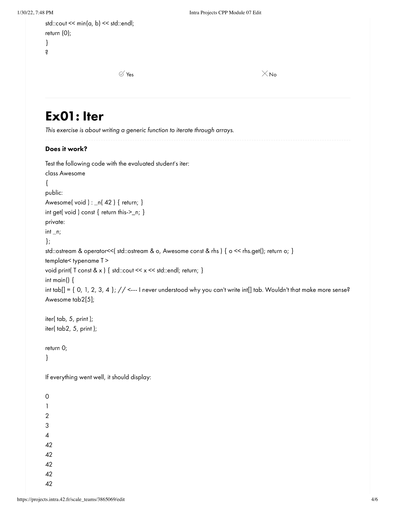

# ng_4_cpp_module_07
## Source File
[sourceFile](./ng_4_cpp_module_07/src/ng_4_cpp_module_07)

 

- - -

 

* 

 

- - -

 

* 

 

- - -

 

* 

 

- - -

 

* 

 

- - -

 

* 

 

- - -

 

* 

 

