# cpp08
## Source File
[sourceFile](./cpp08/src/cpp08)

 

- - -

 

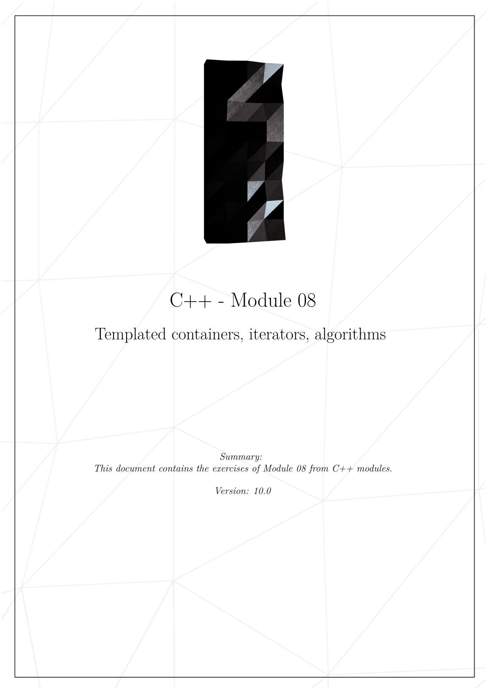
* 

 

- - -

 

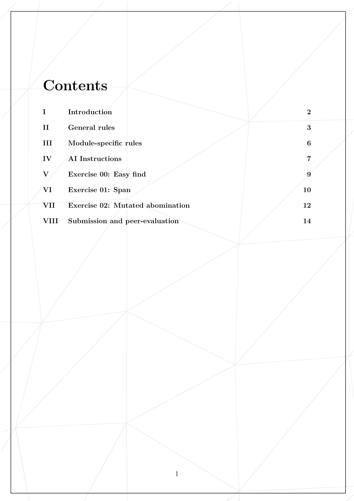
* 

 

- - -

 

* 

 

- - -

 

* 

 

- - -

 

* 

 

- - -

 

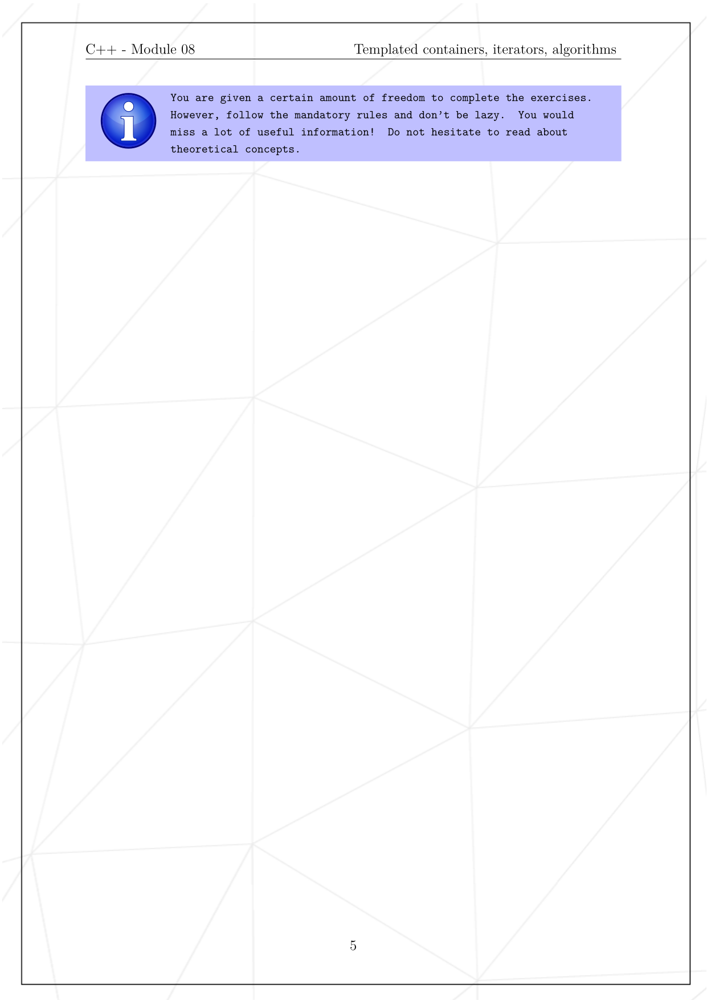
* 

 

- - -

 

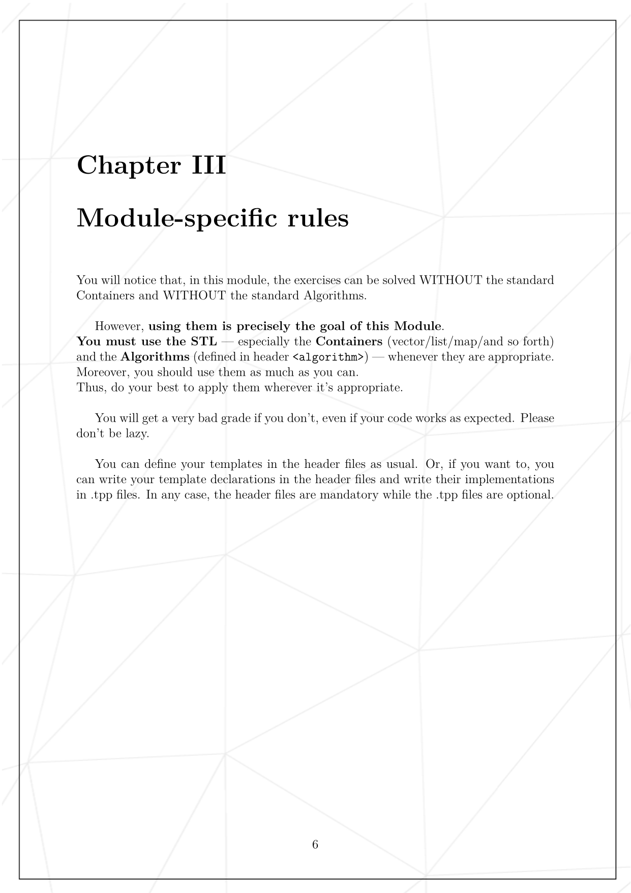
* 

 

- - -

 

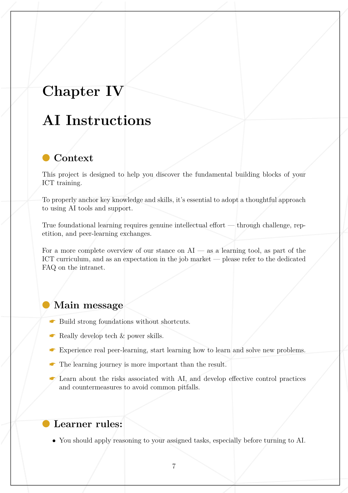
* 

 

- - -

 

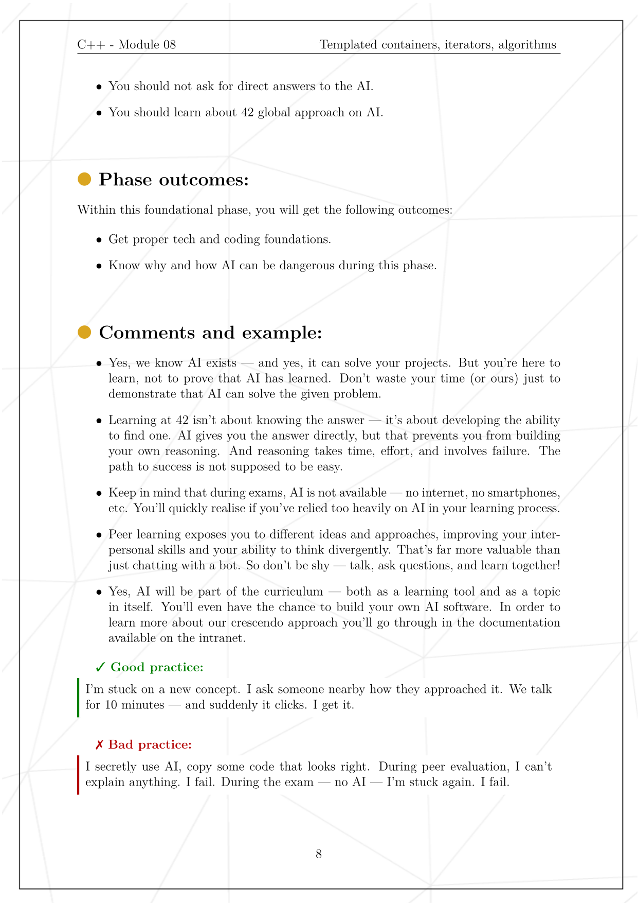
* 

 

- - -

 

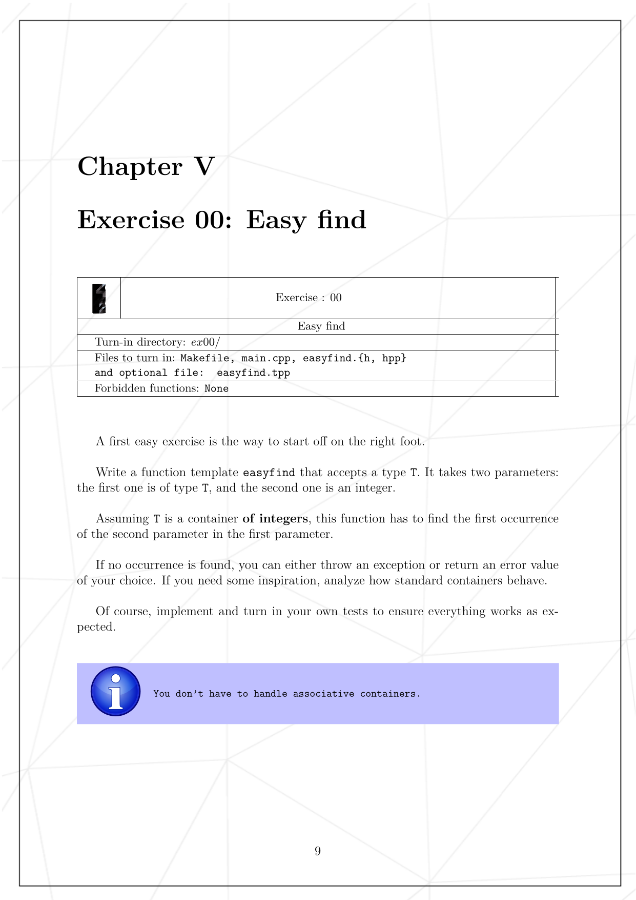
* 

 

- - -

 

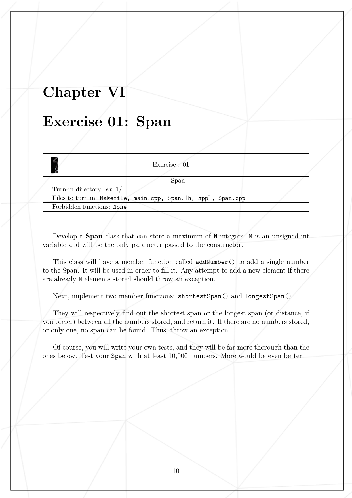
* 

 

- - -

 

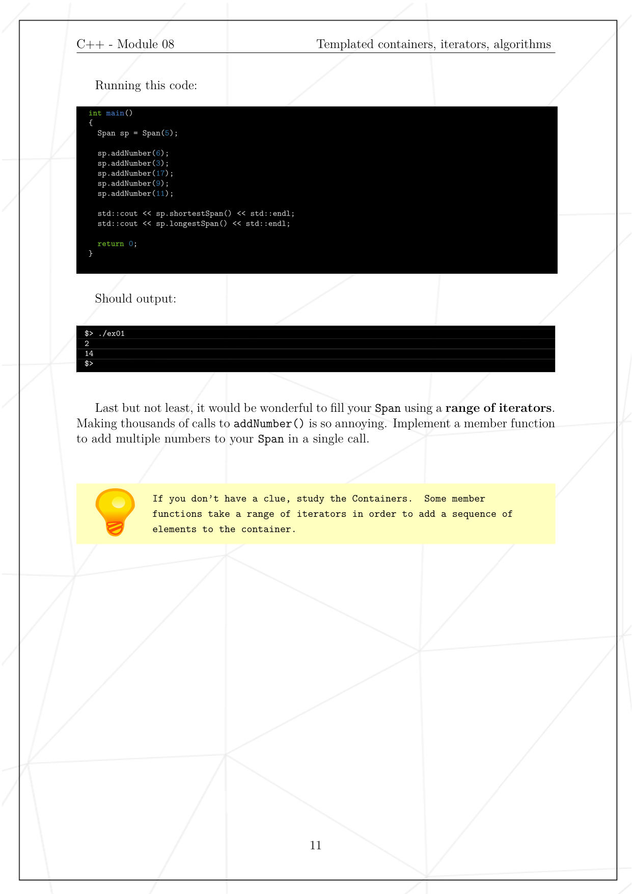
* 

 

- - -

 

* 

 

- - -

 

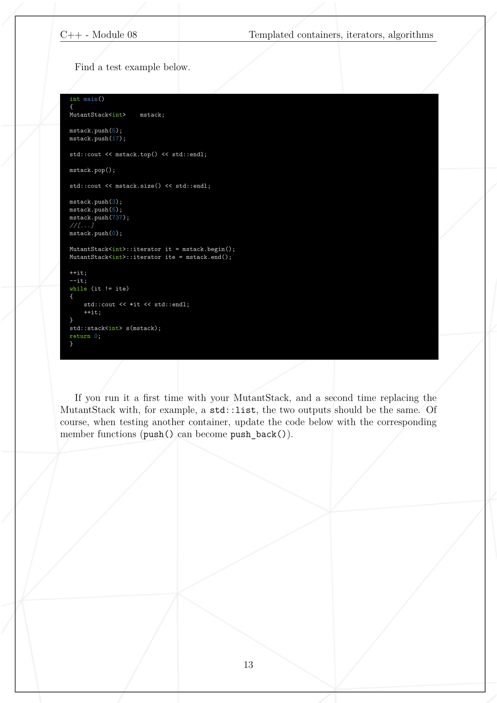
* 

 

- - -

 

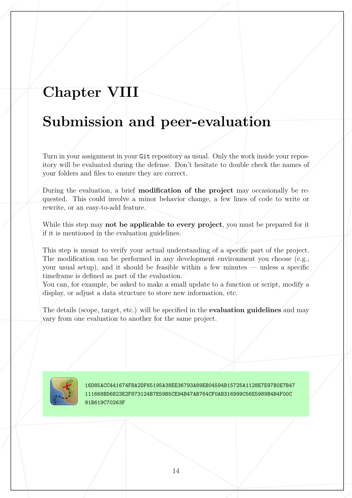
* 

 

